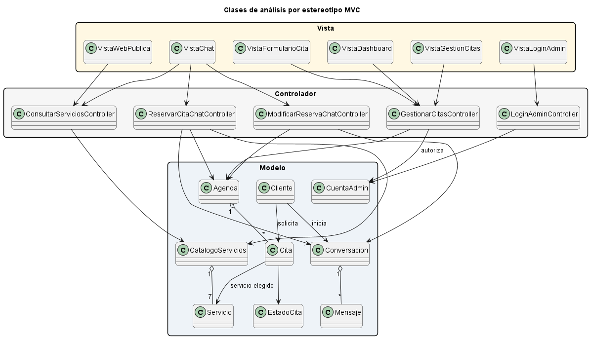
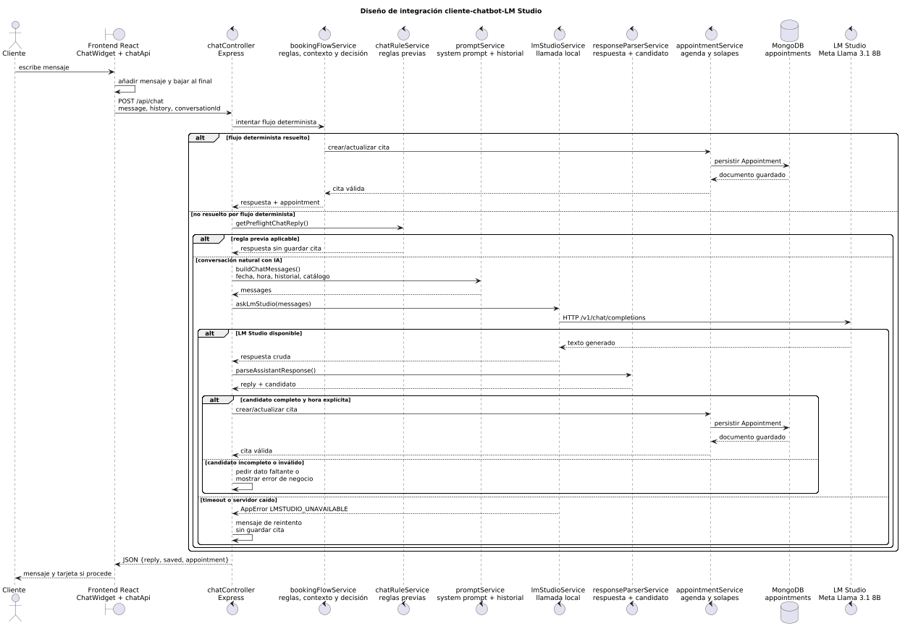

[Capítulo 2](../Capitulo_2/README.md) · [Inicio](../README.md) · [Capítulo 4](../Capitulo_4/README.md)

# Capítulo 3. Análisis y diseño

## Arquitectura general


La solución sigue una arquitectura cliente-servidor con API REST:

| Capa | Tecnología | Responsabilidad |
| --- | --- | --- |
| Presentación | React 19 y Vite | Web pública, chat y administración |
| Comunicación | Axios y JSON | Consumo de la API y gestión de errores |
| API | Node.js y Express 5 | Rutas, controladores, seguridad y coordinación |
| Dominio | Servicios JavaScript | Calendario, reserva, catálogo y conversación |
| Persistencia | MongoDB y Mongoose | Citas, administradores y servicios |
| IA local | LM Studio | Respuestas generativas dentro del dominio |

## Organización MVC modular



```text
Ruta
-> controlador
-> servicio de dominio
-> modelo Mongoose
-> MongoDB
```

Los servicios evitan que los controladores acumulen reglas de negocio:

| Módulo | Responsabilidad |
| --- | --- |
| `appointmentService.js` | Integridad, disponibilidad y persistencia |
| `calendarService.js` | Fechas, calendario laboral y horas |
| `bookingFlowService.js` | Estado del proceso conversacional |
| `chatRuleService.js` | Respuestas deterministas y límites de dominio |
| `chatRequestService.js` | Saneamiento del mensaje y del historial |
| `lmStudioService.js` | Comunicación con el modelo local |
| `responseParserService.js` | Limpieza de la respuesta generativa |
| `serviceCatalogService.js` | Sincronización del catálogo |

## Modelo de datos


### Appointment

- Cliente, servicio, precio y duración.
- Fecha y hora visibles.
- Inicio y fin del intervalo.
- Estado y origen.
- Notas.
- Identificador de conversación.
- Marcas temporales.

### Admin

- Usuario único.
- Hash bcrypt de la contraseña.
- Rol administrativo.

### Service

- Opción del 1 al 7.
- Clave y nombre.
- Precio y duración.

## Diseño del chatbot



```text
Entrada controlada
-> flujo determinista de reserva
-> reglas informativas
-> LM Studio para preguntas abiertas
-> filtrado
-> validación de negocio
-> persistencia
```

El modelo no consulta directamente MongoDB ni confirma disponibilidad. La operación crítica siempre termina en los servicios del backend.

## Decisiones de diseño

### Monolito modular

El alcance local no justifica la complejidad operativa de microservicios. La separación por módulos mantiene cohesión y facilita la evolución.

### MongoDB

La cita es un documento autocontenido. Mongoose aporta esquema, validación e índices para consultas temporales.

### IA local

LM Studio evita el envío de conversaciones a una API externa, elimina el coste por petición y permite cambiar el modelo manteniendo el contrato compatible.

### Reglas deterministas

Calendario, servicio, precio, duración, solapes, autenticación y persistencia no dependen de una respuesta probabilística.

### Catálogo centralizado

Frontend, chatbot y panel comparten una fuente de verdad. El backend ignora precios proporcionados por el cliente y los recalcula.

## Seguridad diseñada

- Contraseñas con bcrypt.
- JWT con caducidad.
- Middleware en todas las rutas de citas.
- Helmet, CORS y rate limiting.
- Límites de mensaje e historial.
- Secretos fuera del repositorio.

## Resultado del capítulo

Los requisitos quedan traducidos a una arquitectura implementable. La separación entre presentación, API, dominio, datos e IA permite utilizar lenguaje natural sin ceder al modelo las decisiones que requieren exactitud.

**Código y documentación**

- [Capítulo 3 completo](../docs/capitulos/03-analisis-diseno.md)
- [Arquitectura y decisiones](../docs/02-arquitectura-y-decisiones.md)
- [Backend](../backend/src/)
- [Frontend](../frontend/src/)
- [Auditoría diseño-implementación](../RUP/99-seguimiento/auditoria-diseno-implementacion.md)

[Capítulo 2](../Capitulo_2/README.md) · [Inicio](../README.md) · [Capítulo 4](../Capitulo_4/README.md)
