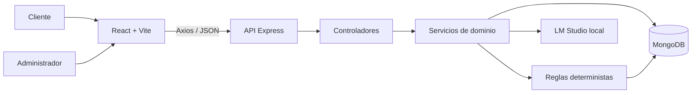

<div align="center">

# Corte Perfecto

### Plataforma web de gestión de citas con chatbot e inteligencia artificial local

Trabajo Fin de Grado en Ingeniería Informática<br>
**Autor:** Adrián García Arranz

[](docs/00-defensa-paso-a-paso.md)
[](entregas/TFG_AdriánGarcíaArranz.pdf)
[](docs/08-demo-defensa.md)
[](docs/06-calidad-seguridad-y-pruebas.md)
[](docs/README.md)

[](docs/capitulos/01-introduccion-estado-arte-objetivos-metodologia.md)
[](docs/capitulos/02-requisitos-modelo-dominio.md)
[](docs/capitulos/03-analisis-diseno.md)
[](docs/capitulos/04-implementacion-mapa-solucion.md)
[](docs/capitulos/05-conclusiones-lineas-futuras.md)

</div>

---

## Empieza aquí

| Orden | Durante la defensa | Acceso |
| ---: | --- | --- |
| 1 | Sigue el recorrido, tiempos, clics y frases | [Defensa paso a paso](docs/00-defensa-paso-a-paso.md) |
| 2 | Presenta el proyecto desde esta portada | [README principal](README.md) |
| 3 | Ejecuta la historia cliente-administrador | [Demostración preparada](docs/08-demo-defensa.md) |
| 4 | Responde al tribunal con precisión | [Preguntas previsibles](docs/10-preguntas-del-tribunal.md) |
| 5 | Consulta la referencia académica oficial | [PDF final entregado](entregas/TFG_AdriánGarcíaArranz.pdf) |

> **Idea central:** la IA conversa, pero no decide la integridad de la agenda. El backend valida servicio, fecha, horario, duración, solapes y persistencia antes de confirmar una cita.

## Resumen del proyecto

Corte Perfecto digitaliza la atención y la gestión de citas de una peluquería local. La solución integra:

- Una web pública con catálogo, precios, horario y acceso al chat.
- Un chatbot que informa y permite reservar, modificar o cancelar.
- Una API Node.js/Express con reglas de negocio deterministas.
- Persistencia local en MongoDB mediante Mongoose.
- Un panel privado para consultar y gestionar la agenda.
- Inferencia conversacional local mediante LM Studio.

El recorrido principal es:

```text
Cliente consulta
-> conversa y aporta los datos
-> backend valida la cita
-> MongoDB persiste
-> administrador ve y gestiona la misma reserva
```

## Recorrido por capítulos

El repositorio conserva una estructura técnica profesional, pero toda la documentación se puede recorrer en el mismo orden que la memoria.

| Capítulo | Pregunta que responde | Contenido y evidencia | Tiempo en defensa |
| --- | --- | --- | ---: |
| **1. Introducción y objetivos** | ¿Qué problema se resuelve y por qué? | [Capítulo completo](docs/capitulos/01-introduccion-estado-arte-objetivos-metodologia.md) · [Resumen del proyecto](docs/01-proyecto-y-objetivos.md) | 3 min |
| **2. Requisitos y dominio** | ¿Qué debe hacer el sistema? | [Capítulo completo](docs/capitulos/02-requisitos-modelo-dominio.md) · [UC-01 a UC-17](RUP/02-requisitos/especificacion-casos-uso.md) · [Diagramas](docs/diagramas-y-capturas.md#capítulo-2-dominio-y-requisitos) | 2 min |
| **3. Análisis y diseño** | ¿Cómo se organiza técnicamente? | [Capítulo completo](docs/capitulos/03-analisis-diseno.md) · [Arquitectura](docs/02-arquitectura-y-decisiones.md) · [Auditoría diseño-código](RUP/99-seguimiento/auditoria-diseno-implementacion.md) | 4 min |
| **4. Implementación** | ¿Qué se ha construido y cómo funciona? | [Capítulo completo](docs/capitulos/04-implementacion-mapa-solucion.md) · [Demo](docs/08-demo-defensa.md) · [API y datos](docs/04-api-y-datos.md) · [Chatbot](docs/05-chatbot-y-reglas.md) | 7 min |
| **5. Evaluación y conclusiones** | ¿Qué resultados, límites y evolución tiene? | [Capítulo completo](docs/capitulos/05-conclusiones-lineas-futuras.md) · [44 pruebas y seguridad](docs/06-calidad-seguridad-y-pruebas.md) · [Limitaciones](docs/11-limitaciones-y-lineas-futuras.md) | 3 min |

[Abrir índice de la memoria navegable](docs/capitulos/README.md) · [Abrir correspondencia memoria-código](docs/07-memoria-y-trazabilidad.md) · [Abrir auditoría final](docs/12-auditoria-entrega-final.md)

## Capítulo 1. Problema y propuesta

La gestión manual mediante llamadas, mensajes y papel interrumpe el trabajo del profesional, exige transcribir solicitudes y facilita errores. La propuesta combina atención conversacional con una agenda centralizada.

Objetivos defendibles:

1. Informar al cliente mediante una web pública.
2. Gestionar reservas mediante lenguaje natural.
3. Proporcionar un panel autenticado al profesional.
4. Mantener reglas críticas verificables y probadas.

Alcance cerrado: no se simulan pagos, notificaciones, varias sedes ni agenda multiempleado.

## Capítulo 2. Requisitos y casos de uso

El sistema tiene dos actores:

- **Cliente:** consulta información y gestiona una reserva mediante el chatbot.
- **Administrador/peluquero:** inicia sesión y opera la agenda.

Se han definido y trazado **17 casos de uso**. Los más representativos para la defensa son:

| Caso | Función | Evidencia |
| --- | --- | --- |
| UC-05 | Reservar por chatbot | `bookingFlowService.js` + `appointmentService.js` |
| UC-09 | Modificar reserva activa | `conversationId` + actualización validada |
| UC-10 | Iniciar sesión | JWT + bcrypt + rutas privadas |
| UC-12 a UC-16 | Gestionar citas | Listado, creación, edición, completado y eliminación |

[Abrir diagrama de contexto](diagramas/capitulo2/imagenes/04_diagrama_contexto.png) · [Abrir casos de uso del cliente](diagramas/capitulo2/imagenes/05a_diagrama_casos_uso_cliente.png) · [Abrir casos de uso del administrador](diagramas/capitulo2/imagenes/05b_diagrama_casos_uso_administrador.png) · [Abrir matriz UC-código-prueba](RUP/99-seguimiento/trazabilidad-casos-uso.md)

## Capítulo 3. Arquitectura y diseño



| Capa | Tecnología | Responsabilidad |
| --- | --- | --- |
| Presentación | React 19, Vite, React Router | Web pública, chat y panel |
| API | Node.js, Express 5 | Rutas, controladores y seguridad HTTP |
| Dominio | Servicios JavaScript | Calendario, reservas, solapes y conversación |
| Datos | MongoDB, Mongoose | Citas, administradores y catálogo |
| IA local | LM Studio | Respuestas abiertas dentro del dominio |

Decisiones principales:

- **Monolito modular:** menor complejidad operativa y responsabilidades separadas.
- **MongoDB:** documentos autocontenidos e índices temporales mediante Mongoose.
- **IA local:** mayor control de privacidad y ausencia de coste por petición.
- **Backend determinista:** el LLM no decide disponibilidad ni escribe directamente.
- **Catálogo centralizado:** precio y duración se recalculan en servidor.

[Abrir arquitectura completa](docs/02-arquitectura-y-decisiones.md) · [Abrir integración con LM Studio](diagramas/capitulo3/imagenes/13_integracion_chat_lmstudio.png)

## Capítulo 4. Producto implementado

[Abrir diagrama bidireccional de navegación UC-01 a UC-17](diagramas/capitulo4/imagenes/02_contexto_navegacion_casos_uso.png)

| Web pública | Chatbot | Panel de administración |
| --- | --- | --- |
| [](diagramas/capitulo4/capturas/01_home.png) | [](diagramas/capitulo4/capturas/03_chat_abierto.png) | [](diagramas/capitulo4/capturas/05_admin_dashboard.png) |

### Cliente

- Consulta de catálogo, precios, duración y horario.
- Reserva por nombre o número de servicio.
- Comprensión de fechas y expresiones horarias en español.
- Modificación y cancelación de la cita activa.
- Confirmación únicamente después de persistir.
- Respuesta controlada aunque LM Studio no esté disponible.

### Administrador

- Inicio de sesión protegido mediante JWT.
- Dashboard con estados e ingresos estimados.
- Listado, filtrado y ordenación.
- Creación, edición, completado y eliminación.
- Catálogo compartido con la web y el chatbot.

### Pipeline del chatbot

```text
Saneamiento y límites
-> flujo determinista de reserva
-> respuestas conocidas
-> LM Studio para preguntas abiertas
-> filtrado
-> validación de negocio
-> MongoDB
```

[Abrir diseño del chatbot](docs/05-chatbot-y-reglas.md) · [Abrir API REST](docs/04-api-y-datos.md) · [Abrir galería completa](docs/diagramas-y-capturas.md)

## Capítulo 5. Evaluación y conclusiones

La implementación cubre el recorrido completo cliente-administrador y mantiene una única agenda. La calidad se comprueba con:

```bash
npm run verify
```

El comando ejecuta:

1. Comprobación sintáctica del backend.
2. **44 pruebas automatizadas**.
3. Build de producción del frontend.

Las pruebas cubren calendario, horas naturales, servicios, nombres, solapes, concurrencia local, propiedad de conversación, entradas adversas, contingencia de IA y filtrado de respuestas.

Limitaciones reconocidas:

- Ejecución local.
- Una agenda y un único recurso.
- Sin pagos ni recordatorios.
- Cola de concurrencia válida para una instancia.
- Seguridad adecuada al alcance académico, no certificación de producción.

Evolución priorizada:

1. Recordatorios y confirmaciones.
2. Agenda multiempleado.
3. Despliegue con concurrencia distribuida, observabilidad y copias.

[Abrir calidad y pruebas](docs/06-calidad-seguridad-y-pruebas.md) · [Abrir limitaciones y futuro](docs/11-limitaciones-y-lineas-futuras.md)

## Demostración en cuatro minutos

1. Abre la web y muestra el catálogo.
2. Pregunta: `¿Qué servicios tenéis y cuánto cuestan?`
3. Reserva una fecha laborable futura:

   ```text
   Quiero reservar la opción 4.
   Me llamo Adrián Demo.
   El próximo martes a las cinco de la tarde.
   ```

4. Inicia sesión en administración y localiza la misma cita.

La historia que debes verbalizar es:

> “El cliente conversa, el backend normaliza y valida, MongoDB persiste y el profesional recibe la misma reserva sin transcribirla.”

[Abrir demo exacta y contingencias](docs/08-demo-defensa.md)

## Puesta en marcha

### Requisitos

- Node.js 20 o superior.
- MongoDB accesible en local.
- LM Studio para respuestas generativas.

### Instalación

```bash
git clone https://github.com/aadrigaar/TFG_CortePerfecto.git
cd TFG_CortePerfecto
npm install
npm run install:all
```

Copia `backend/.env.example` a `backend/.env` y `frontend/.env.example` a `frontend/.env`.

```bash
npm run dev
```

| Servicio | URL |
| --- | --- |
| Aplicación | `http://localhost:5173` |
| API | `http://localhost:5000/api` |
| Salud | `http://localhost:5000/api/health` |
| Panel | `http://localhost:5173/admin/login` |
| LM Studio | `http://127.0.0.1:1234` |

[Abrir instalación detallada](docs/03-instalacion-y-ejecucion.md)

## Memoria y entregables

La referencia académica oficial es el [PDF final entregado](entregas/TFG_AdriánGarcíaArranz.pdf), de **100 páginas**.

| Documento | Función |
| --- | --- |
| [PDF final](entregas/TFG_AdriánGarcíaArranz.pdf) | Memoria oficial entregada |
| [Capítulo 1 DOCX](entregas/Capitulo1.docx) | Entrega intermedia |
| [Capítulo 2 DOCX](entregas/Capitulo2.docx) | Entrega intermedia |
| [Capítulo 3 DOCX](entregas/Capitulo3.docx) | Entrega intermedia |
| [Capítulos 4 y 5 DOCX](entregas/Capitulos4y5.docx) | Entrega intermedia |

Los DOCX conservan etapas del proceso, pero no son copias literales del PDF definitivo.

## Estructura

```text
TFG_CortePerfecto/
├── backend/       API, dominio, persistencia, seguridad y pruebas
├── frontend/      Web pública, chatbot y administración
├── diagramas/     Fuentes PlantUML, diagramas y capturas
├── docs/          Memoria navegable, referencia y defensa
├── entregas/      PDF oficial y capítulos intermedios
├── RUP/           Casos de uso, trazabilidad y auditoría
└── README.md      Entrada principal ordenada por capítulos
```

## Documentación completa

| Necesidad | Documento |
| --- | --- |
| Exponer en 20 minutos | [Defensa paso a paso](docs/00-defensa-paso-a-paso.md) |
| Consultar los capítulos | [Memoria navegable](docs/capitulos/README.md) |
| Instalar y ejecutar | [Guía de instalación](docs/03-instalacion-y-ejecucion.md) |
| Revisar API y datos | [Referencia técnica](docs/04-api-y-datos.md) |
| Entender el chatbot | [Diseño conversacional](docs/05-chatbot-y-reglas.md) |
| Revisar calidad | [Pruebas y seguridad](docs/06-calidad-seguridad-y-pruebas.md) |
| Demostrar coherencia | [Memoria y trazabilidad](docs/07-memoria-y-trazabilidad.md) |
| Preparar preguntas | [Preguntas del tribunal](docs/10-preguntas-del-tribunal.md) |
| Comprobar la entrega | [Auditoría final](docs/12-auditoria-entrega-final.md) |

---

<div align="center">

[](docs/00-defensa-paso-a-paso.md)
[](docs/08-demo-defensa.md)
[](docs/10-preguntas-del-tribunal.md)

</div>
