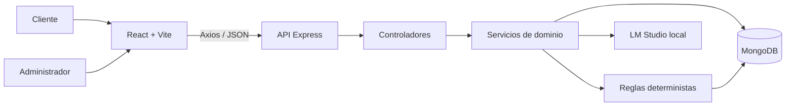

<div align="center">

# Corte Perfecto

### Sistema web de gestión de citas con chatbot conversacional e IA local

Trabajo Fin de Grado en Ingeniería Informática<br>
**Autor:** Adrián García Arranz

[](docs/README.md)
[](docs/00-defensa-paso-a-paso.md)
[](docs/08-demo-defensa.md)
[](docs/06-calidad-seguridad-y-pruebas.md)
[](entregas/TFG_AdriánGarcíaArranz.pdf)

[](docs/capitulos/01-introduccion-estado-arte-objetivos-metodologia.md)
[](docs/capitulos/02-requisitos-modelo-dominio.md)
[](docs/capitulos/03-analisis-diseno.md)
[](docs/capitulos/04-implementacion-mapa-solucion.md)
[](docs/capitulos/05-conclusiones-lineas-futuras.md)

</div>

---

## Qué es Corte Perfecto

Corte Perfecto es una aplicación web full-stack para una peluquería local. Integra un escaparate público, un chatbot capaz de informar y gestionar reservas, y un panel privado desde el que el administrador controla la agenda. La conversación generativa se ejecuta en local mediante LM Studio, mientras que las reglas críticas de negocio permanecen en servicios deterministas del backend.

El proyecto resuelve cuatro necesidades:

1. Ofrecer información clara sobre servicios, precios y horarios.
2. Reservar, modificar y cancelar citas mediante lenguaje natural.
3. Evitar citas inválidas, pasadas, fuera de horario o solapadas.
4. Centralizar la agenda en un panel autenticado para el profesional.

> La IA conversa, pero no decide la integridad de la agenda. Fechas, horarios, servicios, solapes y persistencia se validan siempre en el backend.

## Accesos directos

| Quiero consultar | Acceso |
| --- | --- |
| El recorrido exacto de la exposición | [Empezar la defensa paso a paso](docs/00-defensa-paso-a-paso.md) |
| La memoria oficial entregada | [Abrir PDF final](entregas/TFG_AdriánGarcíaArranz.pdf) |
| Los cinco capítulos completos | [Abrir memoria navegable](docs/capitulos/README.md) |
| Visión general, objetivos y alcance | [Abrir visión del proyecto](docs/01-proyecto-y-objetivos.md) |
| Arquitectura y decisiones técnicas | [Abrir arquitectura](docs/02-arquitectura-y-decisiones.md) |
| Instalación completa | [Abrir puesta en marcha](docs/03-instalacion-y-ejecucion.md) |
| API REST y modelo de datos | [Abrir referencia técnica](docs/04-api-y-datos.md) |
| Funcionamiento interno del chatbot | [Abrir diseño conversacional](docs/05-chatbot-y-reglas.md) |
| Seguridad, calidad y 44 pruebas | [Abrir evidencias](docs/06-calidad-seguridad-y-pruebas.md) |
| Relación entre memoria y código | [Abrir trazabilidad](docs/07-memoria-y-trazabilidad.md) |
| Demostración para el tribunal | [Abrir recorrido de demo](docs/08-demo-defensa.md) |
| Guion oral de 20 minutos | [Abrir guion](docs/09-guion-defensa-20-min.md) |
| Preguntas previsibles del tribunal | [Abrir preparación de preguntas](docs/10-preguntas-del-tribunal.md) |
| Limitaciones y evolución | [Abrir análisis crítico](docs/11-limitaciones-y-lineas-futuras.md) |
| Auditoría final memoria-código | [Abrir resultado de la revisión](docs/12-auditoria-entrega-final.md) |
| Diagramas y capturas | [Abrir galería técnica](docs/diagramas-y-capturas.md) |
| Casos de uso UC-01 a UC-17 | [Abrir especificación](RUP/02-requisitos/especificacion-casos-uso.md) |

## Vista del producto

| Web pública | Chatbot | Panel de administración |
| --- | --- | --- |
| [](diagramas/capitulo4/capturas/01_home.png) | [](diagramas/capitulo4/capturas/03_chat_abierto.png) | [](diagramas/capitulo4/capturas/05_admin_dashboard.png) |

## Arquitectura



- **Frontend:** React 19, Vite, React Router, Axios y Lucide.
- **Backend:** Node.js, Express 5 y arquitectura modular MVC.
- **Persistencia:** MongoDB mediante Mongoose.
- **Seguridad:** JWT, bcrypt, Helmet, CORS y limitación de peticiones.
- **IA local:** LM Studio con API compatible con OpenAI.
- **Calidad:** `node:test`, validación sintáctica y build de producción.

[Ver arquitectura completa](docs/02-arquitectura-y-decisiones.md) · [Ver diagramas fuente](diagramas/) · [Ver auditoría diseño-código](RUP/99-seguimiento/auditoria-diseno-implementacion.md)

## Funcionalidades implementadas

### Cliente

- Consulta de información, catálogo, precios, duración y horario.
- Reserva conversacional por nombre o número de servicio.
- Comprensión de fechas numéricas y expresiones horarias en español.
- Modificación y cancelación de la reserva activa.
- Confirmación visual con resumen de la cita.
- Respuesta controlada aunque LM Studio no esté disponible.

### Administrador

- Inicio de sesión protegido mediante JWT.
- Dashboard con citas, estados e ingresos estimados.
- Listado, filtrado y ordenación de citas.
- Creación, edición, finalización y eliminación.
- Sincronización de servicios con el catálogo oficial.

### Reglas de negocio

- Apertura de lunes a viernes, de 10:00 a 20:00.
- Rechazo de fechas pasadas y fines de semana.
- El servicio debe finalizar antes del cierre.
- Imposibilidad de solapar citas activas.
- Precio y duración calculados en el servidor.
- Modificaciones del chat vinculadas a su conversación.

## Puesta en marcha rápida

### Requisitos

- Node.js 20 o superior.
- MongoDB accesible en local.
- LM Studio para las respuestas generativas.

### Instalación

```bash
git clone https://github.com/aadrigaar/TFG_CortePerfecto.git
cd TFG_CortePerfecto
npm install
npm run install:all
```

Copia `backend/.env.example` a `backend/.env` y `frontend/.env.example` a `frontend/.env`. Después:

```bash
npm run dev
```

| Servicio | URL |
| --- | --- |
| Aplicación web | `http://localhost:5173` |
| API | `http://localhost:5000/api` |
| Salud de la API | `http://localhost:5000/api/health` |
| Panel administrador | `http://localhost:5173/admin/login` |
| LM Studio esperado | `http://127.0.0.1:1234` |

La instalación detallada, solución de problemas y configuración segura están en [docs/03-instalacion-y-ejecucion.md](docs/03-instalacion-y-ejecucion.md).

## Verificación

```bash
npm run verify
```

El comando ejecuta:

1. Comprobación sintáctica del backend.
2. Las **44 pruebas automatizadas** del dominio y del chatbot.
3. El build de producción del frontend.

Las pruebas cubren calendario, nombres, servicios, interpretación temporal, solapes, concurrencia, aislamiento por conversación, entradas adversas, contingencia de IA y saneamiento de respuestas.

## Memoria académica completa

La referencia académica oficial es el [PDF final entregado](entregas/TFG_AdriánGarcíaArranz.pdf), de **100 páginas**. Los DOCX por capítulos son entregas intermedias conservadas como material de trabajo; la memoria final los integra, revisa y amplía, por lo que no deben presentarse como copias literales de la versión definitiva.

| Capítulo | Contenido | Leer en GitHub | Documento original |
| --- | --- | --- | --- |
| 1 | Introducción, estado del arte, objetivos y metodología | [Leer Capítulo 1](docs/capitulos/01-introduccion-estado-arte-objetivos-metodologia.md) | [Abrir DOCX](entregas/Capitulo1.docx) |
| 2 | Requisitos, dominio, actores y casos de uso | [Leer Capítulo 2](docs/capitulos/02-requisitos-modelo-dominio.md) | [Abrir DOCX](entregas/Capitulo2.docx) |
| 3 | Análisis, diseño, arquitectura y pruebas | [Leer Capítulo 3](docs/capitulos/03-analisis-diseno.md) | [Abrir DOCX](entregas/Capitulo3.docx) |
| 4 | Implementación y mapa de la solución | [Leer Capítulo 4](docs/capitulos/04-implementacion-mapa-solucion.md) | [Abrir DOCX conjunto](entregas/Capitulos4y5.docx) |
| 5 | Resultados, conclusiones y líneas futuras | [Leer Capítulo 5](docs/capitulos/05-conclusiones-lineas-futuras.md) | [Abrir DOCX conjunto](entregas/Capitulos4y5.docx) |
| Referencias | Bibliografía de la memoria final | [Consultar referencias](docs/capitulos/06-referencias.md) | Incluidas en la memoria final |

[Abrir PDF oficial](entregas/TFG_AdriánGarcíaArranz.pdf) · [Abrir índice visual de capítulos](docs/capitulos/README.md) · [Ver correspondencia memoria-código](docs/07-memoria-y-trazabilidad.md) · [Consultar auditoría final](docs/12-auditoria-entrega-final.md)

## Estructura del repositorio

```text
TFG_CortePerfecto/
├── backend/       API, dominio, persistencia, seguridad y pruebas
├── frontend/      Web pública, chatbot y panel de administración
├── diagramas/     PlantUML, imágenes renderizadas y capturas
├── docs/          Documentación navegable y preparación de la defensa
│   └── capitulos/ Memoria completa dividida en cinco capítulos
├── entregas/      PDF final oficial y capítulos académicos intermedios
├── RUP/           Casos de uso, trazabilidad y auditoría
└── README.md      Entrada principal del proyecto
```

## Estado

El alcance definido para el TFG está implementado y verificado. El sistema está diseñado para ejecución local, demostración académica y evolución posterior; las limitaciones reales se documentan de forma explícita en [docs/11-limitaciones-y-lineas-futuras.md](docs/11-limitaciones-y-lineas-futuras.md).

---

<div align="center">

[](docs/00-defensa-paso-a-paso.md)
[](docs/08-demo-defensa.md)

</div>
