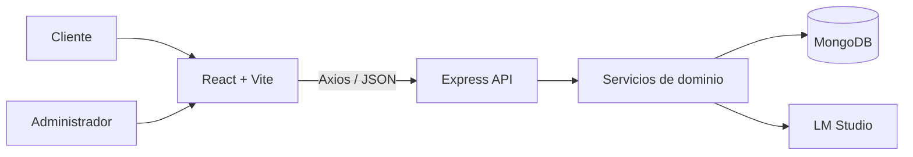

<div align="center">

# Corte Perfecto

### Plataforma web de gestión de citas con chatbot e inteligencia artificial local

Trabajo Fin de Grado en Ingeniería Informática<br>
**Adrián García Arranz · Santander · 2026**

[](entregas/TFG_AdriánGarcíaArranz.pdf)
[](docs/presentacion/README.md)
[](docs/06-calidad-seguridad-y-pruebas.md)
[](RUP/99-seguimiento/trazabilidad-casos-uso.md)

</div>

## Proyecto

Corte Perfecto digitaliza la atención y la gestión de citas de una peluquería local. La aplicación combina una web pública, un chatbot conectado a un modelo ejecutado en LM Studio, una API Node.js/Express, persistencia MongoDB y un panel privado de administración.

La decisión principal del sistema es separar la conversación de la integridad:

> La inteligencia artificial ayuda a comprender al cliente; el backend valida y decide sobre la agenda.

```text
Cliente
-> web y chatbot
-> reglas de negocio
-> MongoDB
-> panel administrativo
```

## Índice general

### [Capítulo 1. Introducción, estado del arte y objetivos](docs/presentacion/Capitulo_1/README.md)

- [Contexto](docs/presentacion/Capitulo_1/README.md#contexto)
- [Problema identificado](docs/presentacion/Capitulo_1/README.md#problema-identificado)
- [Estado del arte](docs/presentacion/Capitulo_1/README.md#estado-del-arte)
- [Solución propuesta](docs/presentacion/Capitulo_1/README.md#solución-propuesta)
- [Objetivos](docs/presentacion/Capitulo_1/README.md#objetivo-general)
- [Alcance e hipótesis](docs/presentacion/Capitulo_1/README.md#alcance)

### [Capítulo 2. Requisitos y modelo del dominio](docs/presentacion/Capitulo_2/README.md)

- [Actores](docs/presentacion/Capitulo_2/README.md#actores)
- [Modelo del dominio](docs/presentacion/Capitulo_2/README.md#modelo-del-dominio)
- [Estados de una cita](docs/presentacion/Capitulo_2/README.md#estados-de-una-cita)
- [Casos de uso](docs/presentacion/Capitulo_2/README.md#casos-de-uso)
- [Reglas suplementarias](docs/presentacion/Capitulo_2/README.md#reglas-suplementarias)
- [Trazabilidad](docs/presentacion/Capitulo_2/README.md#trazabilidad)

### [Capítulo 3. Análisis y diseño](docs/presentacion/Capitulo_3/README.md)

- [Arquitectura general](docs/presentacion/Capitulo_3/README.md#arquitectura-general)
- [Organización MVC](docs/presentacion/Capitulo_3/README.md#organización-mvc-modular)
- [Modelo de datos](docs/presentacion/Capitulo_3/README.md#modelo-de-datos)
- [Diseño del chatbot](docs/presentacion/Capitulo_3/README.md#diseño-del-chatbot)
- [Decisiones técnicas](docs/presentacion/Capitulo_3/README.md#decisiones-de-diseño)
- [Seguridad](docs/presentacion/Capitulo_3/README.md#seguridad-diseñada)

### [Capítulo 4. Implementación y solución](docs/presentacion/Capitulo_4/README.md)

- [Solución implementada](docs/presentacion/Capitulo_4/README.md#solución-implementada)
- [Vista del producto](docs/presentacion/Capitulo_4/README.md#vista-del-producto)
- [Funcionalidad del cliente](docs/presentacion/Capitulo_4/README.md#funcionalidad-del-cliente)
- [Funcionalidad administrativa](docs/presentacion/Capitulo_4/README.md#funcionalidad-administrativa)
- [Recorrido de una reserva](docs/presentacion/Capitulo_4/README.md#recorrido-completo-de-una-reserva)
- [API y código](docs/presentacion/Capitulo_4/README.md#api-principal)

### [Capítulo 5. Evaluación y conclusiones](docs/presentacion/Capitulo_5/README.md)

- [Cumplimiento de objetivos](docs/presentacion/Capitulo_5/README.md#cumplimiento-de-objetivos)
- [Verificación](docs/presentacion/Capitulo_5/README.md#verificación)
- [Resultados](docs/presentacion/Capitulo_5/README.md#resultados)
- [Seguridad y privacidad](docs/presentacion/Capitulo_5/README.md#seguridad-y-privacidad)
- [Limitaciones](docs/presentacion/Capitulo_5/README.md#limitaciones)
- [Líneas futuras y conclusión](docs/presentacion/Capitulo_5/README.md#líneas-futuras)

## Elementos principales

| Elemento | Evidencia |
| --- | --- |
| Problema, propuesta y alcance | [Capítulo 1](docs/presentacion/Capitulo_1/README.md) |
| Modelo del dominio | [Diagrama de clases](diagramas/capitulo2/imagenes/01_diagrama_clases_dominio.png) |
| Actores y contexto | [Diagrama de contexto](diagramas/capitulo2/imagenes/04_diagrama_contexto.png) |
| Casos de uso | [Cliente](diagramas/capitulo2/imagenes/05a_diagrama_casos_uso_cliente.png) · [Administrador](diagramas/capitulo2/imagenes/05b_diagrama_casos_uso_administrador.png) |
| Arquitectura | [Diagrama técnico](diagramas/capitulo3/imagenes/09_arquitectura_tecnica.png) |
| Integración de IA | [Chat, backend, LM Studio y MongoDB](diagramas/capitulo3/imagenes/13_integracion_chat_lmstudio.png) |
| Navegación | [Mapa bidireccional UC-01 a UC-17](diagramas/capitulo4/imagenes/02_contexto_navegacion_casos_uso.png) |
| Implementación | [Capítulo 4](docs/presentacion/Capitulo_4/README.md) |
| Trazabilidad | [UC -> código -> prueba](RUP/99-seguimiento/trazabilidad-casos-uso.md) |
| Calidad | [44 pruebas, seguridad e integridad](docs/06-calidad-seguridad-y-pruebas.md) |
| Presentación oral | [Contenido completo](docs/presentacion/README.md) |

## Solución

| Web pública | Chatbot | Panel administrativo |
| --- | --- | --- |
| [](diagramas/capitulo4/capturas/01_home.png) | [](diagramas/capitulo4/capturas/03_chat_abierto.png) | [](diagramas/capitulo4/capturas/05_admin_dashboard.png) |

### Funcionalidad

- Consulta de servicios, precios, duración y horario.
- Reserva, modificación y cancelación mediante lenguaje natural.
- Validación de calendario, horario, servicio y solapes.
- Persistencia compartida entre chatbot y administración.
- Login JWT y gestión completa de la agenda.
- Contingencia controlada cuando LM Studio no está disponible.

## Arquitectura



| Área | Tecnología |
| --- | --- |
| Frontend | React 19, Vite, React Router, Axios |
| Backend | Node.js, Express 5 |
| Persistencia | MongoDB, Mongoose |
| Seguridad | JWT, bcrypt, Helmet, CORS, rate limiting |
| IA | LM Studio con API compatible |
| Pruebas | `node:test` |

## Verificación

```bash
npm run verify
```

| Comprobación | Resultado |
| --- | --- |
| Sintaxis del backend | Correcta |
| Pruebas automatizadas | 44/44 superadas |
| Build del frontend | Correcto |
| Casos de uso trazados | 17/17 |

## Ejecución

```bash
git clone https://github.com/aadrigaar/TFG_CortePerfecto.git
cd TFG_CortePerfecto
npm install
npm run install:all
npm run dev
```

| Servicio | Dirección |
| --- | --- |
| Aplicación | `http://localhost:5173` |
| API | `http://localhost:5000/api` |
| Panel | `http://localhost:5173/admin/login` |
| LM Studio | `http://127.0.0.1:1234` |

La configuración completa está documentada en [instalación y ejecución](docs/03-instalacion-y-ejecucion.md).

## Estructura del repositorio

```text
TFG_CortePerfecto/
├── backend/       API, servicios, modelos, seguridad y pruebas
├── frontend/      Web pública, chatbot y administración
├── diagramas/     PlantUML, diagramas renderizados y capturas
├── docs/
│   ├── presentacion/  Exposición y resúmenes de los capítulos 1 a 5
│   └── capitulos/     Memoria académica navegable
├── entregas/      Memoria oficial entregada
├── RUP/           Casos de uso, trazabilidad y auditoría
└── README.md
```

## Memoria académica

La referencia oficial es [TFG_AdriánGarcíaArranz.pdf](entregas/TFG_AdriánGarcíaArranz.pdf), con 100 páginas.

La [memoria navegable](docs/capitulos/README.md) conserva los cinco capítulos y las referencias en un formato enlazable desde GitHub.

---

<div align="center">

[Capítulo 1](docs/presentacion/Capitulo_1/README.md) · [Capítulo 2](docs/presentacion/Capitulo_2/README.md) · [Capítulo 3](docs/presentacion/Capitulo_3/README.md) · [Capítulo 4](docs/presentacion/Capitulo_4/README.md) · [Capítulo 5](docs/presentacion/Capitulo_5/README.md) · [Presentación](docs/presentacion/README.md)

</div>
