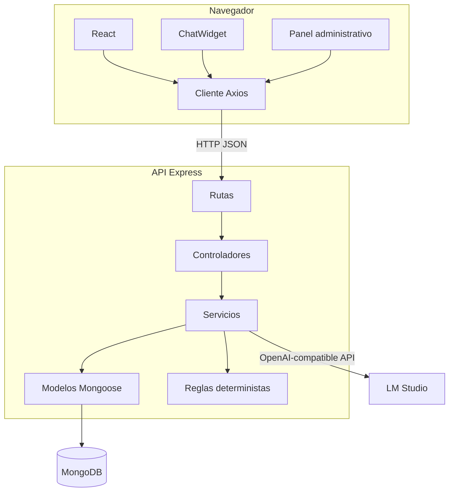
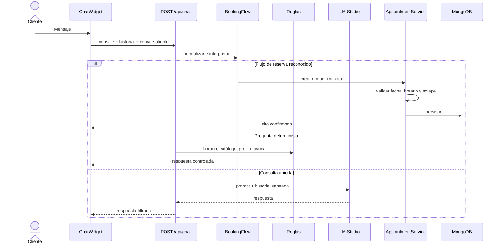

# Arquitectura y decisiones técnicas

## 1. Vista general



La solución es un monolito modular cliente-servidor. Esta elección reduce complejidad operativa y mantiene separadas las responsabilidades sin introducir microservicios innecesarios para el alcance.

## 2. Frontend

### Responsabilidades

- Representar la web pública.
- Mantener la interacción del chatbot.
- Gestionar la sesión administrativa.
- Consumir la API mediante Axios.
- Mostrar estados de carga, error y confirmación.

### Organización

| Carpeta | Responsabilidad |
| --- | --- |
| `components/` | Componentes reutilizables y chatbot |
| `components/admin/` | Formularios administrativos |
| `context/` | Sesión y autenticación |
| `data/` | Contenido de contingencia visual |
| `pages/` | Vistas públicas y privadas |
| `services/` | Cliente HTTP |
| `styles/` | Sistema visual global |
| `utils/` | Formateo de fechas e importes |

React Router separa `/`, `/admin/login`, `/admin`, `/admin/citas` y `/admin/crear`. `ProtectedRoute` impide renderizar las vistas privadas sin una sesión válida.

## 3. Backend

### Flujo MVC modular

```text
HTTP -> route -> controller -> service -> model -> MongoDB
                         \-> LM Studio
                         \-> reglas de calendario y catálogo
```

- **Rutas:** definen recursos y middleware.
- **Controladores:** traducen HTTP a llamadas de aplicación.
- **Servicios:** contienen las decisiones del dominio.
- **Modelos:** definen persistencia e índices.
- **Middleware:** autenticación y tratamiento de errores.
- **Configuración:** entorno y catálogo oficial.

La lógica no se concentra en los controladores. Por ejemplo, `appointmentController.js` delega creación, actualización y consultas en `appointmentService.js`.

## 4. Flujo de una reserva conversacional



## 5. Persistencia

MongoDB se adapta al proyecto porque las entidades principales son documentos autocontenidos y el volumen esperado es reducido. Mongoose aporta validación, índices y una interfaz consistente.

Los modelos son:

- `Appointment`: cliente, servicio, importe, duración, intervalo, estado, origen y conversación.
- `Admin`: usuario, hash de contraseña y rol.
- `Service`: catálogo sincronizado de las siete opciones.

Los campos `startsAt` y `endsAt` permiten comprobar intersecciones temporales sin depender de cadenas de fecha.

## 6. IA local

LM Studio ofrece un endpoint compatible con OpenAI en `http://127.0.0.1:1234/v1`. El backend envía mensajes con temperatura baja y un prompt de dominio.

La privacidad mejora porque la conversación no necesita salir del equipo. Aun así, el sistema no presupone que el modelo sea infalible:

- Las consultas frecuentes se resuelven sin IA.
- Las entradas se acotan y sanean.
- La respuesta se filtra.
- La agenda solo cambia tras pasar reglas deterministas.
- Si LM Studio cae, se devuelve una respuesta útil y controlada.

## 7. Decisiones clave

### Monolito modular frente a microservicios

Un único backend simplifica instalación, depuración y consistencia. Las fronteras internas ya permiten separar servicios en el futuro si el volumen lo exigiera.

### MongoDB frente a SQL

MongoDB reduce configuración y encaja con documentos de cita. La consistencia necesaria se refuerza con validaciones, índices y serialización local de escrituras.

### Modelo local frente a API externa

LM Studio evita coste por petición y mejora el control sobre los datos. La contrapartida es depender de los recursos del equipo y del servidor local.

### Reglas deterministas frente a confiar en el prompt

El prompt orienta la conversación, pero no puede garantizar fechas, solapes ni permisos. Esas decisiones se implementan como código verificable.

### Catálogo centralizado

`serviceCatalog.js` es la fuente canónica de nombres, precios y duraciones. La web, el chat, el formulario y MongoDB consumen o sincronizan esa misma información.

## 8. Principios aplicados

- Separación de responsabilidades.
- Fuente única de verdad para el catálogo.
- Validación en el servidor.
- Fallo controlado sin confirmaciones falsas.
- Trazabilidad entre requisitos, código y pruebas.
- Complejidad proporcional al alcance.

## 9. Diagramas relacionados

- [Arquitectura por capas](../diagramas/capitulo3/imagenes/01_arquitectura_capas.png)
- [Arquitectura técnica](../diagramas/capitulo3/imagenes/09_arquitectura_tecnica.png)
- [Despliegue local](../diagramas/capitulo3/imagenes/10_despliegue_local.png)
- [Modelo MongoDB](../diagramas/capitulo3/imagenes/11_modelo_datos_mongodb.png)
- [Módulos backend](../diagramas/capitulo3/imagenes/12_modulos_backend.png)
- [Integración con LM Studio](../diagramas/capitulo3/imagenes/13_integracion_chat_lmstudio.png)

[Siguiente: instalación](03-instalacion-y-ejecucion.md) · [Volver al índice](README.md)
