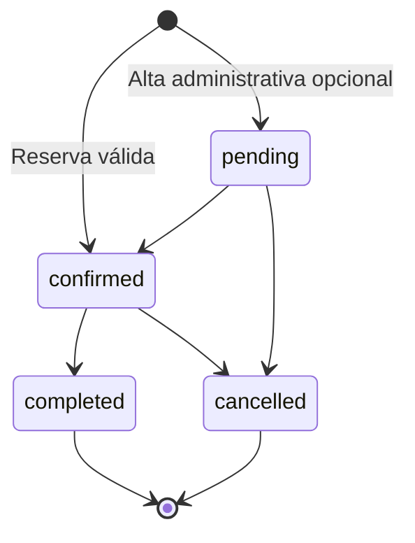

# API REST y modelo de datos

## 1. Convenciones

- Base local: `http://localhost:5000/api`
- Formato: JSON.
- Autenticación privada: `Authorization: Bearer <token>`.
- Éxito: propiedad `success: true`.
- Error: `success`, `message`, `code` y `details`.

## 2. Endpoints

### Salud

| Método | Ruta | Autenticación | Propósito |
| --- | --- | --- | --- |
| GET | `/health` | No | Estado de API, MongoDB y configuración de LM Studio |
| GET | `/health/lmstudio` | No | Disponibilidad y modelos del servidor local |

### Autenticación

| Método | Ruta | Autenticación | Propósito |
| --- | --- | --- | --- |
| POST | `/auth/login` | No | Validar credenciales y emitir JWT |
| GET | `/auth/me` | Sí | Recuperar el administrador actual |

Ejemplo:

```bash
curl -X POST http://localhost:5000/api/auth/login \
  -H "Content-Type: application/json" \
  -d "{\"username\":\"admin\",\"password\":\"admin123\"}"
```

### Servicios

| Método | Ruta | Autenticación | Propósito |
| --- | --- | --- | --- |
| GET | `/services` | No | Devolver el catálogo oficial sincronizado |

### Chat

| Método | Ruta | Autenticación | Propósito |
| --- | --- | --- | --- |
| POST | `/chat` | No | Procesar consulta, reserva, modificación o cancelación |

Petición:

```json
{
  "message": "Quiero reservar un corte mañana a las seis de la tarde",
  "history": [],
  "conversationId": "chat-1710000000000-a1b2",
  "activeAppointmentId": null
}
```

Respuesta de reserva:

```json
{
  "success": true,
  "reply": "Reserva confirmada",
  "saved": true,
  "appointment": {
    "customerName": "Adrián",
    "service": "Corte",
    "date": "2026-06-15",
    "time": "18:00",
    "price": 20,
    "duration": 30
  },
  "resetActiveAppointment": false
}
```

El endpoint limita mensajes, historial e identificadores. También aplica un máximo de 25 solicitudes por minuto y cliente.

### Citas

Todas las rutas requieren JWT.

| Método | Ruta | Propósito |
| --- | --- |
| GET | `/appointments` | Listar y filtrar |
| GET | `/appointments/stats` | Obtener resumen del dashboard |
| GET | `/appointments/:id` | Consultar una cita |
| POST | `/appointments` | Crear desde administración |
| PATCH | `/appointments/:id` | Editar o cambiar estado |
| DELETE | `/appointments/:id` | Eliminar |

Filtros admitidos:

```text
status=all|pending|confirmed|completed|cancelled
date=YYYY-MM-DD
dateFrom=YYYY-MM-DD
dateTo=YYYY-MM-DD
upcoming=true
sort=asc|desc
```

## 3. Modelo Appointment

| Campo | Tipo | Regla |
| --- | --- | --- |
| `customerName` | String | Obligatorio, 2-80 caracteres |
| `service` | String | Una de las siete opciones |
| `price` | Number | Calculado por servidor |
| `duration` | Number | Calculada por servidor |
| `date` | String | `YYYY-MM-DD` |
| `time` | String | `HH:MM` |
| `startsAt` | Date | Inicio indexado |
| `endsAt` | Date | Fin según duración |
| `status` | String | pending, confirmed, completed, cancelled |
| `source` | String | chat o admin |
| `notes` | String | Hasta 500 caracteres |
| `conversationId` | String | Propiedad de la reserva conversacional |

Índices:

- Inicio, fin y estado para agenda y solapes.
- Cliente, fecha, hora y servicio para búsquedas coherentes.

## 4. Modelo Admin

| Campo | Regla |
| --- | --- |
| `username` | Único, normalizado en minúsculas |
| `passwordHash` | Hash bcrypt; nunca se guarda la contraseña |
| `role` | `admin` |

## 5. Modelo Service

El catálogo persistido contiene:

- Identificador del 1 al 7.
- Clave estable.
- Nombre y descripción.
- Precio.
- Duración en minutos.

La fuente canónica está en `backend/src/config/serviceCatalog.js`. La colección `servicios` se sincroniza para que frontend, chatbot y formularios trabajen con los mismos valores.

## 6. Catálogo oficial

| Opción | Servicio | Precio | Duración |
| --- | --- | ---: | ---: |
| 1 | Corte | 20 € | 30 min |
| 2 | Tinte | 40 € | 60 min |
| 3 | Peinado | 15 € | 20 min |
| 4 | Corte y Peinado | 35 € | 50 min |
| 5 | Tinte y Peinado | 55 € | 80 min |
| 6 | Corte y Tinte | 60 € | 90 min |
| 7 | Corte y Tinte y Peinado | 75 € | 110 min |

## 7. Estados



Solo `pending` y `confirmed` bloquean horario. Una cita completada o cancelada no debe impedir una nueva reserva en ese intervalo.

## 8. Validaciones de dominio

1. Servicio reconocido por el catálogo.
2. Nombre plausible y sin datos mezclados.
3. Fecha y hora con formato válido.
4. Día laborable.
5. Instante futuro.
6. Inicio posterior o igual a las 10:00.
7. Fin anterior o igual a las 20:00.
8. Ausencia de intersección con citas activas.
9. Conversación propietaria para cambios desde el chat.

## 9. Errores principales

| Código | Significado |
| --- | --- |
| `INVALID_CUSTOMER_NAME` | Nombre ausente o no plausible |
| `INVALID_SERVICE` | Servicio fuera del catálogo |
| `INVALID_DATE` / `INVALID_TIME` | Formato no reconocido |
| `PAST_DATETIME` | La cita ya ha pasado |
| `WEEKEND_CLOSED` | Sábado o domingo |
| `OUTSIDE_BUSINESS_HOURS` | No cabe dentro del horario |
| `SLOT_UNAVAILABLE` | Existe un solape activo |
| `APPOINTMENT_NOT_FOUND` | Cita inexistente o de otra conversación |
| `LMSTUDIO_UNAVAILABLE` | IA local no accesible |

[Siguiente: chatbot y reglas](05-chatbot-y-reglas.md) · [Volver al índice](README.md)
