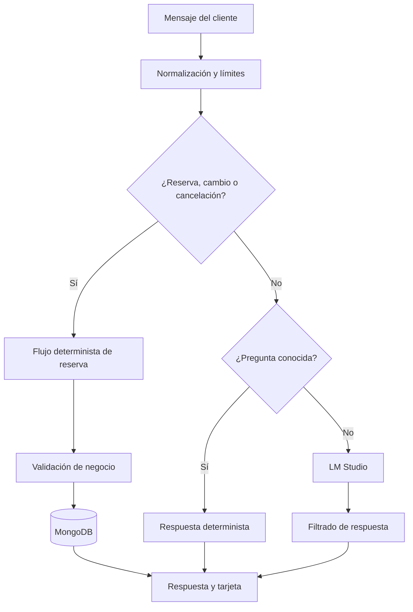

# Chatbot y reglas conversacionales

## 1. Idea principal

El chatbot no es una llamada directa a un modelo de lenguaje. Es un sistema híbrido en el que distintas capas resuelven cada mensaje según el nivel de precisión requerido.

Esta separación evita que una respuesta lingüísticamente convincente se convierta en una reserva incorrecta.

## 2. Componentes

| Componente | Responsabilidad |
| --- | --- |
| `ChatWidget.jsx` | Interfaz, historial, conversación y cita activa |
| `chatRequestService.js` | Saneamiento, límites e identificadores |
| `chatController.js` | Orquestación del pipeline |
| `bookingFlowService.js` | Reserva, modificación y cancelación |
| `chatRuleService.js` | Preguntas frecuentes y protección ante instrucciones ajenas |
| `calendarService.js` | Fechas, días laborables y horas en español |
| `serviceCatalog.js` | Servicios, sinónimos, precio y duración |
| `promptService.js` | Prompt de dominio e historial acotado |
| `lmStudioService.js` | Comunicación con el modelo local |
| `responseParserService.js` | Limpieza y extracción segura |
| `appointmentService.js` | Integridad y persistencia de la agenda |

## 3. Ciclo de una petición

### Paso 1. Entrada controlada

El servidor:

- Rechaza mensajes vacíos.
- Limita cada mensaje a 1.200 caracteres.
- Conserva como máximo 24 elementos de historial.
- Solo acepta roles `user` y `assistant`.
- Elimina caracteres nulos.
- Normaliza identificadores de conversación y cita.

El frontend impide además dobles envíos mediante una referencia síncrona y deshabilita el botón cuando no hay texto.

### Paso 2. Flujo de negocio

`bookingFlowService.js` comprueba primero si el cliente quiere:

- Iniciar una reserva.
- Elegir un servicio.
- Aportar o corregir nombre.
- Indicar fecha u hora.
- Cambiar la cita activa.
- Cancelarla.
- Empezar una reserva nueva.

Solo pregunta por los datos que faltan. Una respuesta compuesta como “me llamo Pepe y quiero un corte” se separa en nombre e intención de servicio.

### Paso 3. Reglas informativas

`chatRuleService.js` responde sin modelo a cuestiones como:

- Saludos.
- Horario.
- Servicios, precios y duración.
- Ubicación y teléfono.
- Fecha u hora actual.
- Capacidades del asistente.
- Ayuda para cancelar.

También detecta intentos de cambiar las instrucciones internas o pedir el prompt.

### Paso 4. IA local

Solo las preguntas abiertas que no han sido resueltas pasan a LM Studio. El prompt:

- Define el rol de peluquería.
- Incluye fecha y hora de Madrid.
- Inyecta el catálogo oficial.
- Limita la conversación al dominio.
- Prohíbe inventar disponibilidad.
- Exige no confirmar sin datos suficientes.

La temperatura baja (`0.2`) favorece respuestas estables.

### Paso 5. Filtrado

La respuesta generativa:

- Se limpia de marcadores técnicos.
- Se limita a 1.800 caracteres.
- No modifica directamente la base de datos.
- Usa una respuesta segura si llega vacía o no es válida.

### Paso 6. Persistencia

La cita solo se guarda después de validar nombre, servicio, fecha, horario, duración y solape. La respuesta de confirmación se muestra después de que MongoDB haya aceptado la operación.

## 4. Comprensión temporal

El sistema entiende:

- Fechas ISO.
- Fechas con barras o guiones.
- “Hoy”, “mañana” y “pasado mañana”.
- Días de la semana.
- “A las seis”.
- “A las seis y media de la tarde”.
- “A las diez menos cuarto”.
- “Al mediodía”.

Las horas ambiguas entre la 1 y las 7 se interpretan dentro del contexto comercial cuando no se especifica mañana, tarde o noche. Todas terminan normalizadas como `HH:MM`.

## 5. Selección de servicios

El cliente puede responder con:

- Número de opción del 1 al 7.
- Nombre completo.
- Sinónimos como “coloración”, “mechas”, “recogido” o “cortar el pelo”.
- Combinaciones.
- Correcciones: “no quiero corte, mejor tinte”.

La lógica respeta negaciones y prioriza la última preferencia explícita.

## 6. Memoria y propiedad

El navegador genera un `conversationId` al abrir la sesión. Cuando el chat crea una cita, se guarda ese identificador. Una modificación posterior exige que la cita siga perteneciendo a la misma conversación.

Esto impide que un cliente modifique una cita ajena simplemente proporcionando o manipulando un identificador.

El `activeAppointmentId` representa la reserva activa en la interfaz. Una cancelación correcta lo reinicia.

## 7. Fallo de LM Studio

Si LM Studio no está disponible:

1. Horarios, catálogo, reservas y otras reglas conocidas siguen funcionando.
2. Las consultas desconocidas reciben una respuesta de contingencia útil.
3. La API responde de forma controlada con `degraded: true`.
4. No se expone un error técnico al cliente.
5. Nunca se confirma una cita que no se haya persistido.

Esta degradación es preferible a convertir la indisponibilidad de IA en una caída total de la aplicación.

## 8. Casos adversos comprobados

- Mensajes vacíos o excesivamente largos.
- Historial con roles no permitidos.
- Intentos de revelar el prompt.
- Negaciones de servicio.
- Cancelaciones expresadas como pregunta o negación.
- Fecha imposible tras una fecha anterior válida.
- Hora inválida tras una hora anterior válida.
- Selección numérica fuera de rango.
- Nombres con órdenes o servicios mezclados.
- Reservas simultáneas sobre el mismo intervalo.
- Modificación desde otra conversación.
- Respuesta de LM Studio vacía o no disponible.

## 9. Garantía técnica y límite del modelo

La garantía central del diseño puede resumirse así:

> “He utilizado un modelo local para la flexibilidad conversacional, pero he mantenido las reglas críticas en servicios deterministas. Por eso el modelo puede ayudar a entender al usuario, pero no puede saltarse el horario, crear solapes ni confirmar una cita no guardada.”

Un chatbot generativo no puede garantizar que toda respuesta libre sea perfecta. La garantía verificable es que los fallos previsibles están acotados, probados y tienen una respuesta controlada, mientras que las operaciones críticas no dependen del modelo.

[Siguiente: calidad y seguridad](06-calidad-seguridad-y-pruebas.md) · [Volver al índice](README.md)
