[Anterior: Capítulo 1](01-introduccion-estado-arte-objetivos-metodologia.md) · [Índice de capítulos](README.md) · [Siguiente: Capítulo 3](03-analisis-diseno.md)

---

**ESCUELA POLITÉCNICA SUPERIOR**

Universidad Europea del Atlántico\
Grado en Ingeniería Informática

**TRABAJO FIN DE GRADO**

**Desarrollo de una plataforma web integral de gestión de citas para la peluquería Corte Perfecto con asistencia inteligente basada en modelos de lenguaje (LLM) de ejecución local**

**Capítulo 2\
Disciplina de requisitos y modelo del dominio**

**Autor:\**
Adrián García Arranz

**Palabras clave:\**
Requisitos · Modelo del dominio · Casos de uso · MongoDB · IA local

Santander, 2026

# CAPÍTULO 2. DISCIPLINA DE REQUISITOS

Este capítulo convierte el contexto presentado en el Capítulo 1 en un contrato de requisitos verificable. Se describen los objetos relevantes del dominio de la peluquería, los actores humanos, los límites del sistema y los casos de uso que guían el desarrollo de la plataforma Corte Perfecto.

## 2.1 Modelo del dominio

El modelo del dominio representa conceptos del negocio, se ha contrastado con el código actual para que las entidades descritas coincidan con la realidad de la aplicación: citas en MongoDB, catálogo numerado, chatbot local y panel de administración.

### 2.1.1 Diagrama de clases del dominio

*Figura 2.1. Diagrama de clases del dominio de Corte Perfecto.*

El diagrama queda deliberadamente simple: el cliente inicia una conversación; la conversación genera o actualiza la cita; la agenda valida y contiene las citas; PeluqueroAdministrador gestiona la agenda; CuentaAdmin representa exclusivamente la parte de acceso y seguridad.

- Cliente: persona que conversa con el asistente y aporta los datos necesarios para reservar.

- Conversación: unidad de contexto del chatbot. Contiene mensajes y puede producir una cita cuando la información está completa.

- Cita: reserva persistida con nombreCliente, servicio, fecha, hora, intervalo, estado, origen y notas.

- Servicio y CatalogoServicios: fuente única de verdad para las siete opciones numeradas, precios y duraciones.

- Agenda y HorarioLaboral: concentran las reglas de disponibilidad, cierre de fin de semana y solapes.

- PeluqueroAdministrador y CuentaAdmin: se separa el rol operativo del peluquero de sus credenciales de acceso, respetando responsabilidad única.

- AsistenteVirtual: interfaz conversacional que atiende mensajes, pero no decide por sí sola las reglas críticas.

### 2.1.2 Diagrama de objetos

El diagrama de objetos muestra una reserva concreta realizada por chat. El administrador no aparece porque no participa en la creación conversacional de esa cita; su papel se modela en los casos de uso del panel privado.

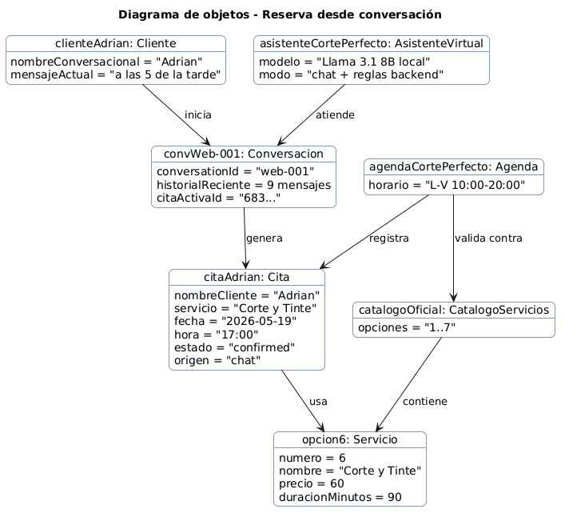

*Figura 2.2. Diagrama de objetos de una reserva desde conversación.*

### 2.1.3 Diagrama de estados

El ciclo de vida refleja que una cita solo queda confirmada cuando el backend valida todos los datos y la persiste. Antes de eso existe una intención de reserva dentro de la conversación.

*Figura 2.3. Estados principales de una cita.*

### 2.1.4 Glosario del dominio

| **Término** | **Definición** |
|----|----|
| Administrador / Peluquero | Persona responsable del negocio que gestiona la agenda desde el panel privado. |
| Agenda | Conjunto de citas y reglas temporales que determinan si un hueco puede reservarse. |
| Asistente virtual | Chatbot web conectado a reglas backend y a LM Studio local para responder en lenguaje natural. |
| Catálogo numerado | Lista oficial de siete servicios que puede elegirse por número para evitar ambigüedad. |
| Cita | Reserva de un servicio en fecha y hora concretas, con duración, precio, estado y origen. |
| Cliente | Persona que consulta la web o solicita una reserva mediante conversación. |
| Conversación | Historial reciente de mensajes que permite mantener nombre, servicio, fecha y hora en contexto. |
| Cuenta admin | Credencial de acceso del peluquero: usuario, hash de contraseña y token JWT de sesión. |
| Estado de cita | Situación operativa de una cita: pending, confirmed, completed o cancelled. |
| Fin de semana | Sábado o domingo. El sistema bloquea reservas y propone viernes o lunes. |
| Horario laboral | Lunes a viernes de 10:00 a 20:00. |
| LM Studio | Servidor local de inferencia con Meta Llama 3.1 8B Instruct. |
| MongoDB | Base de datos documental local con citas, administradores y servicios. |
| Servicio | Prestación de peluquería con precio y duración. |
| Solape | Conflicto entre intervalos startsAt/endsAt de dos citas activas. |
| Validación backend | Comprobación final antes de crear o modificar una cita. |

### 2.1.5 Requisitos suplementarios

| **Código** | **Tipo** | **Descripción** |
|----|----|----|
| RS-01 | Rendimiento | Las operaciones REST sin inferencia LLM deben responder en menos de 1 segundo bajo carga local normal. |
| RS-02 | Rendimiento IA | Las respuestas del chatbot deben tener timeout controlado de 60 segundos frente a LM Studio. |
| RS-03 | Privacidad | Los mensajes no se envían a servicios externos de IA; la inferencia se realiza localmente. |
| RS-04 | Seguridad | Las rutas privadas de administración requieren token JWT válido. |
| RS-05 | Seguridad | La contraseña del administrador se guarda exclusivamente como hash bcrypt. |
| RS-06 | Integridad | No se aceptan nombre inválido, servicio inexistente, fin de semana, hora pasada o fuera de horario. |
| RS-07 | Integridad | No se permiten solapes entre citas activas. |
| RS-08 | Usabilidad | La web y el chat deben funcionar en móvil y escritorio sin instalación. |
| RS-09 | Usabilidad | Los servicios deben poder seleccionarse por número del 1 al 7. |
| RS-10 | Compatibilidad | La aplicación debe funcionar en navegadores modernos. |
| RS-11 | Mantenibilidad | El backend mantiene separación MVC y servicios con responsabilidades específicas. |
| RS-12 | Extensibilidad | Añadir servicios debe centralizarse en el catálogo y no duplicarse en múltiples capas. |
| RS-13 | Disponibilidad local | La ejecución en localhost requiere Node.js, MongoDB y LM Studio activos. |
| RS-14 | Trazabilidad | Cada cita registra timestamps y origen chat/admin. |
| RS-15 | Robustez | Si LM Studio falla, la API responde de forma controlada sin romper la interfaz. |

## 2.2 Diagrama de contexto

El contexto conserva únicamente dos actores humanos: Cliente y Administrador/Peluquero. MongoDB y LM Studio no son actores de negocio, sino sistemas externos/locales con los que se integra la aplicación.

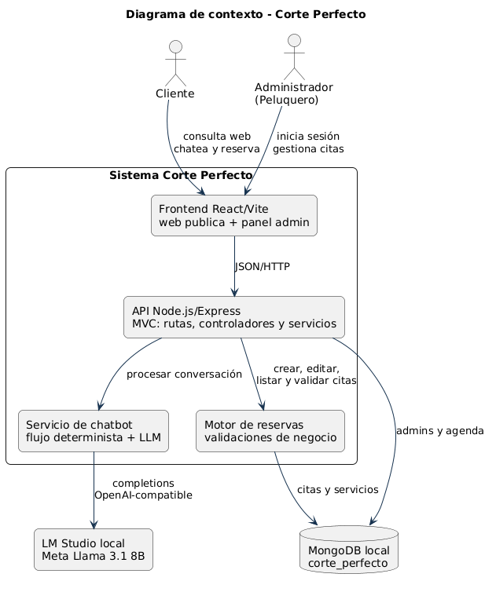

*Figura 2.4. Diagrama de contexto del sistema.*

## 2.3 Actores del sistema

| **Actor** | **Tipo** | **Descripción** |
|:---|:---|:---|
| Cliente | Principal | Consulta la web, pregunta por horarios o servicios, conversa con el chatbot, elige servicio por número y solicita o modifica una reserva activa. |
| Administrador / Peluquero | Principal | Inicia sesión en el panel privado, revisa estadísticas, filtra citas, crea reservas manuales, edita, marca como completadas, elimina citas y cierra sesión. |

## 2.4 Casos de uso

### 2.4.1 Diagrama de casos de uso

Para mantener legibilidad, los casos de uso se separan por actor humano. Esta decisión evita un diagrama único demasiado denso y mantiene claro qué responsabilidades corresponden al cliente y cuáles al peluquero.

*Figura 2.5. Casos de uso del cliente.*

*Figura 2.6. Casos de uso del administrador.*

### 2.4.2 Priorización de casos de uso

| **Código** | **Caso de uso** | **Actor principal** | **Prioridad** |
|----|----|----|----|
| UC-01 | Consultar web pública | Cliente | Media |
| UC-02 | Consultar servicios y precios | Cliente | Alta |
| UC-03 | Pedir detalle de una opción | Cliente | Media |
| UC-04 | Abrir chat y enviar mensaje | Cliente | Alta |
| UC-05 | Reservar cita por chatbot | Cliente | Alta |
| UC-06 | Elegir servicio por número | Cliente | Alta |
| UC-07 | Aportar nombre, día y hora | Cliente | Alta |
| UC-08 | Recibir confirmación y tarjeta | Cliente | Alta |
| UC-09 | Modificar reserva activa por chat | Cliente | Media |
| UC-10 | Iniciar sesión administrador | Administrador | Alta |
| UC-11 | Ver dashboard | Administrador | Media |
| UC-12 | Listar, filtrar y ordenar citas | Administrador | Alta |
| UC-13 | Crear cita manual | Administrador | Alta |
| UC-14 | Editar cita | Administrador | Alta |
| UC-15 | Marcar cita completada | Administrador | Media |
| UC-16 | Eliminar cita | Administrador | Media |
| UC-17 | Cerrar sesión | Administrador | Media |

### 2.4.3 Detalle de casos de uso

Se detallan los casos más importantes y se agrupan los más sencillos cuando comparten flujo. Las reglas técnicas de validación aparecen como pasos internos, no como actores adicionales.

#### UC-01: Consultar web pública

| **Campo** | **Descripción** |
|----|----|
| Actor principal | Cliente |
| Descripción | El cliente visualiza la página de Corte Perfecto con servicios, packs, opiniones y contacto. |
| Precondiciones | El frontend está disponible. |
| Postcondiciones | El cliente conoce la oferta y puede iniciar una reserva. |
| Prioridad | Media |

**Flujo principal:**

1.  El cliente entra en la web.

2.  El sistema muestra inicio, servicios, combinaciones, nosotros, opiniones y contacto.

3.  El cliente puede abrir el chat o navegar por las secciones.

**Flujos alternativos:**

- FA-01: si el backend no está activo, la información estática se muestra, pero no pueden registrarse citas.

#### UC-02/03: Consultar servicios, precios y detalle de opción

| **Campo** | **Descripción** |
|----|----|
| Actor principal | Cliente |
| Descripción | El cliente consulta precios o pregunta por una opción numerada concreta. |
| Precondiciones | El catálogo oficial está disponible. |
| Postcondiciones | El cliente conoce precio, duración y contenido del servicio. |
| Prioridad | Alta / Media |

**Flujo principal:**

1.  El cliente pregunta por servicios, precios u opción concreta.

2.  El sistema devuelve la lista numerada del 1 al 7.

3.  Si pregunta por una opción, explica el servicio sin interpretarlo como fecha.

4.  El cliente puede continuar hacia la reserva.

**Flujos alternativos:**

- FA-01: si introduce un número fuera del 1 al 7, el sistema vuelve a mostrar la lista.

#### UC-05: Reservar cita por chatbot

| **Campo** | **Descripción** |
|----|----|
| Actor principal | Cliente |
| Descripción | El cliente completa una reserva conversando con el asistente. |
| Precondiciones | MongoDB y backend están activos; LM Studio aporta respuesta natural cuando hace falta. |
| Postcondiciones | La cita queda registrada con origen chat. |
| Prioridad | Alta |

**Flujo principal:**

1.  El cliente expresa intención de reservar.

2.  El sistema pide nombre si no existe en el historial.

3.  El sistema pide servicio o muestra el catálogo numerado.

4.  El cliente aporta día y hora.

5.  El backend valida nombre, servicio, fecha laborable, hora futura, horario y solapes.

6.  La cita se guarda en MongoDB.

7.  El cliente recibe confirmación y tarjeta visual.

**Flujos alternativos:**

- FA-01: si la fecha cae en fin de semana, se propone viernes o lunes sin pedir hora.

- FA-02: si la hora ya ha pasado o está fuera de 10:00-20:00, se pide otra hora.

- FA-03: si existe solape, se informa del conflicto y se solicita otra hora.

#### UC-09: Modificar reserva activa por chat

| **Campo** | **Descripción** |
|----|----|
| Actor principal | Cliente |
| Descripción | El cliente modifica servicio, día u hora de una reserva activa dentro de la conversación. |
| Precondiciones | La conversación tiene una cita activa o datos suficientes para localizar la intención. |
| Postcondiciones | La cita queda actualizada si supera validaciones. |
| Prioridad | Media |

**Flujo principal:**

1.  El cliente pide cambiar día, hora o añadir/quitar servicio.

2.  El sistema conserva nombre y datos ya conocidos.

3.  El backend recalcula servicio, precio, duración e intervalo.

4.  Se validan horario, fecha futura y solapes.

5.  La cita se actualiza en MongoDB.

**Flujos alternativos:**

- FA-01: si el nuevo hueco no es válido, se mantiene la reserva anterior y se solicita corrección.

#### UC-10: Iniciar sesión administrador

| **Campo** | **Descripción** |
|----|----|
| Actor principal | Administrador / Peluquero |
| Descripción | El peluquero accede al panel privado con credenciales. |
| Precondiciones | Existe una cuenta admin sembrada en MongoDB. |
| Postcondiciones | El frontend guarda un token JWT y permite acceder al panel. |
| Prioridad | Alta |

**Flujo principal:**

1.  El administrador abre /admin/login.

2.  Introduce usuario y contraseña.

3.  El backend compara la contraseña con bcrypt.

4.  Si es correcta, firma un token JWT.

5.  El panel carga la sesión y redirige al dashboard.

**Flujos alternativos:**

- FA-01: credenciales incorrectas producen error y no crean sesión.

#### UC-12: Listar, filtrar y ordenar citas

| **Campo** | **Descripción** |
|----|----|
| Actor principal | Administrador / Peluquero |
| Descripción | El peluquero consulta la agenda por estado, fechas y orden. |
| Precondiciones | Sesión administrativa válida. |
| Postcondiciones | La tabla muestra las citas que cumplen los filtros. |
| Prioridad | Alta |

**Flujo principal:**

1.  El administrador entra en Gestión de Citas.

2.  La interfaz solicita la lista a /api/appointments.

3.  El administrador aplica estado, fecha desde, fecha hasta u orden.

4.  El backend consulta MongoDB y devuelve la lista.

5.  La tabla muestra cliente, servicio, fecha, estado, importe y acciones.

**Flujos alternativos:**

- FA-01: si no hay resultados, se muestra un estado vacío.

#### UC-13/14/15/16: Crear, editar, completar o eliminar cita

| **Campo** | **Descripción** |
|----|----|
| Actor principal | Administrador / Peluquero |
| Descripción | El panel permite gestionar manualmente el ciclo de vida de las citas. |
| Precondiciones | Sesión válida y, salvo creación, cita existente. |
| Postcondiciones | La cita queda creada, actualizada, completada o eliminada. |
| Prioridad | Alta / Media |

**Flujo principal:**

1.  El administrador elige crear, editar, completar o eliminar.

2.  Para crear/editar, introduce nombre, servicio, fecha, hora y notas.

3.  El backend valida las reglas de agenda.

4.  Para completar, el estado pasa a completed.

5.  Para eliminar, se confirma la acción y se borra el registro.

**Flujos alternativos:**

- FA-01: si al crear o editar hay solape o dato inválido, la operación se rechaza con mensaje específico.

### 2.4.4 Diagramas de comportamiento de casos críticos

Los flujos críticos son la reserva por chatbot, su confirmación técnica y la gestión administrativa. Estos diagramas reflejan la separación de responsabilidades: interfaz, controlador, servicio de conversación, servicio de citas y persistencia.

*Figura 2.7. Actividad principal de reserva por chatbot.*

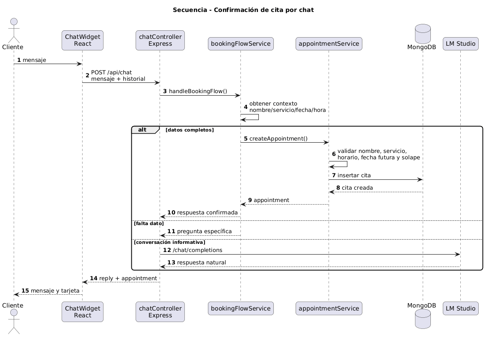

*Figura 2.8. Secuencia técnica de confirmación de cita por chat.*

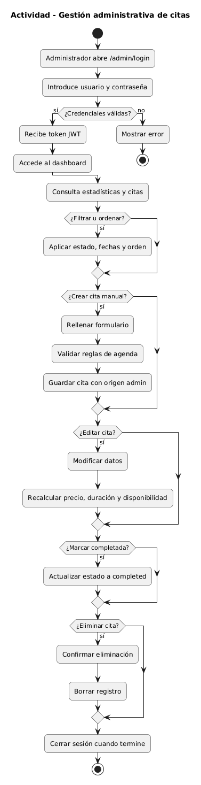

*Figura 2.9. Actividad de gestión administrativa de citas.*

### 2.4.5 Matriz de trazabilidad RS-UC

| **Requisito** | **Casos relacionados** | **Justificación** |
|:---|:---|:---|
| RS-01 | UC-01, UC-02, UC-10, UC-12, UC-13, UC-14 | Las operaciones CRUD y consultas dependen de respuesta rápida de API. |
| RS-02 | UC-04, UC-05, UC-09 | La conversación puede depender de LM Studio. |
| RS-03 | UC-04, UC-05, UC-09 | El chatbot trabaja con IA local. |
| RS-04 | UC-10, UC-11, UC-12, UC-13, UC-14, UC-15, UC-16, UC-17 | Todo el panel privado requiere JWT. |
| RS-05 | UC-10 | El login usa bcrypt. |
| RS-06 | UC-05, UC-07, UC-13, UC-14 | Toda reserva exige datos válidos. |
| RS-07 | UC-05, UC-09, UC-13, UC-14 | La agenda impide solapes. |
| RS-08 | UC-01, UC-04, UC-12 | La web y el chat deben ser cómodos en móvil y escritorio. |
| RS-09 | UC-02, UC-03, UC-05, UC-06 | El catálogo numerado reduce errores del chatbot. |
| RS-10 | UC-01, UC-04, UC-10, UC-12 | Las pantallas principales deben funcionar en navegadores modernos. |
| RS-11 | Todos | MVC y servicios separados facilitan mantenimiento. |
| RS-12 | UC-02, UC-03, UC-05, UC-13, UC-14 | El catálogo central se reutiliza en web, chat y panel. |
| RS-13 | Todos | La ejecución local requiere servicios activos. |
| RS-14 | UC-05, UC-09, UC-12, UC-13, UC-14, UC-15 | Origen y timestamps permiten auditar citas. |
| RS-15 | UC-04, UC-05, UC-09 | El fallo de LM Studio no debe romper la aplicación. |

### 2.4.6 Prototipos de los casos de uso

| **Prototipo** | **Pantalla** | **Casos** | **Comportamiento esperado** |
|:---|:---|:---|:---|
| P-01 | Web pública | UC-01, UC-02, UC-03 | Landing con navegación, servicios, packs, opiniones, contacto y botón de reserva con IA. |
| P-02 | Widget de chat | UC-04, UC-05, UC-06, UC-07, UC-08, UC-09 | Ventana flotante, historial con autoscroll, entrada de texto, catálogo numerado y tarjeta de cita. |
| P-03 | Login admin | UC-10 | Formulario con usuario, contraseña, validación y acceso al panel. |
| P-04 | Dashboard | UC-11 | KPIs de citas, ingresos estimados y próximas reservas. |
| P-05 | Gestión de citas | UC-12, UC-14, UC-15, UC-16 | Filtros, ordenación, tabla y acciones por fila. |
| P-06 | Crear cita | UC-13 | Formulario manual con las mismas validaciones que el chatbot. |

P-01

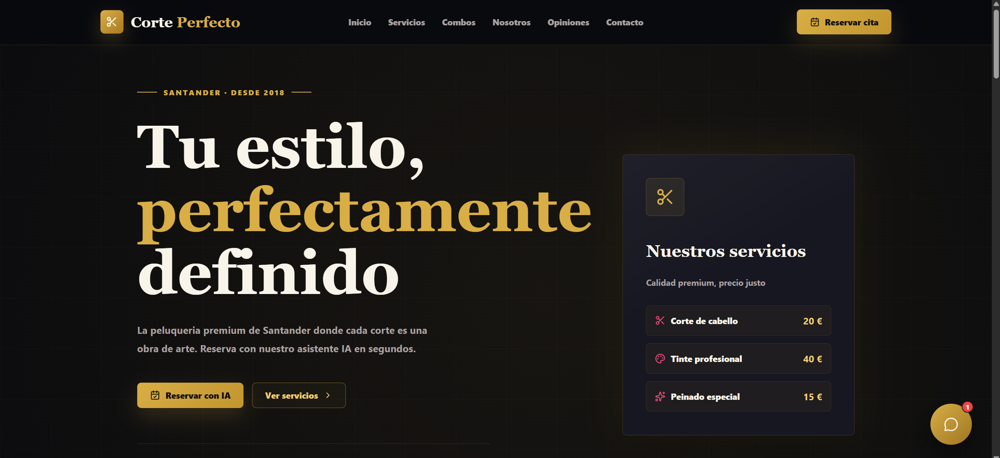

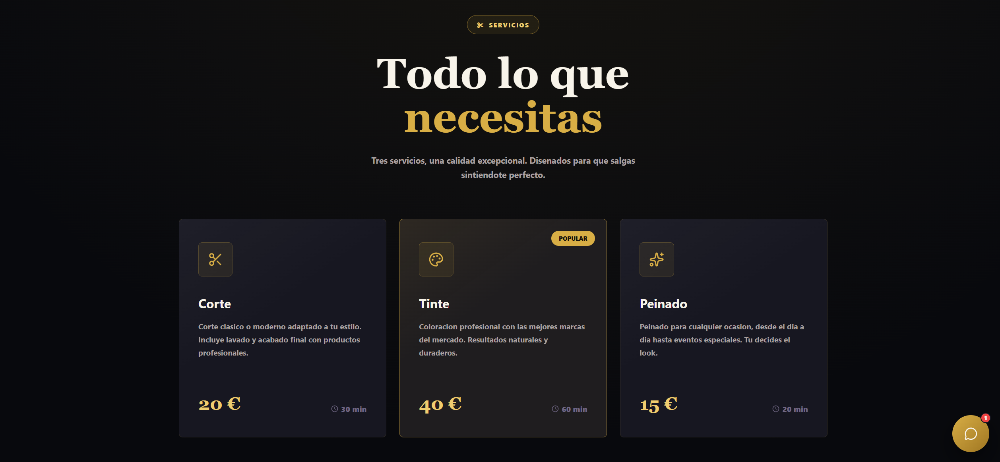

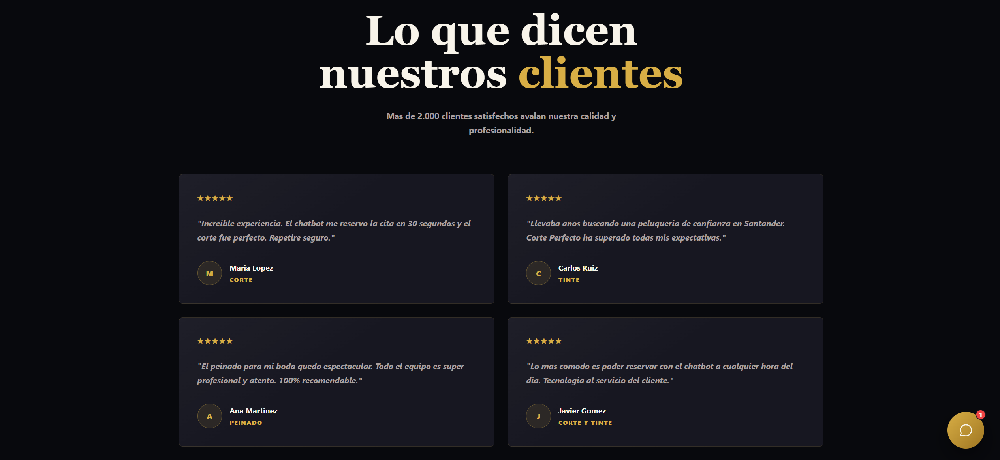

P-02

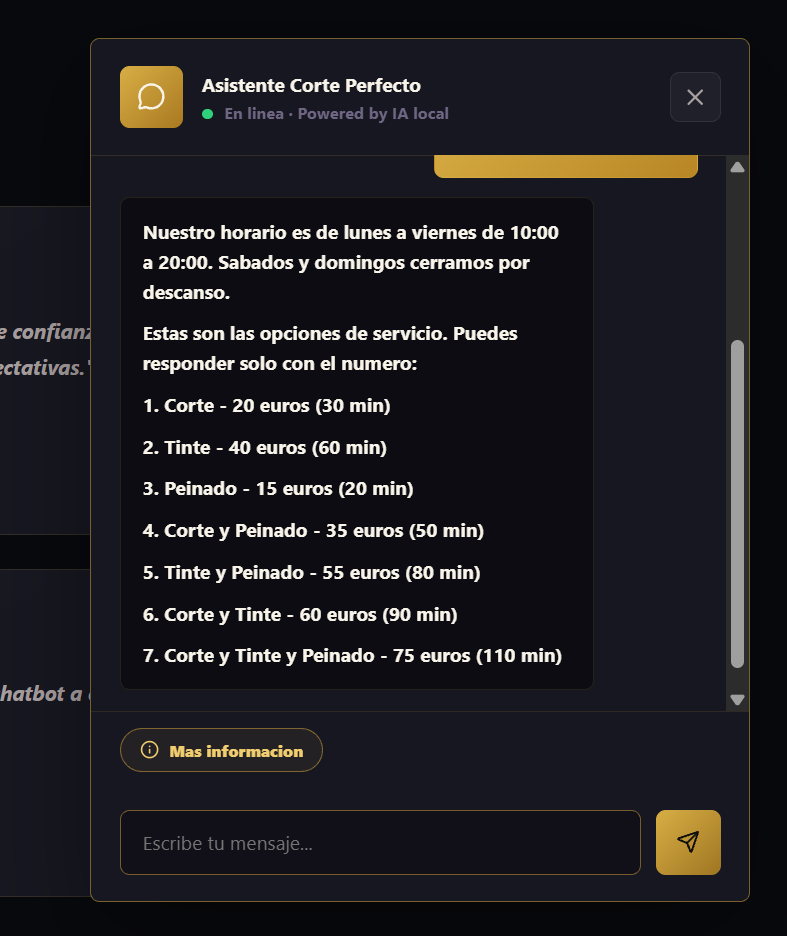 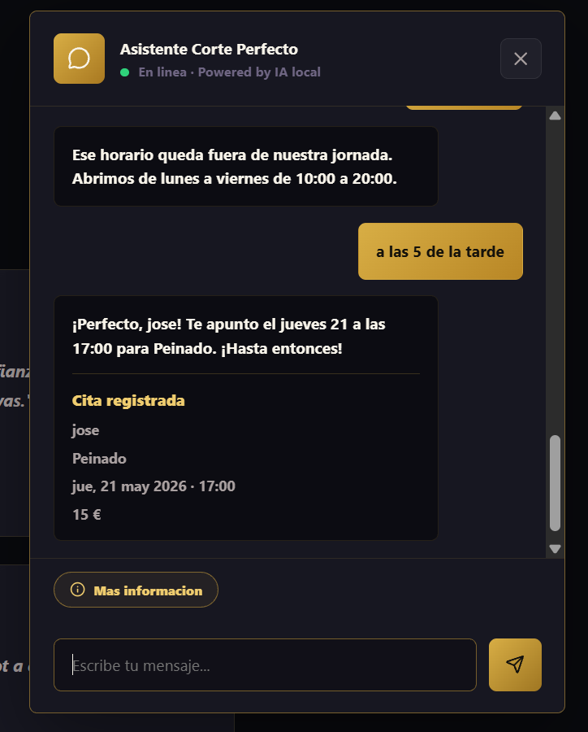

P-03

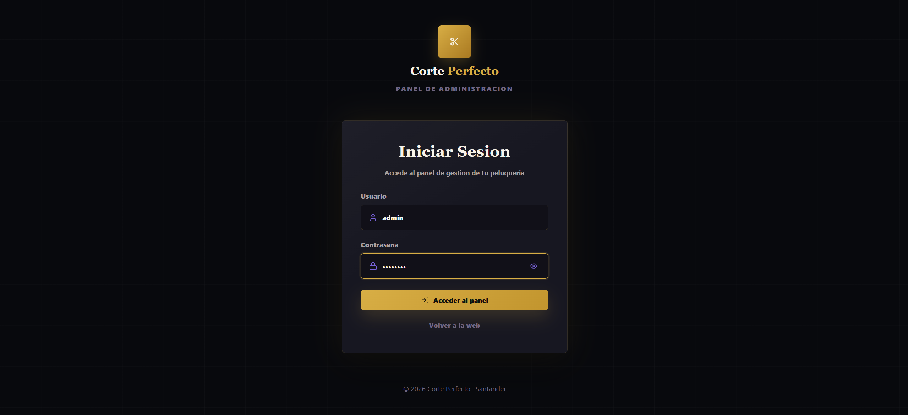

P-04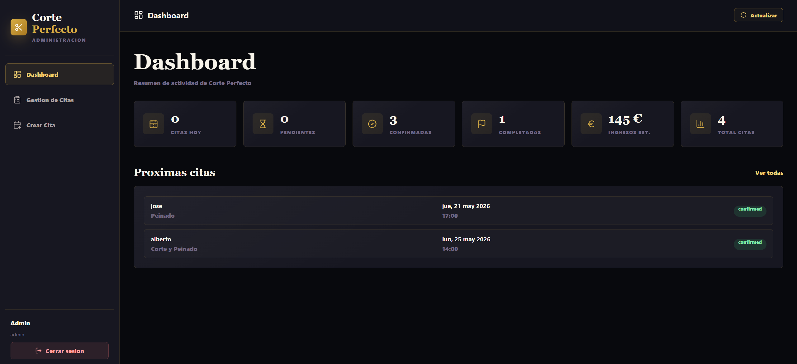

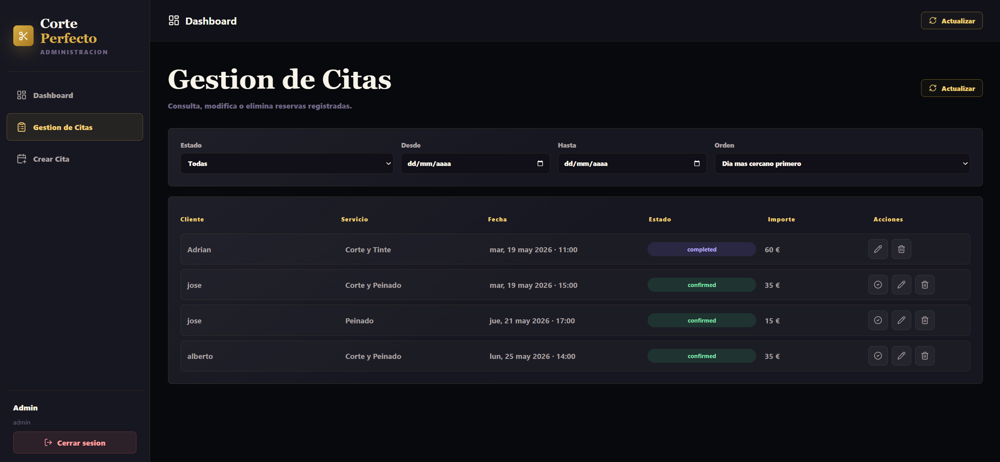

P-05

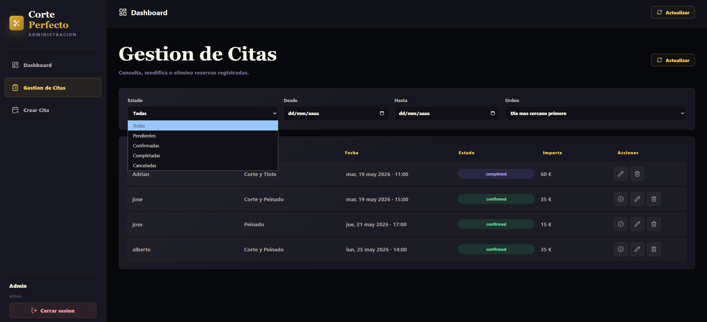

P-06

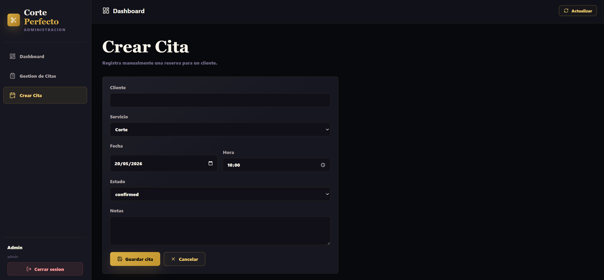

### 2.4.7 Trazabilidad RUP y seguimiento de casos de uso

Además, se incorpora una trazabilidad viva que conecta requisitos, análisis, diseño, código y pruebas. Esta evidencia no sustituye a los diagramas del capítulo, sino que permite comprobar que cada caso de uso importante tiene reflejo en módulos reales del sistema.

| **Artefacto** | **Evidencia** | **Ubicación** |
|:---|:---|:---|
| Matriz UC a implementación | Relaciona cada caso de uso con controlador, servicio, modelo y prueba. | RUP/99-seguimiento/trazabilidad-casos-uso.md |
| Dashboard RUP | Resume el estado de implementación y verificación de los 17 casos de uso. | RUP/99-seguimiento/estado-casos-uso.puml |
| Auditoría diseño-código | Comprueba que el diseño del Capítulo 3 se refleja en el proyecto real. | RUP/99-seguimiento/auditoria-diseno-implementacion.md |
| Pruebas backend | Verifican reglas críticas de agenda, chatbot y citas. | backend/tests/ |

### 2.4.8 Criterios de aceptación verificables

Los casos de uso críticos se cierran con criterios de aceptación ejecutables. De esta forma, la especificación deja de ser únicamente descriptiva y pasa a estar respaldada por comprobaciones automáticas.

| **Regla de negocio** | **Caso de uso** | **Evidencia** |
|:---|:---|:---|
| No registrar citas en sábado o domingo. | UC-05, UC-07, UC-13, UC-14 | calendarService.test.js y appointmentService.test.js |
| No aceptar horas pasadas ni fuera de 10:00 a 20:00. | UC-05, UC-07, UC-13, UC-14 | appointmentService.test.js |
| No aceptar nombres inválidos o genéricos. | UC-05, UC-07 | bookingFlowService.test.js y appointmentService.test.js |
| No solapar citas activas. | UC-05, UC-09, UC-13, UC-14 | appointmentService.test.js |
| Aceptar selección de servicios por número 1..7. | UC-03, UC-06 | bookingFlowService.test.js |

## Resumen del capítulo

El capítulo deja definido el dominio y los requisitos de Corte Perfecto con una regla de diseño clara: el cliente reserva a través de la conversación, y la cita solo se confirma cuando el backend valida y persiste la información. Los actores humanos son Cliente y Administrador/Peluquero, mientras que MongoDB y LM Studio se tratan como sistemas de apoyo.

Esta base permite pasar al Capítulo 3 con una arquitectura más limpia: frontend React/Vite, backend Node.js/Express organizado en MVC, servicios de negocio con responsabilidad única, catálogo centralizado y persistencia MongoDB.

---

[Anterior: Capítulo 1](01-introduccion-estado-arte-objetivos-metodologia.md) · [Índice de capítulos](README.md) · [Siguiente: Capítulo 3](03-analisis-diseno.md)
