[Anterior: Capítulo 2](02-requisitos-modelo-dominio.md) · [Índice de capítulos](README.md) · [Siguiente: Capítulo 4](04-implementacion-mapa-solucion.md)

---

**ESCUELA POLITÉCNICA SUPERIOR\**
Universidad Europea del Atlántico\
Grado en Ingeniería Informática

**TRABAJO FIN DE GRADO**

**Desarrollo de una plataforma web integral de gestión de citas para la peluquería Corte Perfecto\**
con asistente inteligente basado en modelos de lenguaje ejecutados localmente

**Capítulo 3\
Análisis y Diseño**

**Autor:\
Adrián García Arranz\**
Aplicación: Corte Perfecto · Santander\
Stack: React/Vite · Node.js/Express · MongoDB · LM Studio

Santander, 2026

# CAPÍTULO 3. ANÁLISIS Y DISEÑO

Este capítulo transforma los requisitos definidos en el capítulo anterior en una solución técnica concreta. La disciplina de análisis mantiene una abstracción cercana al problema, estructurada en arquitectura, casos de uso, clases y paquetes. La disciplina de diseño aterriza esa estructura en decisiones implementables: componentes React, rutas Express, servicios de negocio, esquemas Mongoose, integración con MongoDB y comunicación con LM Studio.

La decisión de diseño principal es mantener la simplicidad operativa: la aplicación se ejecuta en localhost, separa frontend y backend, conserva el patrón MVC en el servidor y encapsula las reglas críticas de agenda en servicios de negocio. Así, el modelo de IA ayuda a conversar, pero no decide por sí solo si una cita es válida.

## 3.1 Disciplina de análisis

El análisis actúa como puente entre los requisitos y el diseño. Según el enfoque trabajado en IdSw, añade formalismo sin caer todavía en detalles accidentales de implementación. Por ello se describen clases de análisis, objetos de control, vistas y paquetes, prestando atención a cohesión, bajo acoplamiento, responsabilidad única y trazabilidad.

### 3.1.1 Análisis de la arquitectura

La primera decisión arquitectónica consiste en escoger un estilo que encaje con el tamaño del proyecto, el contexto local de ejecución y los requisitos suplementarios. En este TFG no se busca una plataforma multiempresa, sino una solución completa, comprensible y mantenible para una peluquería concreta.

| **Estilo** | **Ventajas para Corte Perfecto** | **Limitaciones** |
|:---|:---|:---|
| Monolito MVC tradicional | Despliegue sencillo y baja complejidad inicial. | Acopla presentación y lógica; dificulta evolucionar chat, panel y API por separado. |
| Microservicios | Escalabilidad y despliegues independientes por módulo. | Complejidad excesiva para un TFG y para una ejecución local con MongoDB y LM Studio. |
| Cliente-servidor con API REST | Separación clara entre React/Vite y Node.js/Express; facilita panel, chat e integración con IA local. | Requiere gestionar estado en cliente, tokens y errores HTTP. |
| Serverless | Menor gestión de infraestructura en nube. | No encaja con la inferencia local de LM Studio ni con el objetivo de localhost. |

Se adopta una arquitectura cliente-servidor con API REST. El frontend React/Vite concentra la experiencia de usuario y el backend Node.js/Express concentra seguridad, validación, persistencia y coordinación con LM Studio. Esta elección se alinea con RS-03, RS-04, RS-06, RS-07, RS-11, RS-12 y RS-13.

En análisis conviene representar primero las capas conceptuales, porque es más fácil explicar responsabilidades y dependencias que con un diagrama técnico de componentes. Por ello la arquitectura se organiza en cuatro capas lógicas:

| **Capa** | **Responsabilidad** | **Tecnología / módulos** |
|:---|:---|:---|
| Presentación | Interfaz pública, widget de chat, login y panel administrativo. | React 19, Vite 7, React Router, componentes JSX, Axios. |
| Aplicación | Enrutado REST, controladores, seguridad, serialización JSON y coordinación de casos de uso. | Express 5, routes, controllers, middleware, JWT, rate-limit. |
| Dominio | Reglas de negocio de cita, catálogo, horario, solapes, estados y conversación. | appointmentService, bookingFlowService, calendarService, serviceCatalog. |
| Infraestructura | Persistencia documental, hash de contraseñas e inferencia local. | MongoDB, Mongoose, bcrypt, LM Studio API compatible con OpenAI. |

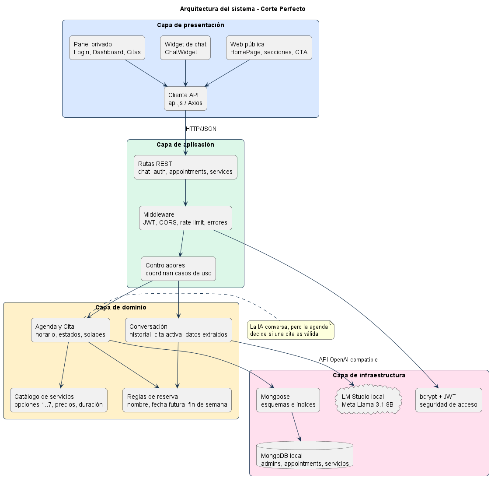

*Figura 3.1. Arquitectura lógica por capas de Corte Perfecto.*

La regla de dependencia es descendente: las vistas consumen casos de uso, los controladores coordinan, el dominio decide las reglas y la infraestructura adapta tecnologías externas. La IA local queda deliberadamente fuera del dominio: puede redactar una respuesta, pero la validez de la cita siempre la decide la agenda.

### 3.1.2 Análisis de casos de uso

No todos los casos de uso tienen el mismo peso arquitectónico. Para el análisis detallado se seleccionan los que obligan a tomar decisiones internas: consulta de catálogo numerado, reserva por chatbot, modificación de reserva activa, autenticación administrativa y gestión completa de citas. Cada uno se analiza con objetos de vista, control y modelo.

| **Caso** | **Objetos de análisis principales** | **Decisión de análisis** |
|:---|:---|:---|
| UC-02/03 Consultar servicios y detalle | VistaChat, VistaWebPublica, ConsultarServiciosController, CatalogoServicios, Servicio. | El catálogo 1..7 evita ambigüedad y permite responder por número sin interpretar una opción como fecha. |
| UC-05 Reservar cita por chatbot | VistaChat, ReservarCitaChatController, Conversacion, CatalogoServicios, Agenda, Cita. | El backend valida la reserva antes de persistirla; el LLM no es fuente de verdad. |
| UC-09 Modificar reserva activa | VistaChat, ModificarReservaChatController, Conversacion, Agenda, Cita. | Se reutiliza la cita activa y se recalculan servicio, precio, duración e intervalo. |
| UC-10 Iniciar sesión administrador | VistaLoginAdmin, LoginAdminController, CuentaAdmin. | La autenticación se separa del dominio de citas mediante hash bcrypt y token JWT. |
| UC-12/13/14/15/16 Gestión de citas | VistaGestionCitas, VistaFormularioCita, GestionarCitasController, Agenda, Cita. | El panel usa las mismas reglas de agenda que el chatbot para evitar duplicidad. |

### Análisis UC-02/03: consultar servicios, precios y detalle de opción

Este caso de uso es importante porque reduce errores conversacionales: el cliente puede pedir información general o preguntar por una opción concreta. El sistema no debe interpretar “opción 4” como una fecha, sino como “Corte y Peinado”.

1.  El cliente pregunta por servicios, precios u opción concreta.

2.  La vista envía la consulta al controlador o al flujo de reglas del chat.

3.  El catálogo devuelve siempre las siete opciones oficiales con precio y duración.

4.  Si el número está entre 1 y 7, se explica el servicio; si no, se repite la lista.

5.  No se crea ninguna cita hasta que el cliente exprese intención clara de reservar.

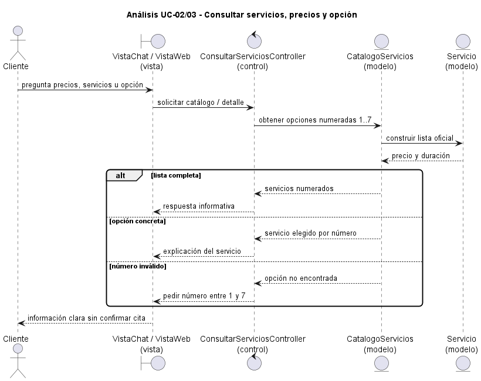

*Figura 3.2. Análisis del caso de uso UC-02/03.*

### Análisis UC-05: reservar cita por chatbot

El flujo de reserva se analiza como una colaboración entre la vista conversacional, un controlador de chat, servicios de flujo y entidades de dominio. El cliente puede expresarse en lenguaje natural, pero la confirmación solo se produce cuando existen nombre, servicio, fecha y hora válidos.

1.  El cliente escribe en el widget de chat.

2.  La vista envía mensaje, historial y conversationId al controlador.

3.  El controlador intenta resolver primero el flujo determinista de reserva.

4.  El catálogo traduce números 1..7 y sinónimos a un servicio oficial.

5.  La agenda valida nombre, horario, fecha futura, cierre de fin de semana y solapes.

6.  Si todo es correcto, se crea la cita y se devuelve una tarjeta de confirmación.

7.  Si LM Studio no responde, el sistema no confirma ni inventa una cita: devuelve un mensaje controlado de reintento y mantiene activa la validación determinista.

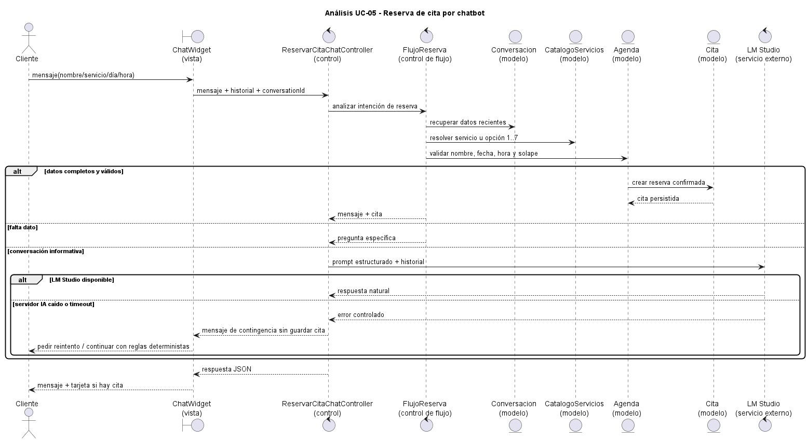

*Figura 3.3. Análisis del caso de uso UC-05.*

### Análisis UC-09: modificar reserva activa por chat

La modificación no se modela como una reserva nueva. Mientras el cliente no indique “otra cita” o “nueva reserva”, la conversación conserva una cita activa y aplica los cambios sobre ella.

1.  El cliente solicita cambiar día, hora o servicio.

2.  El controlador recupera la cita activa mediante activeAppointmentId y el contexto reciente.

3.  El catálogo recalcula servicio, precio y duración si cambia el servicio.

4.  La agenda valida de nuevo horario, fin de semana, fecha futura y solapes.

5.  Si el cambio es válido, se actualiza la cita; si no, se conserva la reserva anterior.

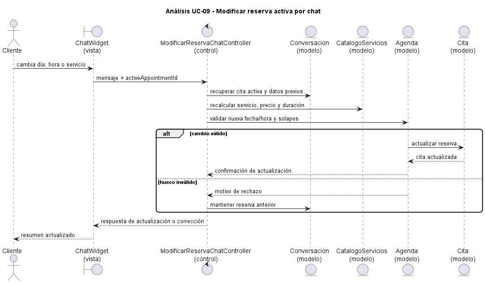

*Figura 3.4. Análisis del caso de uso UC-09.*

### Análisis UC-10: iniciar sesión administrador

El administrador/peluquero es un actor humano, pero la cuenta administrativa se modela como una clase de seguridad. Su objetivo no es representar a una persona dentro del dominio de citas, sino autorizar el uso del panel privado.

1.  El administrador introduce usuario y contraseña.

2.  El controlador busca la cuenta por username.

3.  La contraseña se compara con bcrypt frente al hash almacenado.

4.  Si es correcta, se firma un JWT con identificador y rol.

5.  Si es incorrecta, no se crea sesión y la vista muestra error.

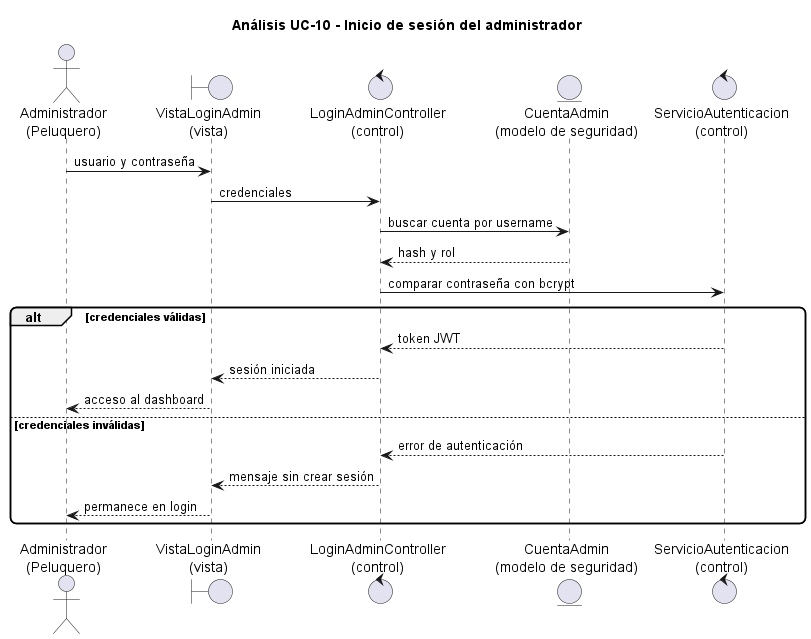

*Figura 3.5. Análisis del caso de uso UC-10.*

### Análisis UC-12/13/14/15/16: gestión administrativa de citas

La gestión administrativa agrupa listar, filtrar, ordenar, crear, editar, completar y eliminar citas. Se analiza junta porque todas las variantes comparten el mismo actor, la misma vista privada y la misma entidad central: Agenda.

1.  El administrador accede a Gestión de Citas con sesión válida.

2.  El panel solicita listados filtrados por estado, fecha y orden.

3.  Al crear o editar, se invocan las mismas reglas de horario, servicio y solape que usa el chatbot.

4.  Al completar, se actualiza el estado a completed.

5.  Al eliminar, se borra la cita tras confirmación de la acción.

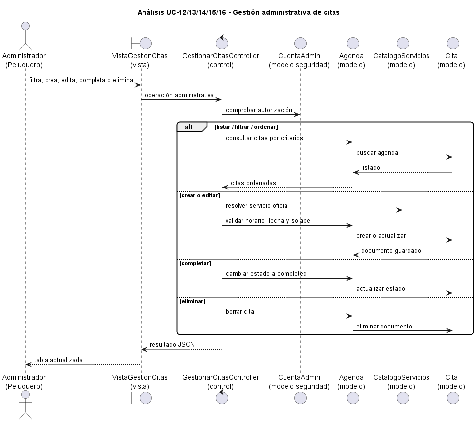

*Figura 3.6. Análisis de los casos de uso administrativos UC-12/13/14/15/16.*

### 3.1.3 Análisis de clases

Partiendo del modelo de dominio del Capítulo 2 y de los casos de uso, las clases de análisis se clasifican en modelo, vista y controlador. Esta clasificación no es todavía código definitivo; sirve para repartir responsabilidades y detectar dependencias antes de diseñar los módulos reales.

*Figura 3.7. Clases de análisis clasificadas por MVC.*

El diagrama distingue clases de vista, control y modelo. Las relaciones se limitan a las colaboraciones necesarias para ejecutar los casos de uso: las vistas invocan controladores, los controladores coordinan objetos de negocio y el modelo conserva las entidades conceptuales de conversación, agenda, cita, servicio y cuenta administrativa.

| **Clase modelo** | **Origen** | **Responsabilidad** |
|:---|:---|:---|
| Cliente | Actor cliente | Persona que conversa con el asistente y aporta datos de reserva. |
| Conversacion | Chatbot | Mantener contexto reciente, datos conocidos y cita activa. |
| Mensaje | Chatbot | Representar un intercambio usuario/asistente dentro del historial. |
| Cita | Dominio | Reserva persistida con fecha, hora, servicio, precio, duración, estado y origen. |
| EstadoCita | Dominio | Controlar ciclo de vida: pending, confirmed, completed, cancelled. |
| Servicio | Dominio | Servicio o combinación oficial con precio y duración. |
| CatalogoServicios | Dominio | Resolver opciones 1..7, sinónimos y combinaciones. |
| Agenda | Dominio | Validar horario, días laborables, citas futuras y solapes. |
| CuentaAdmin | Seguridad | Credencial del peluquero para acceder al panel privado. |

| **Clase vista** | **Actor / ámbito** | **Descripción** |
|:---|:---|:---|
| VistaWebPublica | Cliente | Landing con servicios, packs, opiniones, contacto y acceso al chat. |
| VistaChat | Cliente | Widget flotante, historial, autoscroll, entrada de texto y tarjeta de cita. |
| VistaLoginAdmin | Administrador | Formulario de acceso al panel privado. |
| VistaDashboard | Administrador | Resumen de KPIs, ingresos estimados y próximas citas. |
| VistaGestionCitas | Administrador | Tabla con filtros, ordenación y acciones por fila. |
| VistaFormularioCita | Administrador | Formulario reutilizable para crear o editar una cita. |

| **Clase controladora de análisis** | **Casos asociados** | **Responsabilidad** |
|:---|:---|:---|
| ConsultarServiciosController | UC-02, UC-03 | Entregar catálogo numerado y detalle de opciones. |
| ReservarCitaChatController | UC-04, UC-05, UC-06, UC-07, UC-08 | Coordinar conversación, extracción de datos y confirmación. |
| ModificarReservaChatController | UC-09 | Actualizar la cita activa manteniendo reglas de agenda. |
| LoginAdminController | UC-10, UC-17 | Autenticar al administrador y cerrar sesión en cliente. |
| GestionarCitasController | UC-11 a UC-16 | Listar, crear, editar, completar y eliminar citas. |

### 3.1.4 Análisis de paquetes

Los paquetes de análisis agrupan clases que cambian por el mismo motivo. Esta decisión responde a las directrices de cohesión y bajo acoplamiento: presentación reúne las vistas, aplicación coordina los casos de uso, dominio concentra las reglas del negocio e infraestructura aporta persistencia, seguridad e integración local con IA.

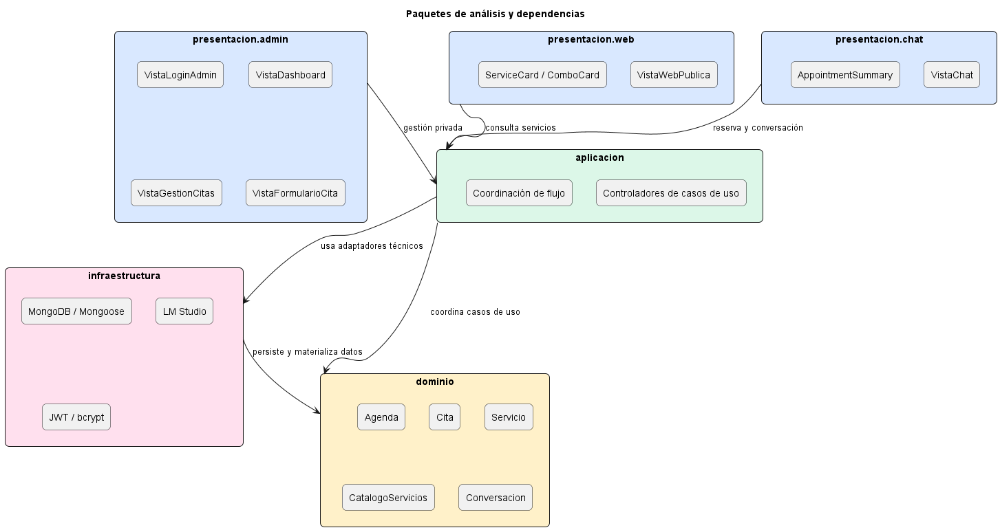

*Figura 3.8. Paquetes de análisis y dependencias.*

| **Paquete** | **Contenido** | **Justificación** |
|:---|:---|:---|
| presentacion.web | VistaWebPublica, ServiceCard, ComboCard, Brand. | Agrupa la interfaz pública del cliente. |
| presentacion.chat | VistaChat, AppointmentSummary. | Aísla la experiencia conversacional. |
| presentacion.admin | VistaLoginAdmin, VistaDashboard, VistaGestionCitas, VistaFormularioCita. | Agrupa pantallas privadas del peluquero. |
| aplicacion | Controladores de análisis y coordinación de casos de uso. | Contiene el flujo de aplicación, sin persistencia directa. |
| dominio | Cita, Agenda, Servicio, CatalogoServicios, Conversacion. | Núcleo conceptual del negocio. |
| infraestructura | MongoDB, Mongoose, LM Studio, JWT, bcrypt. | Adapta tecnologías externas al dominio. |

Las dependencias siguen una regla simple: presentación llama a aplicación, aplicación coordina el dominio e infraestructura da soporte técnico a los casos de uso. Así, cada paquete mantiene una responsabilidad clara y el esquema resulta más directo de explicar.

## 3.2 Disciplina de diseño

El diseño convierte el modelo de análisis en una solución implementable. Aquí ya se nombran tecnologías, carpetas, módulos reales y mecanismos de comunicación. Se mantiene la trazabilidad con los requisitos suplementarios y con los casos de uso priorizados.

### 3.2.1 Diseño de la arquitectura

La arquitectura de diseño concreta la elección realizada en análisis. En este nivel ya aparecen los procesos reales, protocolos, rutas, middleware, módulos y servicios locales que permiten ejecutar la aplicación en localhost.

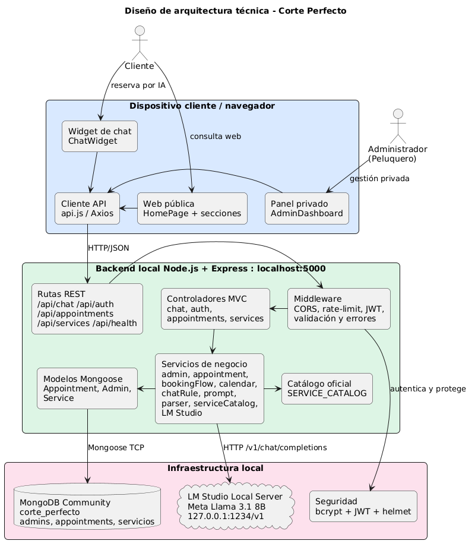

*Figura 3.9. Arquitectura técnica de componentes y protocolos.*

| **Componente** | **Tecnología** | **Responsabilidad** |
|:---|:---|:---|
| Frontend | React 19 + Vite 7 | Renderizar web pública, chat y panel privado; consumir API REST con Axios. |
| Backend | Node.js + Express 5 | Exponer rutas REST, validar entradas, aplicar seguridad y coordinar servicios. |
| Base de datos | MongoDB + Mongoose | Persistir citas, administradores y catálogo de servicios sincronizado. |
| IA local | LM Studio + Meta Llama 3.1 8B | Generar respuestas conversacionales cuando el flujo determinista no basta. |
| Seguridad | JWT + bcrypt + helmet + CORS | Proteger panel privado, hash de contraseña y cabeceras HTTP. |

El segundo esquema representa el despliegue local. No se añade una capa de contenedores porque no es necesaria para el objetivo del proyecto: el sistema se ejecuta en el equipo del desarrollador o de la peluquería con MongoDB y LM Studio abiertos localmente.

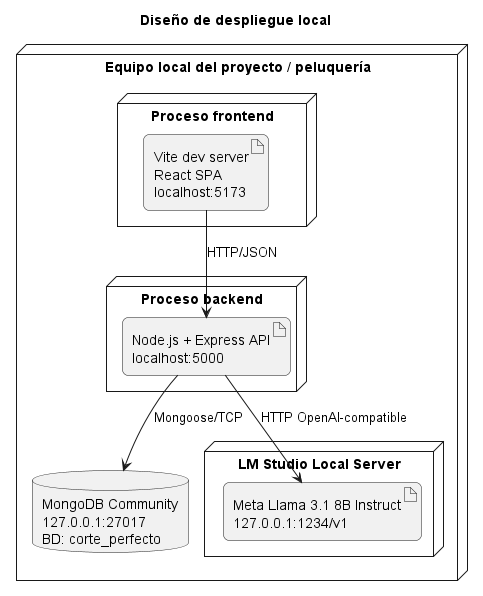

*Figura 3.10. Diseño de despliegue local.*

| **Ruta** | **Métodos** | **Uso** |
|:---|:---|:---|
| /api/chat | POST | Enviar mensaje, historial y cita activa; devuelve respuesta y posible cita. |
| /api/auth/login | POST | Autenticación del administrador y emisión de JWT. |
| /api/auth/me | GET | Validación de sesión activa. |
| /api/appointments | GET, POST | Listar/filtrar citas y crear cita manual. |
| /api/appointments/:id | GET, PATCH, DELETE | Consultar, editar, completar/cancelar o eliminar una cita. |
| /api/appointments/stats | GET | Indicadores del dashboard. |
| /api/services | GET | Catálogo oficial de servicios. |
| /api/health | GET | Comprobación básica de disponibilidad del backend. |

Autenticación y control de acceso: toda la API privada de citas está protegida con JSON Web Tokens. El middleware requireAuth verifica la firma del token, recupera la cuenta administrativa y rechaza peticiones sin credenciales válidas. El frontend conserva el token en localStorage y lo adjunta automáticamente mediante el interceptor de Axios.

### 3.2.2 Diseño del modelo de datos

MongoDB se utiliza como base documental porque el sistema maneja documentos de cita autocontenidos y necesita flexibilidad para registrar origen, notas, conversación y marcas temporales. Mongoose aporta validación de esquema, índices y un acceso homogéneo desde los servicios.

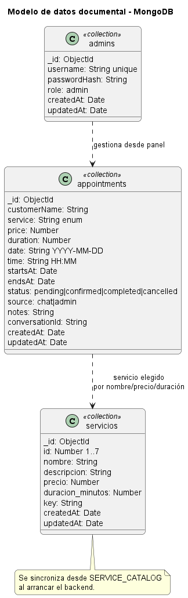

*Figura 3.11. Modelo de datos documental en MongoDB.*

La base local se denomina corte_perfecto y las colecciones relevantes son appointments, admins y servicios. La colección servicios se sincroniza al arrancar el backend desde SERVICE_CATALOG para que el catálogo numerado exista tanto en código como en MongoDB; las citas guardan servicio, precio y duración de forma desnormalizada para conservar el histórico aunque el catálogo cambie en el futuro.

| **Campo appointments** | **Tipo** | **Descripción** |
|:---|:---|:---|
| \_id | ObjectId | Identificador único de MongoDB. |
| customerName | String | Nombre validado del cliente; mínimo dos caracteres y sin valores genéricos. |
| service | Enum String | Uno de los siete servicios oficiales. |
| price / duration | Number | Precio y duración derivados del catálogo en el momento de reservar. |
| date / time | String | Fecha YYYY-MM-DD y hora HH:MM usadas por la interfaz. |
| startsAt / endsAt | Date | Intervalo real para ordenar, filtrar e impedir solapes. |
| status | Enum String | pending, confirmed, completed o cancelled. |
| source | Enum String | chat o admin, según origen de la reserva. |
| notes | String | Notas del panel administrativo. |
| conversationId | String | Identificador de conversación cuando la cita procede del chatbot. |
| createdAt / updatedAt | Date | Trazabilidad temporal automática de Mongoose. |

| **Campo admins** | **Tipo** | **Descripción** |
|:---|:---|:---|
| \_id | ObjectId | Identificador único. |
| username | String unique | Usuario del peluquero, normalizado a minúsculas. |
| passwordHash | String | Hash bcrypt de la contraseña; no se guarda la contraseña en claro. |
| role | Enum String | Rol admin para acceder al panel privado. |
| createdAt / updatedAt | Date | Marcas de tiempo automáticas. |

| **Campo servicios** | **Tipo** | **Descripción** |
|:---|:---|:---|
| \_id | ObjectId | Identificador único. |
| id | Number | Número visible del catálogo, del 1 al 7. |
| nombre | String | Nombre oficial: Corte, Tinte, Peinado o combinación. |
| descripcion | String | Etiqueta pública del servicio. |
| precio | Number | Precio en euros. |
| duracion_minutos | Number | Duración usada para calcular endsAt. |
| key | String | Clave interna estable del catálogo. |
| createdAt / updatedAt | Date | Sincronización de catálogo. |

| **Relación documental** | **Tipo** | **Detalle** |
|:---|:---|:---|
| Appointment -\> Servicio | Referencia lógica por valor | La cita guarda nombre, precio y duración; no depende de un ObjectId para conservar histórico. |
| Admin -\> Appointment | Asociación operativa sin identificador guardado | El administrador gestiona citas desde el panel autenticado; la cita no necesita guardar qué cuenta realizó la modificación. |
| Conversation -\> Appointment | Asociación por conversationId | Permite reconocer la cita creada por chat y actualizarla durante la conversación. |
| Appointment intervals | Restricción de negocio | No se permite solape si startsAt \< nuevoEnd y endsAt \> nuevoStart en estados activos. |

Los índices de Appointment se diseñan alrededor de las consultas reales: startsAt/endsAt/status para agenda y solapes, y customerName/date/time/service para búsquedas y consistencia operativa.

### 3.2.3 Diseño de clases y módulos

En la implementación JavaScript, una clase de diseño puede materializarse como clase, esquema Mongoose, controlador Express, servicio exportado o módulo de configuración. La Figura 3.12 resume los módulos reales del backend que intervienen en la reserva y en la sincronización del catálogo. Las flechas discontinuas representan uso de módulos o paso de información; por eso ServiceCatalogService y ServiceModel aparecen separados del flujo conversacional: sincronizan y exponen el catálogo público de MongoDB, pero no participan en cada turno del chatbot.

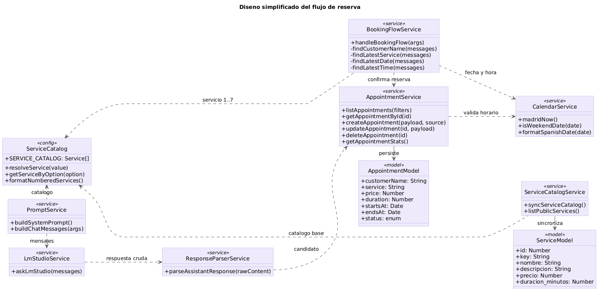

Figura 3.12. Diseño simplificado de clases y módulos del backend de reserva.

| **Módulo** | **Responsabilidad** | **Principio aplicado** |
|----|----|----|
| serviceCatalog.js / SERVICE_CATALOG | Define las siete opciones oficiales, resuelve servicios por texto u opción numérica y genera la lista numerada. | Fuente única de catálogo para prompt, validación y sincronización. |
| promptService | Construye el system prompt y los mensajes de chat con calendario, hora actual, historial y catálogo. | Separa la preparación del prompt respecto al controlador. |
| lmStudioService | Encapsula la llamada HTTP al servidor local de LM Studio, con timeout y error controlado. | Adaptador sustituible para el proveedor local de IA. |
| responseParserService | Separa la respuesta visible para el cliente del posible JSON de cita generado por la IA. | Aísla el parseo del lenguaje natural. |
| bookingFlowService | Extrae nombre, servicio, fecha y hora del historial y confirma reservas deterministas cuando los datos están completos. | Responsabilidad única del flujo conversacional de reserva. |
| appointmentService | Lista, consulta, crea, actualiza, elimina y calcula estadísticas de citas; valida nombre, servicio, horario, fecha futura y solapes. | Alta cohesión: toda regla crítica de agenda está en un punto. |
| calendarService | Centraliza fecha/hora de Madrid, días laborables, fines de semana y formatos de fecha usados por chat y agenda. | Evita duplicar lógica temporal. |
| serviceCatalogService | Sincroniza SERVICE_CATALOG con la colección servicios y expone el catálogo público a la API. | Mantiene coherencia entre prompt, frontend y MongoDB. |
| adminService | Prepara la cuenta inicial, autentica al administrador y obtiene la sesión desde JWT. | Separa seguridad y credenciales de controladores y database.js. |

| **Relación** | **Tipo** | **Detalle** |
|----|----|----|
| promptService -\> serviceCatalog.js | Dependencia | Usa formatNumberedServices() para insertar en el prompt las opciones 1..7. |
| bookingFlowService -\> serviceCatalog.js | Dependencia | Usa getServiceByOption(), resolveService() y normalizeText() para interpretar el servicio del cliente. |
| bookingFlowService -\> calendarService | Dependencia | Interpreta fechas relativas, bloquea fines de semana y formatea la fecha de confirmación. |
| bookingFlowService -\> appointmentService | Dependencia | Cuando reúne nombre, servicio, fecha y hora, crea o actualiza la cita. |
| chatController -\> bookingFlowService | Orquestación | El controlador intenta primero resolver el flujo determinista de reserva. |
| chatController -\> chatRuleService | Orquestación | Aplica reglas previas de horario, servicios, fines de semana y selección numérica inválida. |
| chatController -\> prompt/lmStudio/parser | Orquestación IA | Solo si no hay respuesta determinista, prepara mensajes, llama a LM Studio y parsea la respuesta. |
| appointmentService -\> calendarService | Validación | Comprueba fines de semana, hora actual y horario permitido antes de persistir. |
| appointmentService -\> serviceCatalog.js | Validación | Resuelve el servicio oficial para fijar precio, duración y etiqueta guardada. |
| appointmentService -\> Appointment | Persistencia | Consulta y modifica documentos de citas mediante Mongoose. |
| appointmentController -\> appointmentService | Dependencia | El panel administrativo delega listado, detalle, alta, edición, borrado y estadísticas. |
| authController / requireAuth -\> adminService -\> Admin | Seguridad | Autentica credenciales, firma/verifica JWT y recupera la cuenta administrativa. |
| server.js / serviceController -\> serviceCatalogService | Catálogo | server.js sincroniza servicios al arrancar y serviceController responde GET /api/services. |
| serviceCatalogService -\> Service + SERVICE_CATALOG | Sincronización | Actualiza la colección servicios desde el catálogo base y la usa como respaldo si MongoDB está vacío. |
| lmStudioService -\> env + AppError | Integración local | Lee URL, modelo y timeout desde env y transforma fallos de LM Studio en errores controlados. |

### Patrones y principios aplicados:

- MVC en backend: rutas y controladores forman la capa de entrada, servicios concentran negocio y modelos Mongoose representan persistencia.

- Fachada API en frontend: api.js centraliza baseURL, timeout, token JWT e interceptores.

- Adaptador para LM Studio: lmStudioService encapsula el endpoint compatible con OpenAI.

- Servicios de dominio: appointmentService, bookingFlowService y calendarService evitan controladores con lógica de negocio.

- Fuente única de catálogo: SERVICE_CATALOG alimenta prompt, validación y sincronización de la colección servicios.

### 3.2.4 Diseño de paquetes

La estructura de carpetas implementa los paquetes definidos en análisis y refleja el código real del repositorio. La dirección de dependencias es estable: las rutas llaman a controladores; los controladores delegan en servicios; los servicios usan modelos, configuración y utilidades; las vistas React consumen la API mediante una fachada HTTP centralizada. Además, el backend separa seed y tests, de modo que la inicialización del administrador y la verificación automática no quedan mezcladas con la lógica de ejecución.

TFG_CortePerfecto/

├── frontend/

│ └── src/

│ ├── components/ \# Brand, tarjetas, cabecera y ChatWidget

│ ├── components/admin/ \# AppointmentForm del panel privado

│ ├── context/ \# AuthContext y sesión JWT

│ ├── data/ \# Datos estáticos de servicios, combos y contacto

│ ├── pages/ \# HomePage pública

│ ├── pages/admin/ \# Login, layout, dashboard, citas y alta manual

│ ├── services/ \# api.js, fachada Axios

│ ├── styles/ \# CSS global

│ └── utils/ \# Formateo de fechas y moneda

├── backend/

│ ├── src/

│ │ ├── config/ \# env, database, serviceCatalog

│ │ ├── controllers/ \# auth, chat, appointments, services, health

│ │ ├── middleware/ \# requireAuth y errores

│ │ ├── models/ \# Admin, Appointment, Service

│ │ ├── routes/ \# Rutas REST Express

│ │ ├── seed/ \# Preparación del administrador inicial

│ │ ├── services/ \# Negocio, IA local, catálogo y calendario

│ │ ├── utils/ \# AppError, asyncHandler

│ │ └── app.js / server.js \# Configuración Express y arranque Node

│ └── tests/ \# calendarService, bookingFlowService, appointmentService

├── diagramas/ \# Fuentes PlantUML, capturas e imágenes

└── RUP/ y entregas/ \# Trazabilidad y documentos finales

| **Paquete físico** | **Contenido real** | **Criterio de cohesión** |
|----|----|----|
| frontend/src/components y components/admin | Brand, ChatWidget, ServiceCard, ComboCard, SiteHeader y AppointmentForm. | Componentes reutilizables sin acceso directo a persistencia. |
| frontend/src/pages y pages/admin | HomePage; AdminLogin, AdminLayout, AdminDashboard, AdminAppointments y AdminCreateAppointment. | Pantallas asociadas a navegación pública o privada. |
| frontend/src/context, services, data, styles y utils | AuthContext, api.js, siteData, global.css y format.js. | Estado de sesión, fachada HTTP, datos de presentación, estilo y formato común. |
| backend/src/controllers | authController, chatController, appointmentController, serviceController y healthController. | Entrada de casos de uso y composición de respuestas HTTP. |
| backend/src/services | adminService, appointmentService, bookingFlowService, calendarService, chatRuleService, lmStudioService, promptService, responseParserService y serviceCatalogService. | Reglas de negocio, integración de IA local, seguridad y sincronización de catálogo. |
| backend/src/models | Admin, Appointment y Service. | Esquemas persistentes de MongoDB. |
| backend/src/routes | authRoutes, chatRoutes, appointmentRoutes, serviceRoutes y healthRoutes. | Enrutado REST separado de controladores y reglas de negocio. |
| backend/src/middleware y utils | requireAuth, errorMiddleware, asyncHandler y AppError. | Seguridad, manejo de errores y utilidades transversales reutilizables. |
| backend/src/config y seed | env, database, serviceCatalog y adminSeed. | Configuración de entorno, conexión MongoDB, catálogo oficial e inicialización controlada. |
| backend/tests | calendarService.test.js, bookingFlowService.test.js y appointmentService.test.js. | Verificación automática de reglas críticas. |
| diagramas, RUP y entregas | Fuentes PlantUML, imágenes, capturas, trazabilidad y documentos finales. | Evidencia metodológica y material entregable. |

### 3.2.5 Diseño de interfaces de usuario

El diseño de interfaz mantiene dos ámbitos: web pública para clientes y panel privado para el peluquero. La web pública prioriza reserva rápida y consulta de precios; el panel prioriza densidad, filtros y acciones repetidas.

| **Vista real** | **Actor** | **Decisiones de diseño** |
|:---|:---|:---|
| HomePage | Cliente | Secciones Inicio, Servicios, Combos, Nosotros, Opiniones y Contacto; CTA de reserva visible. |
| ChatWidget | Cliente | Ventana flotante, autoscroll, historial, acciones rápidas, entrada única y tarjeta de confirmación. |
| AdminLogin | Administrador | Formulario centrado, validación y transición al panel con token JWT. |
| AdminDashboard | Administrador | KPIs, ingresos estimados y próximas citas para visión rápida. |
| AdminAppointments | Administrador | Filtros por estado, fecha y orden; acciones editar, completar y eliminar. |
| AdminCreateAppointment | Administrador | Alta manual de cita reutilizando AppointmentForm. |

Una decisión importante de usabilidad es la selección numerada de servicios. El catálogo 1..7 se comparte entre web, prompt, backend y colección servicios; de esta manera el usuario puede contestar simplemente “6” y el sistema traduce la opción a “Corte y Tinte”. Esto reduce ambigüedad del LLM y cumple RS-09.

**HomePage**

Secciones Inicio

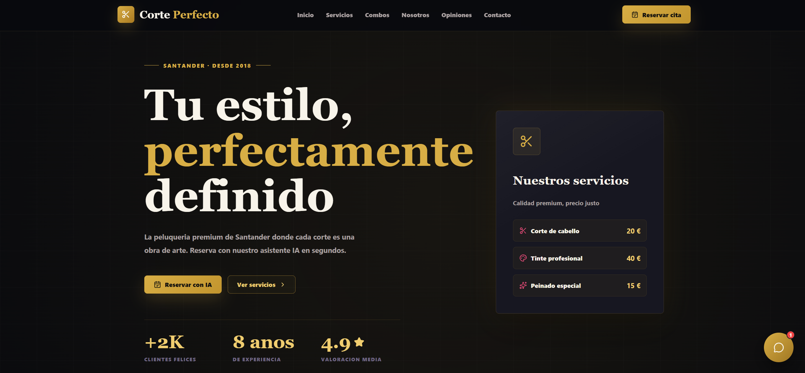

Servicios

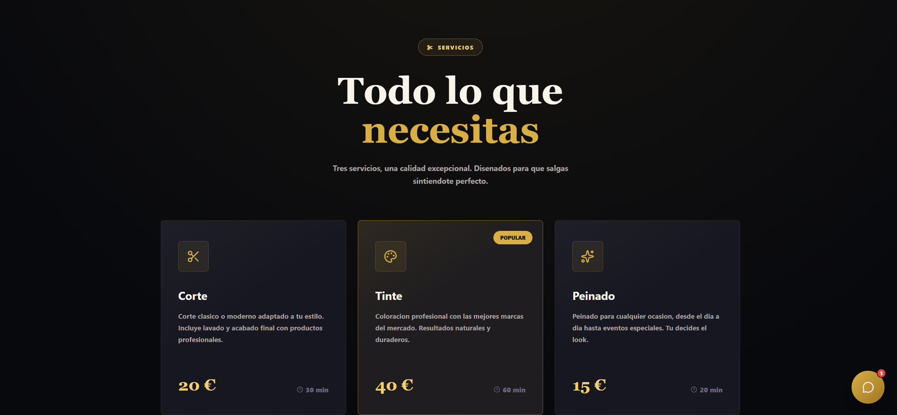

Combos

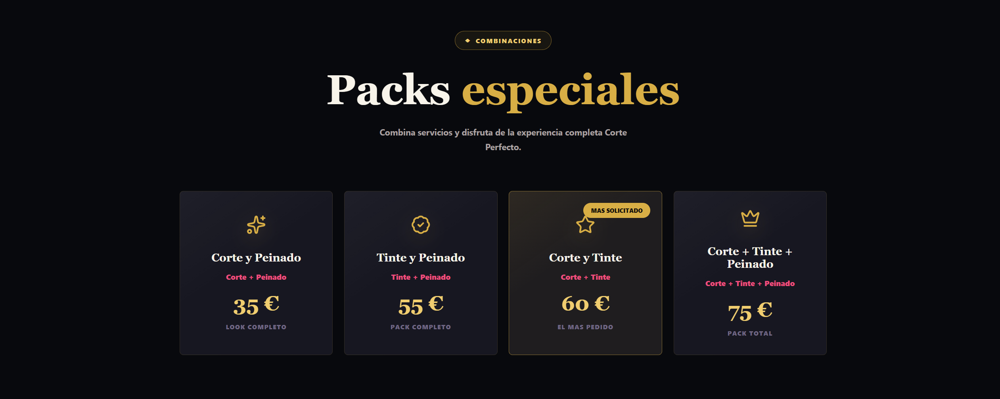

Nosotros

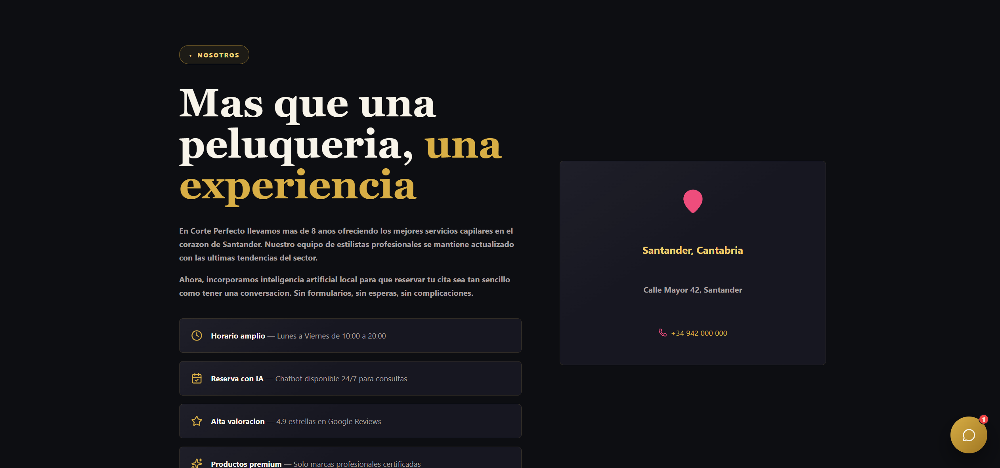

Opiniones

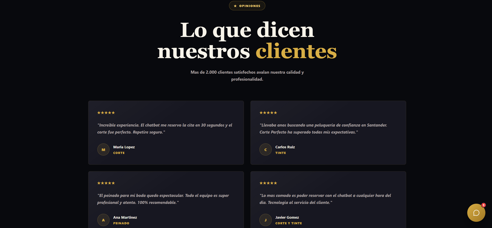

Contacto

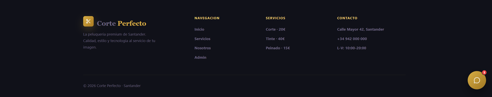

CTA de reserva visible

**ChatWidget**

Ventana flotante

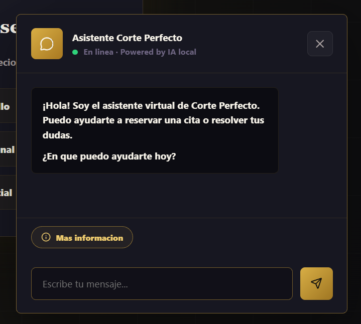

Autoscroll

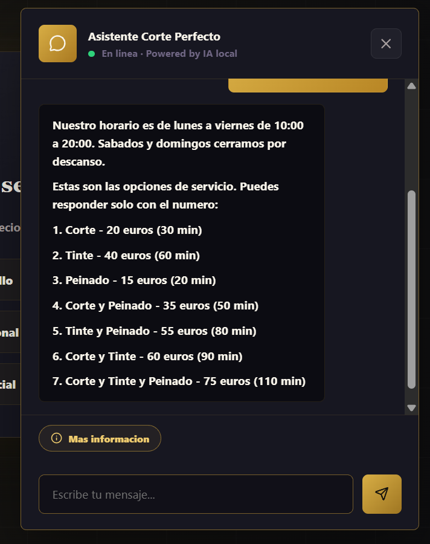

Historial

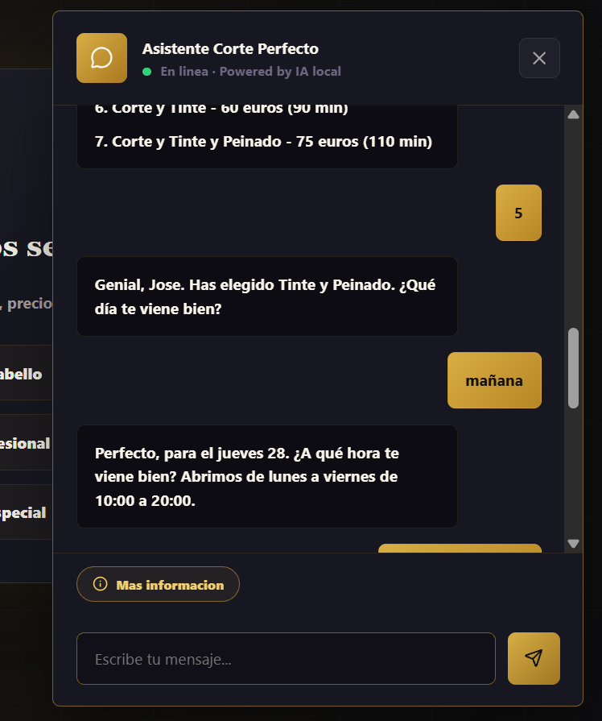

Acciones rápidas

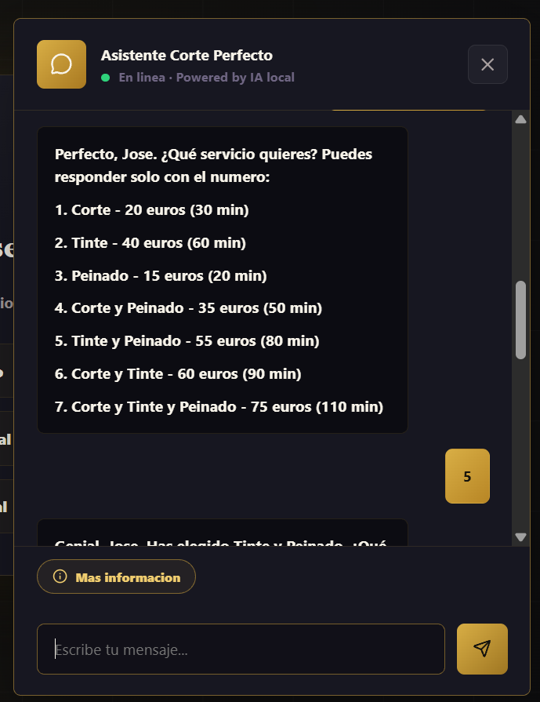

Entrada única y tarjeta de confirmación

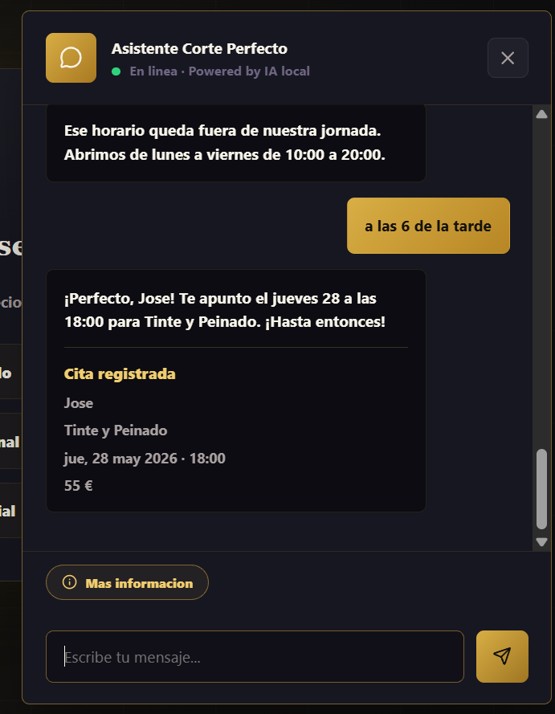

**AdminLogin**

Formulario centrado

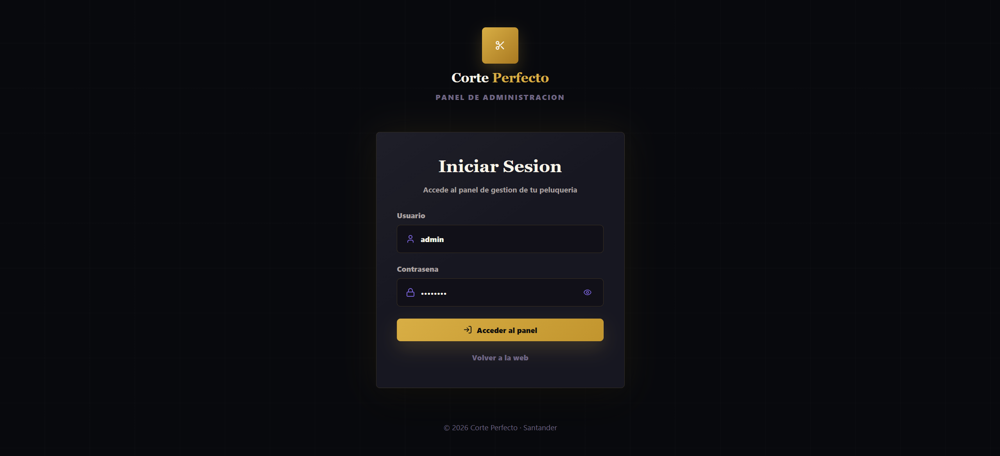

Validación y transición al panel con token JWT

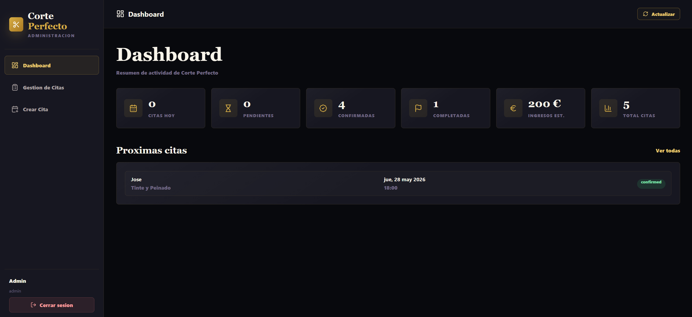

**AdminDashboard**

KPIs e Ingresos estimados

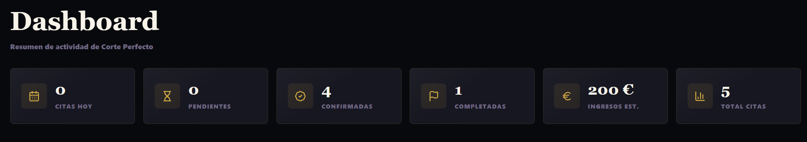

Próximas citas para visión rápida

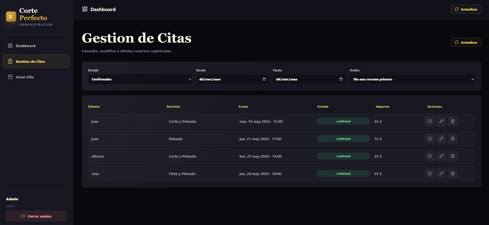

**AdminAppointments**

Filtros por estado, fecha y orden

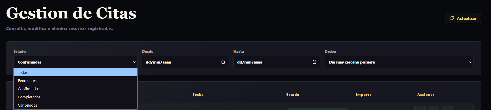

Acciones editar, completar y eliminar

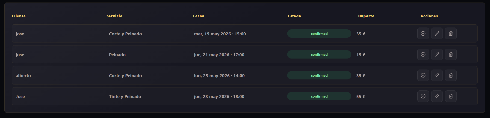

**AdminCreateAppointment**

Alta manual de cita reutilizando AppointmentForm

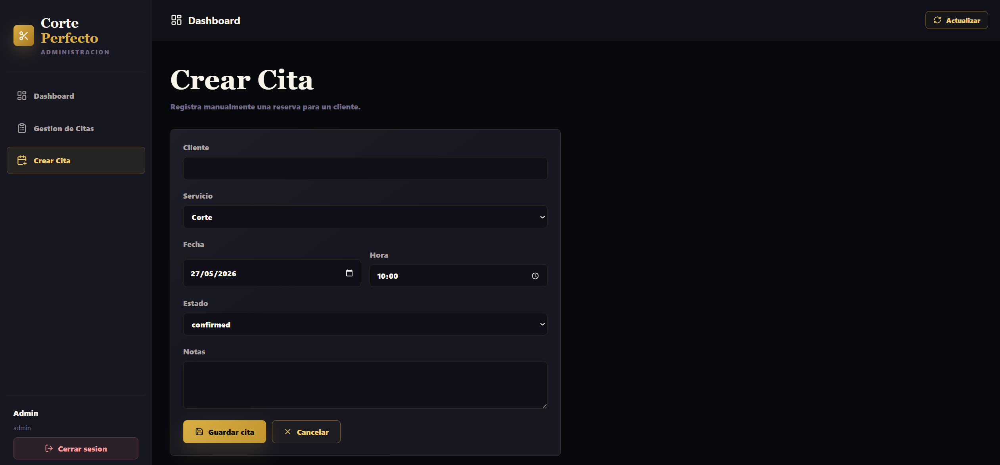

### 3.2.6 Diseño de integración con sistemas locales

La integración más sensible es el chatbot. La Figura 3.13 refleja el orden real de chatController: primero intenta bookingFlowService; si no hay respuesta determinista, consulta chatRuleService; cuando necesita IA, construye mensajes con promptService, llama a lmStudioService, parsea con responseParserService y solo después delega en appointmentService. Así ningún texto generado se persiste sin validación de negocio.

| **Sistema** | **Protocolo** | **Dirección** | **Control de errores** |
|:---|:---|:---|:---|
| LM Studio | HTTP /v1/chat/completions | Backend -\> LM Studio | Timeout de 60 s y respuesta 503 controlada. |
| MongoDB | TCP local mediante Mongoose | Backend -\> MongoDB | Validación de esquema, índices y errores centralizados. |
| Frontend | HTTP/JSON con Axios | React -\> Express | Timeout de cliente e interceptores para JWT y mensajes de error. |
| JWT | Bearer token | Frontend -\> rutas privadas | Middleware requireAuth rechaza token ausente, inválido o caducado. |

*Figura 3.13. Integración del cliente con chatbot, backend, LM Studio y MongoDB.*

Este diagrama se centra en el cliente porque es la integración crítica de IA local. La integración administrativa ya queda cubierta por los diagramas UC-10 y UC-12/13/14/15/16: el peluquero no llama a LM Studio, sino que opera contra rutas privadas protegidas por JWT y contra la agenda persistida en MongoDB.

Si LM Studio está caído, el fallo no se propaga como una cita falsa. lmStudioService convierte el timeout o la conexión rechazada en un AppError controlado; el controlador devuelve un mensaje de reintento y el backend solo mantiene activos los flujos deterministas que no dependen de generación de lenguaje.

### 3.2.7 Estructura del system prompt y contingencia de IA local

El system prompt se diseña como una pieza de arquitectura, no como texto improvisado. Su objetivo es limitar la variabilidad del modelo, mantener el tono de peluquero real y delegar las decisiones críticas en reglas del backend. Por ello se construye dinámicamente desde promptService.js, incorporando calendario de Europe/Madrid, hora actual y catálogo numerado de servicios.

| **Bloque del prompt** | **Responsabilidad de diseño** |
|:---|:---|
| Identidad y tono | Define al asistente como peluquero de Corte Perfecto, evita lenguaje técnico y mantiene una conversación natural. |
| Calendario fijo | Inyecta fecha, hora actual, mañana, pasado mañana y próximos días laborables para evitar citas pasadas o fines de semana. |
| Prohibiciones | Impide pedir datos ya disponibles, confirmar sin nombre real, inventar disponibilidad o mostrar instrucciones internas. |
| Catálogo numerado | Publica las opciones 1..7 desde SERVICE_CATALOG para que cliente, prompt y backend compartan la misma fuente de verdad. |
| Reglas de reserva | Indica cómo pedir nombre, servicio, fecha y hora, y cómo emitir JSON solo cuando la información está completa. |
| Marcador de respuesta | Obliga a devolver el texto útil tras un marcador estable para que responseParserService pueda separar mensaje y JSON. |

La caída de LM Studio se trata como una degradación controlada. En ese escenario el backend no crea citas basadas en una respuesta incompleta: conserva los flujos deterministas disponibles (servicios, horarios, fines de semana, citas pasadas y validación de solapes) y devuelve un mensaje claro para que el usuario pueda reintentar cuando el servidor local vuelva a estar activo.

## 3.3 Trazabilidad y planificación técnica

La trazabilidad asegura que cada requisito suplementario tenga una decisión de diseño verificable. También sirve como guía de producción: primero se construyen los módulos de mayor riesgo técnico y después las vistas que dependen de ellos.

| **Requisito** | **Componentes de diseño** | **Evidencia de cumplimiento** |
|----|----|----|
| RS-01 Rendimiento | appointmentService, índices MongoDB, rutas REST | Operaciones CRUD sin LLM y consultas ordenadas por startsAt. |
| RS-02 Rendimiento IA | lmStudioService, env.lmStudioTimeoutMs | Timeout configurable y error controlado. |
| RS-03 Privacidad | LM Studio local | No se envían mensajes a servicios cloud de IA. |
| RS-04 Seguridad | requireAuth, AuthContext, api.js | Rutas privadas con Bearer JWT. |
| RS-05 Passwords | adminService, Admin, bcrypt | Hash bcrypt antes de guardar credenciales. |
| RS-06 Disponibilidad local | Vite, Express, MongoDB, LM Studio | Ejecución completa en localhost. |
| RS-07 Usabilidad | HomePage, ChatWidget, AdminAppointments | Reserva conversacional y panel con filtros. |
| RS-08 Validación temporal | calendarService, appointmentService | Bloqueo de fines de semana, horario y citas pasadas. |
| RS-09 Catálogo numerado | SERVICE_CATALOG, promptService, chatRuleService | Opciones 1..7 coherentes en prompt, API y DB. |
| RS-10 Persistencia | MongoDB, Appointment, Admin, Service | Citas, cuenta administrativa y catálogo público persistidos o sincronizados. |
| RS-11 Mantenibilidad | MVC, servicios, paquetes | Separación por responsabilidad y bajo acoplamiento. |
| RS-12 Administración | appointmentRoutes, requireAuth, AdminAppointments | CRUD privado de citas. |
| RS-13 Contingencia IA | lmStudioService, errorMiddleware | Fallo de IA no crea citas ni rompe reglas deterministas. |
| RS-14 Trazabilidad | createdAt, updatedAt, source, status | Evolución básica de cada reserva. |
| RS-15 Calidad visual | Componentes React, CSS global | Interfaz consistente con prototipos. |

### Medidas de calidad de diseño

| **Medida** | **Aplicación en Corte Perfecto** |
|:---|:---|
| Alta cohesión | Cada servicio tiene una responsabilidad clara: citas, calendario, prompt, LM Studio, parser. |
| Bajo acoplamiento | El frontend solo conoce api.js; el backend encapsula MongoDB y LM Studio en servicios. |
| Responsabilidad única (SOLID/SRP) | Los controladores no calculan precios ni solapes; delegan en servicios. |
| Legibilidad | Nombres de módulos orientados al dominio: appointmentService, bookingFlowService, serviceCatalog. |
| Mantenibilidad correctiva | Errores centralizados con AppError y errorMiddleware. |
| Mantenibilidad perfectiva | Catálogo centralizado para añadir nuevos servicios sin duplicar lógica. |
| Mantenibilidad adaptativa | Adaptador lmStudioService permite cambiar endpoint o modelo local. |

## 3.4 Auditoría diseño-implementación

Siguiendo la práctica de revisión de pySigHor, se contrasta el diseño con el código real. El objetivo es evitar brechas entre lo modelado en análisis y diseño y lo construido finalmente en React, Node.js, Express, MongoDB y LM Studio.

| **Área** | **Diseño** | **Implementación** | **Estado** |
|:---|:---|:---|:---|
| Arquitectura | Cliente-servidor con API REST y ejecución local. | frontend React/Vite, backend Express, MongoDB local y LM Studio local. | Correcto |
| MVC backend | Rutas, controladores, servicios y modelos separados. | routes, controllers, services, models. | Correcto |
| Reglas de agenda | Validación determinista fuera de la IA. | appointmentService, bookingFlowService y calendarService. | Correcto |
| Seguridad admin | JWT y rutas privadas para el panel. | authController, adminService, requireAuth y appointmentRoutes. | Correcto |
| Contingencia IA | Si LM Studio cae no se confirma ninguna cita inventada. | lmStudioService devuelve AppError controlado. | Correcto |
| Evidencia de pruebas | Reglas críticas verificables. | backend/tests con node:test. | Reforzado |
| Catálogo de servicios | Fuente única para web, chat y persistencia. | SERVICE_CATALOG, serviceCatalogService y Service. | Correcto |

## 3.5 Plan de pruebas automatizadas

El plan de pruebas se centra en los riesgos principales del sistema: citas inválidas, solapes, errores de calendario, selección numérica de servicios y gestión administrativa de estados. Se priorizan pruebas de servicios porque ahí reside la lógica de negocio.

| **Prueba** | **Riesgo cubierto** | **Módulos** |
|:---|:---|:---|
| calendarService.test.js | Interpretación incorrecta de días laborables y fines de semana. | calendarService |
| bookingFlowService.test.js | Pérdida de contexto conversacional, servicio numérico o fin de semana. | bookingFlowService, serviceCatalog |
| appointmentService.test.js | Citas inválidas, solapes, estados y borrado. | appointmentService, Appointment |
| npm run build --prefix frontend | Errores de integración o empaquetado del cliente. | React/Vite |
| npm run check --prefix backend | Errores sintácticos de entrada del servidor. | Node.js/Express |

## 3.6 Dashboard RUP del proyecto

Además de los diagramas del capítulo, el repositorio incluye un dashboard PlantUML de seguimiento. Este artefacto toma la idea de pySigHor de usar el diagrama de contexto como herramienta de gestión: los casos de uso no solo se dibujan, también se marca su estado de implementación y verificación.

El dashboard se conserva en RUP/99-seguimiento/estado-casos-uso.puml y permite enseñar de forma rápida qué casos están implementados por build y cuáles cuentan además con pruebas específicas.

## Resumen del capítulo

Este capítulo convierte los requisitos de Corte Perfecto en un diseño implementable y trazable. El análisis define una arquitectura por capas, casos de uso críticos con sus colaboraciones, clases MVC y paquetes principales. El diseño concreta esas decisiones en React/Vite, Node.js/Express, servicios de negocio, MongoDB/Mongoose y LM Studio local. Con ello queda preparada una base clara para el capítulo de implementación, con especial atención a arquitectura, system prompt, secuencias críticas y contingencia ante caída de la IA local.

---

[Anterior: Capítulo 2](02-requisitos-modelo-dominio.md) · [Índice de capítulos](README.md) · [Siguiente: Capítulo 4](04-implementacion-mapa-solucion.md)
