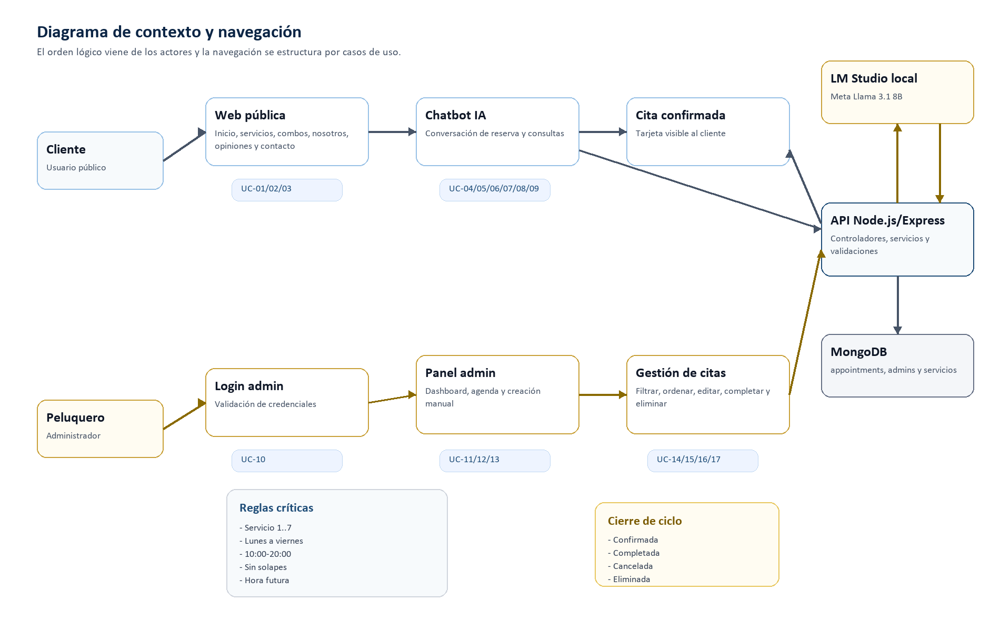
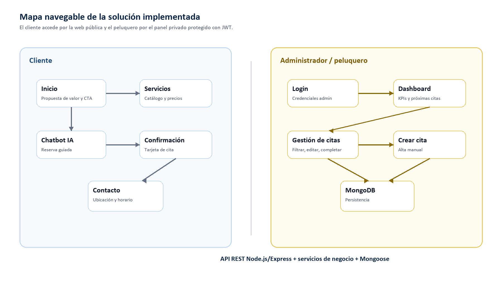
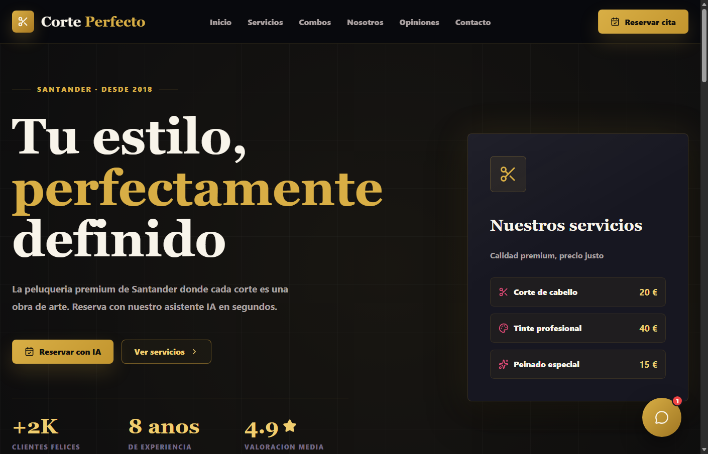
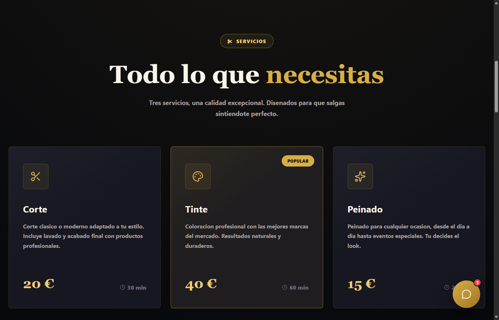
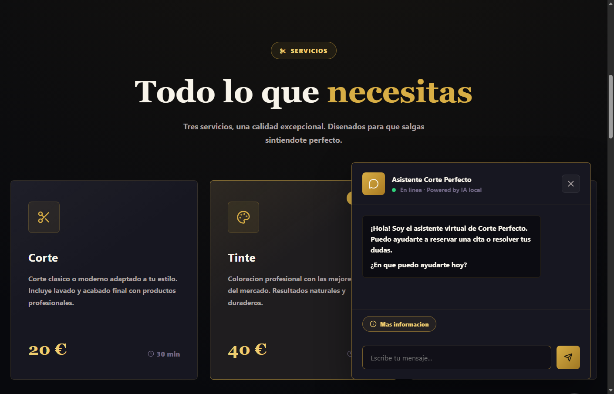
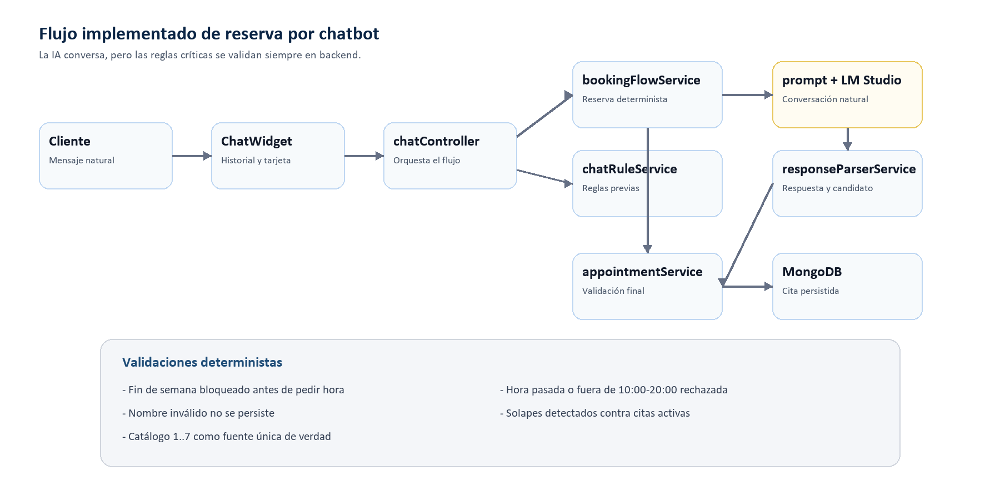
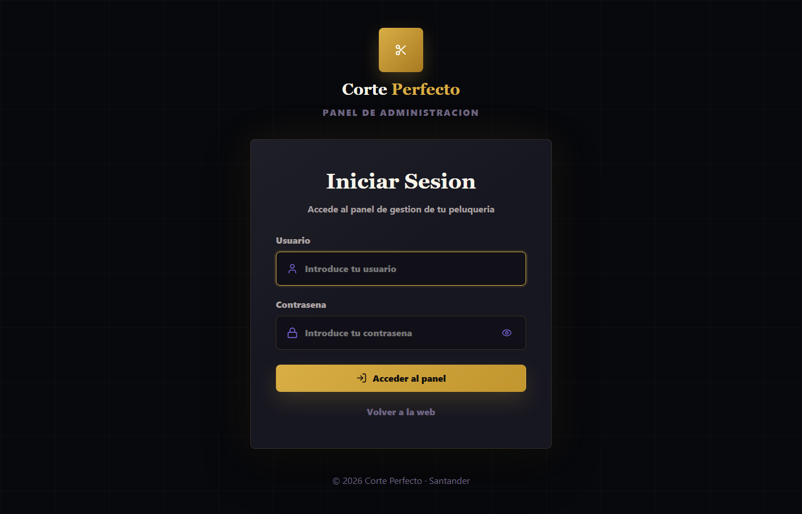
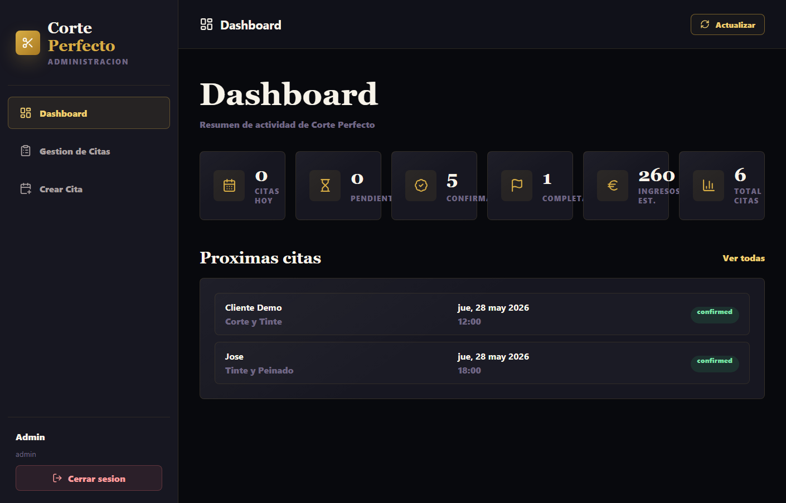
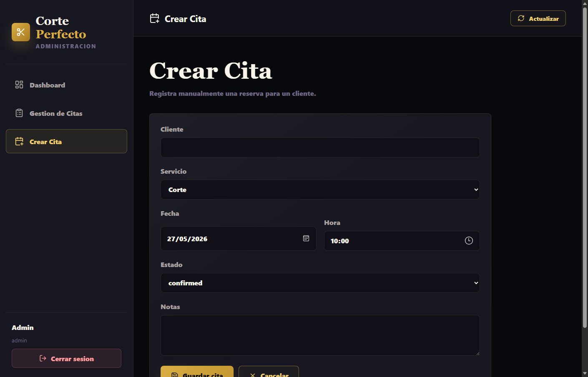

[Anterior: Capítulo 3](03-analisis-diseno.md) · [Índice de capítulos](README.md) · [Siguiente: Capítulo 5](05-conclusiones-lineas-futuras.md)

---

**CAPÍTULOS 4 Y 5**

Implementación, validación, conclusiones y líneas futuras

Corte Perfecto · Peluquería en Santander con reservas mediante IA local

**Trabajo de Fin de Grado · Ingeniería Informática**

Autor: Adrián García Arranz

Curso 2025/2026

# Capítulo 4. Implementación y mapa de la solución

Este capítulo presenta la solución desarrollada desde el punto de vista de su materialización final. Después de haber definido requisitos, análisis y diseño en los capítulos anteriores, se muestra cómo esos artefactos se convierten en pantallas, flujos navegables, rutas de API, servicios de negocio y colecciones persistidas en MongoDB. El objetivo no es repetir el diseño técnico, sino demostrar que existe una aplicación funcional y coherente con el proceso metodológico seguido.

<table style="width:96%;">
<colgroup>
<col style="width: 96%" />
</colgroup>
<thead>
<tr>
<th style="text-align: left;">
<strong>Criterio de implementación</strong>

La solución se considera cerrada cuando cada caso de uso principal puede recorrerse desde la interfaz, pasar por la API Express, aplicar reglas de negocio en servicios independientes y dejar evidencia persistente o verificable.
</th>
</tr>
</thead>
<tbody>
</tbody>
</table>

## 4.1 Estado técnico de la solución implementada

Antes de documentar la interfaz se revisó el estado del código para comprobar que la implementación respeta la arquitectura comprometida: frontend React/Vite, backend Node.js/Express organizado siguiendo MVC, persistencia MongoDB mediante Mongoose y conexión local con LM Studio. La comprobación ejecutada fue \`npm run verify\`, que encadena validación sintáctica del backend, pruebas automáticas y construcción de producción del frontend.

| **Área revisada** | **Resultado** | **Evidencia** |
|----|----|----|
| Estructura MVC backend | Rutas, controladores, servicios y modelos separados. | backend/src/routes, controllers, services, models |
| Persistencia MongoDB | Colecciones \`appointments\`, \`admins\` y \`servicios\` modeladas o sincronizadas. | Appointment.js, Admin.js, Service.js |
| Chatbot con IA local | LM Studio actúa como motor conversacional; las reglas críticas permanecen en backend. | chatController, bookingFlowService, lmStudioService |
| Panel administrador | Login JWT, dashboard, listado, filtrado, creación, edición, completado y borrado. | AdminLogin, AdminDashboard, AdminAppointments, AppointmentForm |
| Verificación automática | 44 pruebas superadas, backend válido y build de frontend correcto. | backend/tests y \`npm run verify\` |

## 4.2 Organización final del código

La organización del proyecto se mantiene deliberadamente simple. No se introducen microservicios ni capas accidentales porque el alcance del TFG se resuelve mejor con una API modular de alta cohesión. La separación entre frontend y backend es física y lógica: el frontend no accede a MongoDB ni a LM Studio; todo pasa por la API. A su vez, los controladores no concentran reglas de negocio, sino que delegan en servicios.

| **Capa** | **Carpetas / módulos** | **Responsabilidad** |
|----|----|----|
| Presentación pública | frontend/src/pages, components, styles | Mostrar la web comercial, abrir el chatbot y renderizar la confirmación de cita. |
| Presentación administrativa | frontend/src/pages/admin, components/admin, context | Login, dashboard, filtros de agenda, formularios y acciones privadas. |
| Entrada backend | backend/src/routes, controllers, middleware | Exponer API REST, proteger rutas privadas, controlar errores y coordinar cada petición. |
| Dominio / negocio | backend/src/services, config/serviceCatalog.js | Gestionar citas, autenticación, calendario, solapes, servicios, prompt, reglas de chat y respuesta de LM Studio. |
| Persistencia | backend/src/models, MongoDB | Persistir citas, cuenta administrativa y catálogo de servicios sincronizado. |
| Evidencia metodológica | RUP/99-seguimiento, backend/tests | Mantener trazabilidad caso de uso-código-prueba siguiendo el estilo de pySigHor. |

Durante la revisión final se eliminaron responsabilidades mezcladas: la sincronización del catálogo de servicios queda centralizada en \`serviceCatalogService\` y la preparación/autenticación de la cuenta del administrador se ubica en \`adminService\`. Por tanto, \`database.js\` conserva una responsabilidad única: abrir la conexión con MongoDB. Esta decisión mejora la cohesión y evita que el módulo de conexión conozca reglas funcionales.

## 4.3 Mapa navegable de la solución

El mapa de navegación se deriva de los actores y casos de uso definidos en el Capítulo 2. El cliente entra en la web pública y puede consultar información o reservar mediante el chatbot. El administrador accede por una ruta privada, se autentica y gestiona la agenda. Ambas experiencias convergen en la misma API y en la misma base de datos, lo que evita agendas paralelas.

*Figura 4.1. Diagrama de contexto y navegación de Corte Perfecto.*

Este diagrama cumple la indicación de partir del diagrama de contexto: no representa solo pantallas, sino transiciones relevantes entre actores, sistema público, chatbot, panel privado y persistencia. La navegación queda ligada a los casos de uso, por lo que el Capítulo 4 no se limita a enseñar interfaces aisladas.

*Figura 4.2. Mapa navegable de la solución implementada.*

| **Zona** | **Pantallas** | **Casos de uso cubiertos** |
|----|----|----|
| Web pública | Inicio, Servicios, Combos, Nosotros, Opiniones, Contacto | UC-01, UC-02, UC-03 |
| Chatbot | Widget flotante, historial, acciones rápidas, tarjeta de cita | UC-04, UC-05, UC-06, UC-07, UC-08, UC-09 |
| Acceso admin | Login protegido | UC-10 |
| Panel admin | Dashboard, Gestión de Citas, Crear Cita, Modal de edición | UC-11, UC-12, UC-13, UC-14, UC-15, UC-16, UC-17 |

## 4.4 Web pública: escaparate y entrada al chatbot

La pantalla inicial concentra la identidad visual de Corte Perfecto, el acceso rápido a la reserva y un resumen de los servicios principales. La interfaz utiliza una estética oscura con acentos dorados, coherente con la percepción premium planteada desde el Capítulo 1. El botón principal abre el chatbot, por lo que la reserva no depende de que el cliente busque un formulario convencional.

*Figura 4.3. Pantalla de inicio de Corte Perfecto.*

La sección de servicios materializa el catálogo oficial de la peluquería. En la web se presentan los servicios base y sus precios; en el chatbot se utiliza el mismo catálogo en formato numerado del 1 al 7 para reducir ambigüedades conversacionales. Esta decisión conecta directamente con la corrección realizada tras las pruebas iniciales: la opción numérica evita que el modelo interprete mal expresiones como “el 4”.

*Figura 4.4. Sección de servicios con catálogo visible.*

## 4.5 Chatbot de reserva con LM Studio

El chatbot es el punto más singular del sistema. La interfaz se comporta como un asistente de reserva: saluda, ofrece información, acepta números de servicio, pregunta solo los datos que faltan y muestra una tarjeta cuando la cita se guarda correctamente. El componente \`ChatWidget\` mantiene el historial reciente y el identificador de conversación, pero la validación real se ejecuta en backend.

*Figura 4.5. Widget de chat abierto sobre la web pública.*

La implementación evita confiar ciegamente en la salida del LLM. Primero se ejecutan reglas deterministas rápidas con \`chatRuleService\`; si el caso lo requiere, \`promptService\` prepara el historial y \`lmStudioService\` consulta LM Studio mediante endpoint compatible con OpenAI; finalmente \`responseParserService\` separa el mensaje del posible candidato de cita y \`appointmentService\` lo valida antes de persistir. Así se mantiene una conversación natural sin trasladar a la IA decisiones críticas de agenda.

*Figura 4.6. Flujo técnico de reserva por chatbot.*

| **Regla** | **Lugar de implementación** | **Efecto visible** |
|----|----|----|
| Servicios por número | serviceCatalog.js, chatRuleService.js, bookingFlowService.js | El cliente puede responder 1..7 y el sistema resuelve el servicio exacto. |
| Nombre real obligatorio | bookingFlowService.js, appointmentService.js | No se registra una cita con nombre vacío, genérico o inválido. |
| Fin de semana cerrado | calendarService.js, chatRuleService.js, bookingFlowService.js y appointmentService.js | El sistema propone viernes o lunes antes de pedir hora. |
| Hora actual | calendarService.js, chatRuleService.js y appointmentService.js | No se aceptan reservas para una hora pasada del mismo día. |
| Solapes | appointmentService.js | No se crean dos citas activas en el mismo intervalo. |
| LM Studio caído | lmStudioService.js, AppError.js y errorMiddleware.js | El usuario recibe un error controlado y no se inventa una confirmación. |

## 4.6 Acceso y panel de administración

El peluquero dispone de un panel privado. El acceso se realiza mediante usuario y contraseña; el backend valida la contraseña con hash y emite un JWT. Las rutas de citas quedan protegidas por middleware, de modo que un usuario sin token válido no puede consultar, modificar ni eliminar reservas.

*Figura 4.7. Pantalla de inicio de sesión del administrador.*

Tras iniciar sesión, el dashboard resume la actividad: citas del día, pendientes, confirmadas, completadas, ingresos estimados y total de citas. Esta pantalla no sustituye a la agenda detallada, pero ofrece al peluquero una lectura rápida del estado del negocio.

*Figura 4.8. Dashboard administrativo.*

La gestión de citas permite filtrar por estado, acotar por fechas, ordenar cronológicamente y ejecutar acciones directas sobre cada reserva. Las acciones principales son editar, eliminar y marcar como completada. Esta última función fue incorporada para reflejar el ciclo de vida real de una cita: no basta con crearla, también debe poder cerrarse cuando el servicio ha sido prestado.

*Figura 4.9. Gestión administrativa de citas.*

La creación manual cubre el escenario en el que el cliente llama por teléfono, acude presencialmente o el peluquero necesita registrar una reserva sin pasar por el chatbot. El formulario utiliza el mismo backend y las mismas reglas de validación que las citas conversacionales, por lo que la agenda mantiene una única fuente de verdad.

*Figura 4.10. Formulario de creación manual de cita.*

## 4.7 Casos de uso representativos resueltos en interfaz

La siguiente tabla recoge los casos de uso más representativos de la solución. La intención es mostrar el puente entre el modelado de capítulos anteriores y la experiencia implementada: cada acción del usuario tiene pantalla, endpoint, servicio y validación asociada.

| **Caso de uso** | **Interfaz** | **Backend implicado** | **Resultado** |
|----|----|----|----|
| UC-02 Consultar servicios | Sección Servicios y acción rápida del chat. | GET /api/services, serviceCatalogService. | Catálogo visible, numerado y consistente con MongoDB. |
| UC-05 Reservar cita por chatbot | Widget de chat con conversación guiada. | chatController, bookingFlowService, appointmentService. | Cita confirmada y persistida en \`appointments\`. |
| UC-09 Modificar reserva activa | Chat conserva la cita activa durante la conversación. | updateAppointment con \`activeAppointmentId\`. | La cita existente se actualiza sin duplicarla. |
| UC-10 Iniciar sesión | Formulario de login administrador. | authController, adminService, bcryptjs, JWT. | Token válido y acceso al panel privado. |
| UC-12 Listar/filtrar citas | Tabla administrativa con filtros y orden. | listAppointments con query params. | Agenda consultable por estado, fecha y orden. |
| UC-13 Crear cita manual | Formulario de alta del panel. | createAppointment con source admin. | Reserva manual validada igual que las del chat. |
| UC-14 Editar cita | Modal de edición sobre la tabla. | updateAppointment. | Cambio controlado de datos, servicio, estado o notas. |
| UC-15 Completar cita | Botón de check en cada fila activa. | PATCH /api/appointments/:id. | La cita pasa a estado \`completed\`. |
| UC-16 Eliminar cita | Botón de papelera con confirmación. | deleteAppointment. | El registro se elimina de MongoDB. |

## 4.8 Persistencia y sincronización de datos

La base de datos \`corte_perfecto\` utiliza un modelo documental sencillo y suficiente para la primera versión del sistema. Las citas se guardan como documentos completos con nombre, servicio, precio, duración, fecha, hora, rango temporal, estado, origen y notas. El catálogo de servicios se sincroniza al arrancar desde una definición oficial del backend, lo que permite que MongoDB refleje las siete opciones disponibles sin convertir el catálogo en lógica duplicada.

| **Colección** | **Uso** | **Campos principales** |
|----|----|----|
| appointments | Agenda operativa de reservas. | customerName, service, price, duration, date, time, startsAt, endsAt, status, source, notes, conversationId. |
| admins | Cuenta de acceso del peluquero. | username, passwordHash, role, timestamps. |
| servicios | Catálogo público sincronizado. | id, key, nombre, descripcion, precio, duracion_minutos. |

## 4.9 Verificación de la implementación

La verificación combina pruebas automáticas y comprobación manual de la interfaz. Siguiendo la filosofía de pySigHor, la evidencia no queda únicamente en el texto del TFG: también permanece en el repositorio mediante la carpeta \`RUP/99-seguimiento\` y las pruebas del backend.

| **Comprobación** | **Comando / artefacto** | **Estado** |
|----|----|----|
| Sintaxis backend | npm run check --prefix backend | Superado |
| Reglas de negocio | npm run test --prefix backend | 44 pruebas superadas |
| Build frontend | npm run build --prefix frontend | Superado |
| Verificación integrada | npm run verify | Superado |
| Trazabilidad UC-código | RUP/99-seguimiento/trazabilidad-casos-uso.md | Actualizada |
| Auditoría diseño-implementación | RUP/99-seguimiento/auditoria-diseno-implementacion.md | Actualizada |

## 4.10 Recorrido end-to-end de una reserva

El flujo completo de reserva confirma que la solución no funciona como piezas aisladas, sino como un circuito integrado. El cliente inicia la conversación en la web pública; el frontend envía el mensaje al backend; el backend decide si puede responder mediante reglas propias o si necesita consultar LM Studio; cuando se reúnen nombre, servicio, fecha y hora, la cita se valida y se guarda en MongoDB. Finalmente, el frontend muestra una tarjeta de confirmación y el panel administrativo puede consultar la misma reserva.

| **Paso** | **Elemento responsable** | **Control aplicado** |
|----|----|----|
| 1\. Inicio de conversación | ChatWidget.jsx | Crea identificador de conversación y conserva historial reciente. |
| 2\. Entrada al backend | chatController.js | Rechaza mensajes vacíos y coordina el flujo. |
| 3\. Reglas previas | chatRuleService.js | Responde a horarios/servicios, detecta fines de semana y opciones numéricas inválidas. |
| 4\. Flujo de reserva | bookingFlowService.js | Extrae nombre, servicio, fecha y hora manteniendo contexto conversacional. |
| 5\. IA local | lmStudioService.js | Solo se consulta cuando hace falta conversación abierta; timeout y error controlado. |
| 6\. Persistencia | appointmentService.js y Appointment.js | Valida nombre, servicio, horario, fecha futura y solapes antes de guardar. |
| 7\. Confirmación | ChatWidget.jsx | Muestra respuesta natural y tarjeta con datos persistidos. |
| 8\. Gestión posterior | AdminAppointments.jsx | Permite editar, completar o eliminar la misma cita. |

## 4.11 Revisión MVC y principios de diseño

El código no implementa SOLID de forma ceremonial con clases innecesarias; lo aplica en decisiones concretas: responsabilidades pequeñas, dependencias claras y servicios especializados. En un proyecto Node.js moderno, muchas unidades de diseño son módulos exportados en lugar de clases ES6, pero la separación conceptual se mantiene.

| **Principio** | **Aplicación en Corte Perfecto** | **Ejemplo** |
|----|----|----|
| Responsabilidad única | Cada servicio concentra una familia de reglas. | calendarService para fechas; appointmentService para agenda; promptService para prompt. |
| Abierto/cerrado | El catálogo se amplía desde una fuente central sin tocar controladores. | SERVICE_CATALOG y serviceCatalogService. |
| Sustitución | La API de LM Studio queda encapsulada, permitiendo cambiar el proveedor compatible. | lmStudioService. |
| Segregación de interfaces | El frontend consume fachadas pequeñas por dominio. | authApi, appointmentApi, chatApi y serviceApi. |
| Inversión de dependencias práctica | Controladores dependen de servicios, no de detalles de MongoDB. | appointmentController delega en appointmentService. |
| MVC | Rutas y controladores son entrada; servicios son negocio; modelos son persistencia; React contiene vistas. | backend/src y frontend/src. |

## 4.12 Cierre del capítulo

La solución implementada cubre el flujo completo planteado al inicio del trabajo: un cliente puede conocer los servicios, conversar con un asistente local, reservar una cita y recibir confirmación; el peluquero puede autenticarse, consultar la agenda, crear citas manualmente, modificarlas, completarlas o eliminarlas. La implementación conserva la separación de responsabilidades definida en el diseño y evita que la IA tenga control directo sobre la persistencia o sobre las reglas críticas de agenda.

---

[Anterior: Capítulo 3](03-analisis-diseno.md) · [Índice de capítulos](README.md) · [Siguiente: Capítulo 5](05-conclusiones-lineas-futuras.md)
