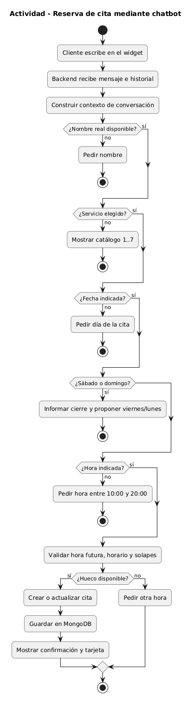

# Presentación oral del Trabajo Fin de Grado

## Corte Perfecto

**Desarrollo de una plataforma web integral de gestión de citas para una peluquería con asistencia inteligente basada en modelos de lenguaje de ejecución local**

**Autor:** Adrián García Arranz<br>
**Duración objetivo:** 15 minutos

## Distribución recomendada del tiempo

| Sección | Tiempo | Descripción | Elemento clave |
| --- | ---: | --- | --- |
| Puesta en contexto | 3 minutos | Se establece el marco de trabajo: problema, negocio, entidades principales y relación entre ellas. | Modelo del dominio |
| Exposición de requisitos | 2 minutos | Se presentan los actores, los casos de uso principales y los límites del sistema. | Actores, casos de uso y contexto |
| Casos de uso representativos | 3 minutos | Se explican dos recorridos importantes de forma sencilla: reservar por chat y gestionar la agenda. | Reserva y gestión de citas |
| Demostración de la solución | 5 minutos | Se muestra el sistema funcionando desde la web pública y desde el panel privado. | Solución funcionando |
| Conclusiones | 2 minutos | Se conectan los objetivos iniciales con el resultado obtenido y con posibles mejoras futuras. | Cierre del proyecto |

---

## 1. Puesta en contexto

Corte Perfecto es una aplicación web pensada para una peluquería que quiere gestionar sus citas de una forma más ordenada, más cómoda y menos dependiente de llamadas o mensajes sueltos.

El problema de partida es sencillo. En una peluquería pequeña, cada reserva suele implicar varias tareas: responder al cliente, explicar los servicios, comprobar si hay hueco, apuntar la cita, evitar duplicidades y recordar después que esa cita existe. Si todo esto se hace de forma manual, se pierde tiempo y aumenta la posibilidad de cometer errores.

La solución que planteo combina tres partes:

- Una web pública donde el cliente puede ver información general y servicios.
- Un chatbot que ayuda a resolver dudas y a crear reservas de forma conversacional.
- Un panel privado donde el administrador puede consultar y gestionar la agenda.

La idea principal del proyecto es que el cliente pueda hablar de forma natural, pero que las decisiones importantes las controle siempre la aplicación. Es decir, la inteligencia artificial ayuda en la conversación, pero la agenda se valida con reglas propias del sistema.

### Modelo del dominio


Este modelo resume las piezas principales del negocio. La cita es el centro del sistema. Cada cita está relacionada con un cliente, con un servicio y con la agenda.

El servicio guarda datos como el nombre, el precio y la duración. Esto es importante porque el sistema no deja que el cliente invente un precio o una duración: siempre se toma la información del catálogo oficial.

La agenda se encarga de organizar las citas y comprobar si un hueco está disponible. Así se evita que dos clientes tengan una reserva en el mismo tramo horario.

### Objeto de reserva


Este diagrama baja el modelo a un ejemplo concreto. Representa una reserva creada desde el chat. Aparecen el cliente, el servicio elegido, la conversación y la cita guardada.

Lo importante de este punto es demostrar que la conversación no se queda solo en un mensaje. Termina creando una cita real que después se puede ver desde el panel de administración.

### Estados de una cita


Las citas pueden pasar por varios estados. Una cita activa ocupa hueco en la agenda. Una cita completada o cancelada ya no debe bloquear ese horario.

Esto permite mantener un histórico de lo ocurrido sin impedir nuevas reservas cuando una cita ya ha terminado o se ha cancelado.

El alcance del proyecto incluye la consulta de servicios, la reserva por chatbot, la modificación o cancelación de citas activas y la gestión desde un panel privado. Fuera del alcance quedan pagos online, recordatorios automáticos, varias sedes y varios empleados.

---

## 2. Exposición de requisitos

El sistema tiene dos actores principales:

- El cliente, que usa la web pública y el chatbot.
- El administrador, que usa el panel privado para gestionar la agenda.

El cliente puede consultar servicios, abrir el chat, pedir información, reservar una cita y modificar o cancelar una reserva activa. El administrador puede iniciar sesión, consultar las citas, crear nuevas reservas, editarlas, completarlas o eliminarlas.

### Actores y casos de uso

| Cliente | Administrador |
| --- | --- |
|  |  |

Estos diagramas muestran que el proyecto no se limita a una pantalla aislada. Hay un recorrido completo para el cliente y otro recorrido completo para la administración.

Los casos de uso más importantes para explicar el valor del sistema son:

- Reservar una cita mediante chatbot.
- Modificar una cita activa desde el chat.
- Iniciar sesión como administrador.
- Consultar y gestionar las citas desde el panel privado.

Para que la explicación sea clara, los casos de uso se pueden agrupar en dos bloques. El primer bloque corresponde al cliente y cubre la parte pública del sistema. El segundo bloque corresponde al administrador y cubre el trabajo interno de la peluquería.

| Bloque | Qué incluye | Por qué es importante |
| --- | --- | --- |
| Cliente | Consultar la web, ver servicios, abrir el chat, reservar, modificar o cancelar una cita. | Reduce llamadas y permite que el cliente pueda resolver una reserva sin depender de una conversación manual. |
| Administrador | Iniciar sesión, ver la agenda, crear citas, editar citas, completar citas y eliminarlas. | Mantiene el control final de la peluquería y permite revisar todo lo que ocurre en la agenda. |

Esta separación ayuda a entender el alcance. El cliente tiene una experiencia sencilla y guiada. El administrador tiene una herramienta de gestión. Las dos partes están conectadas por la misma agenda.

### Diagrama de contexto


El diagrama de contexto marca los límites del sistema. El cliente no toca directamente la base de datos. El administrador tampoco. Todo pasa por la aplicación, que es la que decide qué se puede hacer y qué no.

Esto es importante porque centraliza las reglas. Si una cita no es válida, se rechaza desde la aplicación, tanto si viene del chat como si viene del panel privado.

### Navegación por casos de uso


Las reglas principales son:

- La peluquería trabaja de lunes a viernes.
- Las reservas deben estar dentro del horario de apertura.
- El servicio debe existir en el catálogo.
- No se pueden crear citas solapadas.
- El panel privado requiere inicio de sesión.
- Si el asistente no puede responder con seguridad, se muestra una respuesta controlada.

---

## 3. Casos de uso representativos

Para explicar el proyecto he elegido dos recorridos. El primero es la reserva por chatbot, porque es la parte más diferencial del trabajo. El segundo es la consulta de la agenda desde administración, porque demuestra que la reserva queda registrada y se puede gestionar después.

### Caso 1: reservar cita mediante chatbot


En este caso el cliente no rellena un formulario largo. Habla con el asistente y va aportando la información necesaria poco a poco.

La ficha sencilla del caso es esta:

| Elemento | Explicación |
| --- | --- |
| Actor principal | Cliente |
| Objetivo | Conseguir una cita sin llamar por teléfono ni rellenar un formulario largo. |
| Datos necesarios | Servicio, nombre, fecha y hora. |
| Resultado correcto | La cita queda guardada y el cliente recibe confirmación. |
| Casos que se rechazan | Fecha no válida, horario fuera de apertura, servicio inexistente o hueco ocupado. |

El recorrido principal es el siguiente:

1. El cliente pregunta por los servicios.
2. El sistema responde con las opciones disponibles.
3. El cliente elige un servicio.
4. El sistema pide los datos que falten.
5. El cliente indica su nombre, fecha y hora.
6. La aplicación comprueba si la reserva se puede crear.
7. Si todo es correcto, la cita queda guardada.



Este diagrama de actividad muestra el flujo desde el punto de vista del proceso. No importa si el cliente escribe todo en un mensaje o lo va diciendo poco a poco. La aplicación va reuniendo la información necesaria y, cuando la tiene completa, comprueba si la reserva es posible.


El diagrama de secuencia muestra el orden de la conversación. Primero habla el cliente, después responde el asistente, luego se piden los datos que faltan y finalmente se confirma la reserva si todo está bien.

Lo más importante es que el chatbot no confirma una cita solo por haber entendido al cliente. Antes de confirmar, la aplicación revisa el catálogo, el horario y la disponibilidad.

Por ejemplo, si el cliente pide una cita fuera del horario, en fin de semana o en un hueco ya ocupado, el sistema no la guarda. En ese caso responde indicando que hay que escoger otra fecha u otra hora.

Este caso demuestra la idea principal del TFG: usar inteligencia artificial para que la conversación sea más cómoda, pero mantener el control de la agenda dentro de la aplicación.

También es un caso representativo porque mezcla varias partes del proyecto en una sola acción. Hay interfaz de usuario, conversación, reglas de negocio y almacenamiento de la cita. Por eso es un buen ejemplo para enseñar que el sistema no es solo un chatbot, sino una aplicación completa de gestión.

### Caso 2: consultar y gestionar citas


El segundo caso representa el trabajo del administrador. Después de iniciar sesión, el administrador puede ver las citas registradas, filtrarlas, ordenarlas y gestionarlas.

Este punto es importante porque conecta la parte pública con la parte privada. La cita que el cliente crea desde el chat aparece después en la agenda de administración.

La ficha sencilla del caso es esta:

| Elemento | Explicación |
| --- | --- |
| Actor principal | Administrador |
| Objetivo | Consultar y mantener la agenda actualizada. |
| Entrada | Inicio de sesión y datos de la agenda. |
| Resultado correcto | El administrador ve las citas y puede actuar sobre ellas. |
| Casos que se controlan | Acceso no autorizado, lista vacía, cita que ya no existe o datos incorrectos al editar. |

El administrador puede:

- Ver las citas del día o de próximas fechas.
- Consultar el estado de cada cita.
- Crear una cita manualmente si el cliente llama por teléfono.
- Editar una cita si el cliente cambia de hora.
- Marcar una cita como completada.
- Eliminar o cancelar citas cuando sea necesario.


Este diagrama de actividad resume el trabajo del administrador. Primero entra al panel privado, después revisa la agenda y finalmente realiza la acción necesaria: crear, editar, completar o eliminar una cita.

La secuencia de este caso se puede explicar de forma sencilla:

1. El administrador inicia sesión.
2. La aplicación comprueba que puede entrar al panel privado.
3. Se carga la agenda con las citas registradas.
4. El administrador busca o filtra la información que necesita.
5. Si hace un cambio, la aplicación comprueba que los datos sean correctos.
6. La agenda se actualiza y queda preparada para la siguiente consulta.

La ventaja es que no hay dos agendas separadas. El chatbot y el panel privado trabajan sobre la misma información. Así se evita tener que copiar datos a mano y se reduce el riesgo de errores.

Este caso sirve para cerrar el recorrido anterior. Primero el cliente crea una reserva desde la web. Después el administrador comprueba esa misma reserva en su panel. Esa conexión entre cliente y administrador es una de las partes más importantes del proyecto.

---

## 4. Demostración de la solución

La demostración se puede explicar como un recorrido único: primero actúa el cliente y después actúa el administrador.

### Paso 1: web pública


La web pública presenta Corte Perfecto, muestra los servicios y ofrece acceso al asistente. El objetivo es que el cliente tenga una entrada clara y no necesite llamar para resolver dudas básicas.

### Paso 2: conversación con el chatbot

En la demostración se puede usar una conversación sencilla:

```text
¿Qué servicios tenéis y cuánto cuestan?
Quiero reservar la opción 4.
Me llamo Adrián Demo.
El próximo martes a las cinco de la tarde.
```

El asistente va guiando al cliente. Si falta algún dato, lo pide. Si el dato no es válido, lo corrige. Si todo está bien, crea la reserva.

### Paso 3: confirmación de la cita

La confirmación aparece cuando la cita ya se ha guardado correctamente. Esto evita que el cliente crea que tiene una cita si realmente no se ha registrado.

En esta parte conviene destacar que el sistema no solo responde de forma natural: también comprueba reglas reales del negocio.

### Paso 4: entrada al panel privado


Después se entra como administrador. El panel resume la situación general de la agenda y permite acceder a la gestión de citas.

### Paso 5: comprobación en la agenda


La cita creada desde el chat aparece en la tabla de administración. Este es el cierre de la demostración: el cliente reserva desde la web y el administrador ve esa misma cita en su panel.

Con esto se ve el ciclo completo:

- El cliente consulta.
- El cliente reserva.
- La aplicación comprueba la información.
- La cita se guarda.
- El administrador la consulta y la puede gestionar.

---

## 5. Conclusiones

El proyecto cumple los objetivos planteados al inicio. Se ha analizado un problema real, se ha diseñado una solución completa y se ha desarrollado una aplicación funcional que conecta cliente, chatbot, agenda y administración.

| Objetivo | Resultado obtenido |
| --- | --- |
| Entender el problema | Se identificó la necesidad de ordenar reservas y reducir gestión manual. |
| Definir requisitos | Se modelaron actores, reglas y casos de uso. |
| Diseñar la solución | Se planteó una aplicación con web pública, asistente y panel privado. |
| Implementar el sistema | Se desarrolló la reserva por chat, la agenda y la administración. |
| Revisar el resultado | Se comprobaron los recorridos principales y la coherencia con los casos de uso. |

### Resultados del chatbot y tiempo de respuesta

Además de cumplir los objetivos funcionales, también se ha revisado cómo se comporta la parte de inteligencia artificial. La conclusión principal es que el asistente responde dentro del tema de la peluquería y no tiene autoridad para inventar reservas.

El resultado se puede explicar así:

| Aspecto | Resultado |
| --- | --- |
| Qué debe responder | Servicios, precios, horario, dudas de la peluquería y ayuda para reservar. |
| Qué no debe responder | Instrucciones internas, detalles técnicos, razonamientos del modelo o temas ajenos al negocio. |
| Reserva de citas | La IA ayuda a conversar, pero la aplicación comprueba si la cita se puede guardar. |
| Tiempo observado | En las respuestas generadas por el modelo local se observaron tiempos aproximados de 2 a 8 segundos. |
| Límite de espera | LM Studio tiene un máximo de 60 segundos y el frontend espera hasta 70 segundos. Si no hay respuesta, se muestra un mensaje controlado. |

Para mí, el tiempo de respuesta se valora desde el punto de vista del usuario. Si una pregunta se puede resolver con reglas simples, como horario o servicios, la respuesta es muy rápida porque no hace falta usar el modelo. Si la pregunta necesita una respuesta más abierta, entra LM Studio y el tiempo depende del equipo y del modelo cargado.

En este proyecto se ha usado Llama 3.1 8B Instruct ejecutado en local con LM Studio. Lo elegí porque ofrece un equilibrio razonable entre calidad y rendimiento: entiende bien instrucciones, funciona correctamente en español y puede ejecutarse en local con el equipo disponible. Frente a una alternativa más pequeña como Nemotron 3 Nano 4B, la ventaja de Nemotron sería que puede ser más ligero y rápido; sin embargo, para este TFG me interesaba más la estabilidad de las respuestas y que el asistente siguiera bien las instrucciones del dominio de la peluquería. Por eso Llama 3.1 8B encaja mejor como modelo principal.

Los ajustes principales han sido:

| Ajuste | Explicación sencilla |
| --- | --- |
| Temperatura baja | Uso `0.1` para que el asistente sea más estable y menos creativo. Para una peluquería interesa que responda claro, no que improvise. |
| Límite de salida | El modelo tiene un máximo de 900 tokens de respuesta para evitar textos demasiado largos. |
| Historial acotado | El sistema no envía toda la conversación infinita, solo la parte reciente necesaria. La entrada del chat conserva como máximo 24 elementos de historial. |
| Mensaje limitado | El usuario no puede enviar mensajes enormes: cada mensaje se limita a 1.200 caracteres. |
| Respuesta de seguridad | Si el modelo falla, está vacío o tarda demasiado, se devuelve un mensaje controlado. |

Los tokens se pueden explicar como pequeñas partes de texto que el modelo lee o genera. En mi caso controlo dos cosas: el contexto, que es lo que el modelo recibe para entender la conversación, y la salida, que es la respuesta que genera. Para evitar respuestas demasiado largas o conversaciones que crezcan sin control, limito el historial, el tamaño de los mensajes y la salida máxima a 900 tokens. No he usado los tokens por segundo como métrica principal porque dependen mucho del equipo y del modelo cargado; para la defensa es más claro hablar del tiempo real que nota el usuario, que en las respuestas generativas locales estuvo aproximadamente entre 2 y 8 segundos.

La principal aportación del TFG es integrar un asistente conversacional en un proceso donde no basta con responder al usuario. La reserva tiene que ser correcta, tener sentido para el negocio y quedar guardada para que el administrador pueda trabajar con ella.

La decisión más importante ha sido separar dos cosas:

- El asistente ayuda al cliente a expresarse de forma natural.
- La aplicación conserva el control de la agenda y de las reglas.

Esto hace que el sistema sea más fiable. Si el cliente pide algo que no se puede hacer, la aplicación no lo acepta simplemente porque el mensaje esté bien escrito. Se comprueba antes de guardar.

También se ha mantenido una estructura ordenada para que el proyecto pueda evolucionar. No es solo una demo visual: hay una web pública, una parte privada, una base de datos y una organización clara entre lo que ve el usuario y lo que gestiona la aplicación por dentro.

Las limitaciones principales son:

- De momento trabaja con una única agenda.
- No incluye pagos online.
- No envía recordatorios automáticos.
- La ejecución de la inteligencia artificial se ha planteado en local.
- No está pensado todavía para varias sedes o varios empleados.

Las líneas futuras más naturales serían:

- Añadir recordatorios por correo, SMS o WhatsApp.
- Permitir varios empleados con agendas distintas.
- Publicar la aplicación en un entorno online seguro.
- Mejorar el seguimiento de errores y tiempos de respuesta.
- Ampliar la gestión de servicios y horarios especiales.
- Recoger opiniones de usuarios reales para mejorar la experiencia.

Como cierre, Corte Perfecto demuestra que se puede usar inteligencia artificial en un negocio real sin perder el control de las reglas importantes.

> El asistente ayuda a conversar; la aplicación se encarga de que la cita sea correcta.

Muchas gracias.

---

[Capítulo 1](Capitulo_1/README.md) · [Capítulo 2](Capitulo_2/README.md) · [Capítulo 3](Capitulo_3/README.md) · [Capítulo 4](Capitulo_4/README.md) · [Capítulo 5](Capitulo_5/README.md) · [Memoria oficial](../../entregas/TFG_AdriánGarcíaArranz.pdf)
