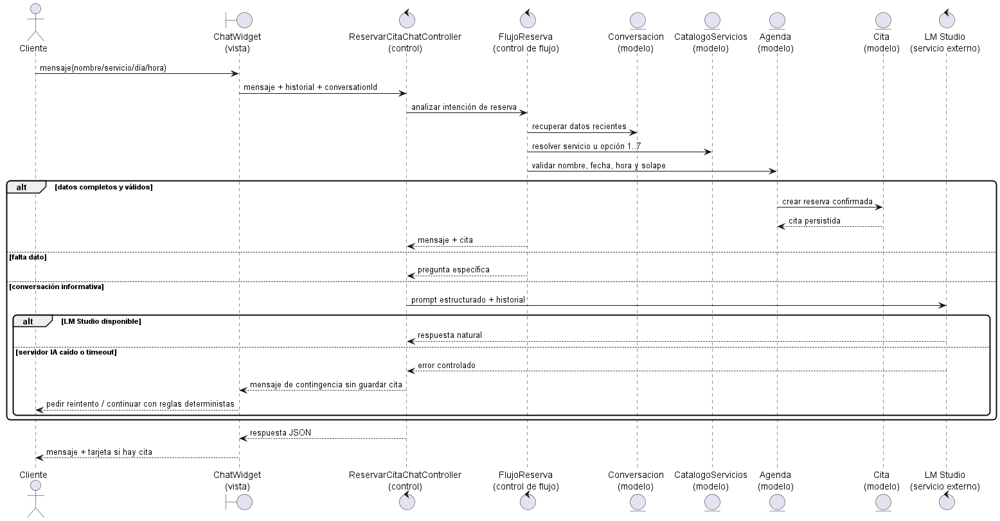
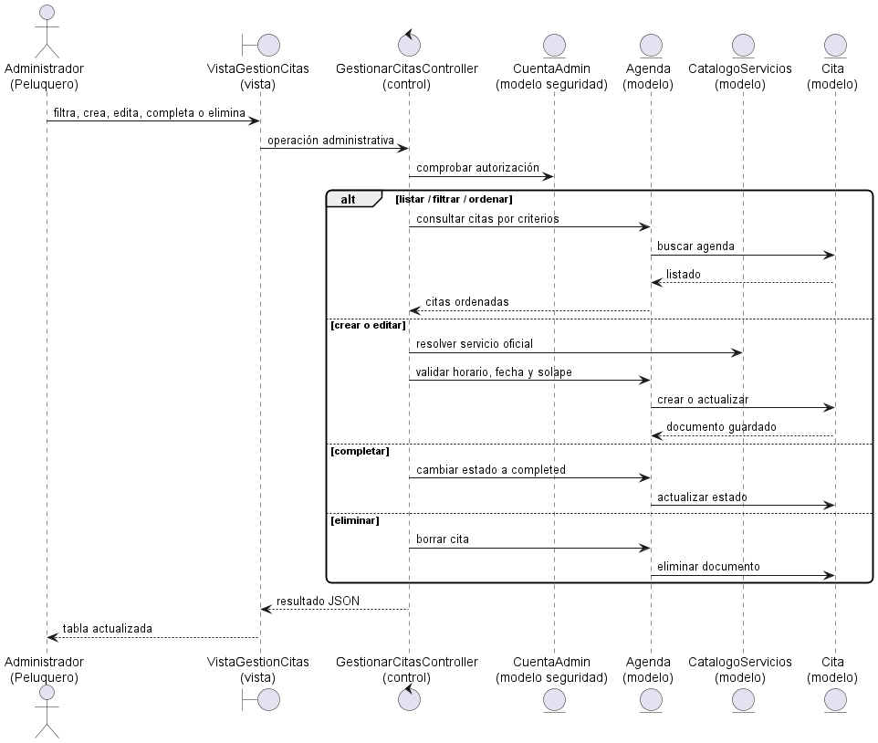
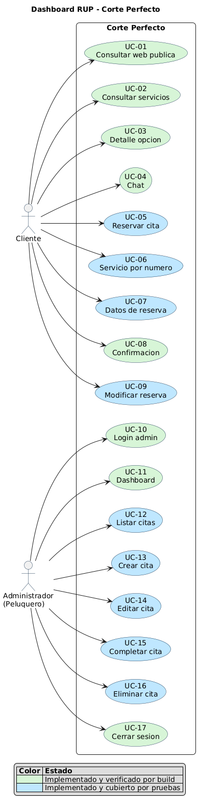

# Presentación oral del Trabajo Fin de Grado

## Corte Perfecto

**Desarrollo de una plataforma web integral de gestión de citas para una peluquería con asistencia inteligente basada en modelos de lenguaje de ejecución local**

**Autor:** Adrián García Arranz<br>
**Duración objetivo:** 15 minutos

## Distribución recomendada del tiempo

| Sección | Tiempo | Descripción | Elemento clave |
| --- | ---: | --- | --- |
| Puesta en contexto | 3 minutos | Se establece el marco de trabajo: escenario problemático, entidades principales y relaciones entre ellas. | Modelo del dominio |
| Exposición de requisitos | 2 minutos | Se presentan actores, casos de uso principales y diagrama de contexto para fijar límites y alcance. | Actores, casos de uso y contexto |
| Detalle de casos de uso representativos | 3 minutos | Se explican dos casos de uso con su cascada: detalle, interfaz, análisis MVC y diseño técnico. | UC-05 y UC-12 |
| Demostración de la solución | 5 minutos | Se ejecuta el sistema funcionando con los casos explicados. | Reserva y panel administrativo |
| Conclusiones | 2 minutos | Se conectan objetivos, resultados, competencias profesionales y evolución. | Conclusiones finales |

---

## 1. Puesta en contexto

El marco de trabajo es una peluquería local que necesita digitalizar la gestión de citas sin convertir el proceso en una herramienta compleja para el cliente ni para el profesional. El sistema propuesto se llama Corte Perfecto y combina tres piezas: una web pública para informar, un chatbot para atender y reservar mediante lenguaje natural, y un panel privado para que el administrador gestione la agenda.

El punto de partida del proyecto es un problema habitual en negocios pequeños. Cada llamada o mensaje interrumpe el trabajo del profesional. Además, no basta con contestar: hay que interpretar qué quiere el cliente, revisar el horario, comprobar la agenda, elegir el servicio correcto y transcribir manualmente la reserva. Ese proceso consume tiempo, depende de la disponibilidad del peluquero y puede generar errores.

Las alternativas existentes resuelven solo parte del problema. La agenda en papel no automatiza nada; la mensajería mantiene la gestión manual; las plataformas SaaS introducen coste y dependencia; y un chatbot puramente generativo no garantiza por sí solo reglas críticas como horario, disponibilidad o ausencia de solapes.

La propuesta combina conversación y control. El cliente puede hablar con lenguaje natural, pero las decisiones importantes no quedan en manos del modelo. La idea central del proyecto es:

> La inteligencia artificial conversa; el backend valida y decide.

### Modelo del dominio


El modelo del dominio resume el espacio de trabajo desde una visión estática. La entidad principal es la cita, asociada a un cliente, a un servicio, a una agenda y, cuando nace desde el chatbot, a una conversación.

El servicio define nombre, precio y duración. Estos datos no se aceptan desde el cliente ni desde la respuesta de la IA: se recalculan en el backend a partir del catálogo oficial.

La agenda contiene las citas activas y permite comprobar disponibilidad. Para ello, la cita no guarda únicamente la fecha y la hora visibles, sino también dos campos clave: `startsAt` y `endsAt`. Por ejemplo, si un cliente reserva Corte y Peinado a las 17:00 y ese servicio dura 50 minutos, el intervalo real ocupado es de 17:00 a 17:50.

Esta representación permite detectar solapes aunque los servicios tengan duraciones diferentes. No se compara solo una hora puntual, sino un intervalo completo.

### Objeto de reserva


El diagrama de objetos aterriza el modelo anterior en un ejemplo concreto. Representa una reserva creada desde el chat, con un cliente, un servicio seleccionado, una conversación y una cita persistida. Lo importante es que no es una idea abstracta: los objetos del dominio acaban teniendo correspondencia con documentos reales en MongoDB.

### Estados de una cita


El diagrama de estados explica el ciclo de vida de la cita. Los estados `pending` y `confirmed` representan citas activas y bloquean hueco en la agenda. Los estados `completed` y `cancelled` ya no deben bloquear horario. Esta distinción es importante porque permite liberar huecos cancelados y mantener histórico de citas completadas.

El objetivo general ha sido construir una solución full-stack que permita consultar información, reservar mediante conversación y administrar una única agenda. El alcance incluye consulta de servicios, reserva, modificación, cancelación, login administrativo y gestión de citas. Quedan fuera del alcance pagos, notificaciones, varias sedes, varios empleados y alta disponibilidad en producción.

---

## 2. Exposición de requisitos

El sistema tiene dos actores principales. El cliente utiliza la web pública y el chatbot para informarse y gestionar reservas. El administrador, que representa al peluquero, accede a un panel privado para consultar y modificar la agenda.

Se han definido 17 casos de uso. Del UC-01 al UC-09 se cubre el recorrido del cliente: consultar la web, ver servicios, abrir el chat, reservar, elegir una opción, aportar datos, recibir confirmación y modificar una reserva activa. Del UC-10 al UC-17 se cubre el recorrido administrativo: iniciar sesión, ver dashboard, listar citas, crear, editar, completar, eliminar y cerrar sesión.

### Actores y casos de uso

| Cliente | Administrador |
| --- | --- |
|  |  |

Los casos de uso más importantes para entender el valor del proyecto son UC-05, reservar cita mediante chatbot; UC-09, modificar una reserva activa por chat; UC-10, iniciar sesión como administrador; y UC-12 a UC-16, que cubren la gestión de citas.

### Diagrama de contexto


El diagrama de contexto marca los límites de la solución. El cliente no interactúa directamente con MongoDB ni con LM Studio. El administrador tampoco accede directamente a la base de datos. Todas las operaciones pasan por la aplicación y por la API.

### Navegación por casos de uso


El diagrama de navegación conecta los casos de uso con las pantallas principales. Desde la web pública se puede llegar al chatbot y completar el recorrido de reserva. Desde el login se accede al panel administrativo, donde se listan, crean, editan, completan o eliminan citas. Las flechas de retorno representan que el usuario puede volver al menú principal, cerrar sesión o cancelar una operación sin romper el flujo.

Las reglas principales del sistema son las siguientes:

- La peluquería abre de lunes a viernes, de 10:00 a 20:00.
- El servicio debe terminar antes del cierre.
- El nombre del cliente debe ser válido.
- El servicio debe existir en el catálogo oficial.
- Precio y duración se recalculan siempre en backend.
- Las citas activas no pueden solaparse.
- Las rutas administrativas requieren autenticación JWT.
- Si LM Studio falla, el sistema no debe confirmar datos falsos.

Los estados de una cita también forman parte de las reglas del dominio. `pending` y `confirmed` bloquean horario porque representan citas activas. `completed` y `cancelled` no bloquean horario porque la cita ya ha terminado o ha sido anulada.

---

## 3. Detalle de casos de uso representativos

Para la defensa he seleccionado dos casos de uso representativos. El primero es UC-05, porque concentra el valor diferencial del chatbot y la validación de agenda. El segundo es UC-12, porque demuestra que la reserva no termina en una conversación aislada, sino en una agenda administrativa real y consultable.

### Caso 1: UC-05 Reservar cita mediante chatbot

#### Detalle del caso de uso

| Elemento | Descripción |
| --- | --- |
| Actor | Cliente |
| Objetivo | Registrar una cita a partir de una conversación natural |
| Entrada | Servicio, nombre, fecha y hora |
| Resultado | Cita validada, persistida y confirmada |
| Alternativas | Servicio inválido, nombre inválido, fin de semana, hora pasada, solape, fallo de LM Studio |

La cascada completa de UC-05 es:

```text
React/Vite
-> Axios
-> Express
-> chatController
-> bookingFlowService
-> appointmentService
-> Mongoose
-> MongoDB
```

Cada paso tiene una responsabilidad concreta:

| Paso | Responsabilidad |
| --- | --- |
| React/Vite | Renderiza la web pública y el componente `ChatWidget`; Vite permite desarrollo rápido y build de producción. |
| Axios | Envía el mensaje, historial e identificadores a la API en JSON, aplica timeout y recibe la respuesta. |
| Express | Recibe la petición HTTP en `POST /api/chat` y la dirige a la ruta correspondiente. |
| `chatController` | Orquesta el caso de uso: normaliza la entrada, decide si hay flujo determinista, consulta LM Studio si hace falta y construye la respuesta. |
| `bookingFlowService` | Mantiene el proceso conversacional: detecta intención de reserva, servicio, nombre, fecha, hora y datos pendientes. |
| `appointmentService` | Aplica las reglas críticas de agenda: catálogo, precio, duración, horario, fecha futura y solapes. |
| Mongoose | Valida el esquema de cita y traduce la operación JavaScript a documentos MongoDB. |
| MongoDB | Persiste la cita y actúa como fuente única de verdad para chatbot y administración. |

#### Interfaz de usuario propuesta


El cliente interactúa con `ChatWidget`, un componente React. Desde su punto de vista, solo conversa: pregunta por servicios, elige una opción, escribe su nombre y propone fecha y hora.

React no decide si la cita es válida. Axios envía el mensaje, el historial reciente, el identificador de conversación y, si existe, el identificador de cita activa. La petición llega a `POST /api/chat`.

#### Análisis MVC



En análisis, el caso se separa siguiendo responsabilidades MVC. La vista es el chat, el controlador coordina la operación y las entidades principales son conversación, catálogo, agenda y cita.

En la implementación, esta separación se traduce en rutas, controladores, servicios y modelos. `chatController` coordina la petición, `bookingFlowService` mantiene el estado conversacional y `appointmentService` concentra la validación de negocio.

#### Diseño técnico y arquitectura


La arquitectura confirma la misma cascada en términos tecnológicos:

```text
React/Vite
-> Axios
-> Express
-> chatController
-> bookingFlowService
-> appointmentService
-> Mongoose
-> MongoDB
```

Cuando el sistema ya dispone de nombre, servicio, fecha y hora, `appointmentService` realiza las validaciones críticas:

1. Comprueba que el nombre sea real.
2. Resuelve el servicio contra el catálogo oficial.
3. Recalcula precio y duración.
4. Comprueba que el día sea laborable.
5. Comprueba que la hora sea futura.
6. Verifica que el servicio termine antes de las 20:00.
7. Calcula `startsAt` y `endsAt`.
8. Busca solapes con citas activas.
9. Guarda la cita si todo es correcto.

La detección de solape se basa en intervalos:

```text
citaExistente.startsAt < nuevaCita.endsAt
y
citaExistente.endsAt > nuevaCita.startsAt
```

Esto significa que dos citas se solapan si comparten cualquier parte del intervalo temporal.

LM Studio queda encapsulado en `lmStudioService`. Se utiliza para consultas abiertas, pero no decide disponibilidad, precio, duración ni persistencia. Las respuestas generativas usan temperatura `0.2`, límite de `900` tokens y timeout de 60 segundos.


La confirmación solo se devuelve después de guardar en MongoDB. Si MongoDB falla o la validación rechaza la operación, el sistema no muestra una confirmación falsa.

### Caso 2: UC-12 Listar, filtrar y ordenar citas

#### Detalle del caso de uso

| Elemento | Descripción |
| --- | --- |
| Actor | Administrador |
| Objetivo | Consultar la agenda persistida y localizar citas |
| Entrada | Token JWT, filtros de fecha, estado y orden |
| Resultado | Listado administrativo de citas |
| Alternativas | Token inválido, sesión caducada, lista vacía o error de API |

UC-12 representa la parte administrativa. Demuestra que las reservas creadas desde el chatbot no se quedan en una conversación, sino que llegan a una agenda operativa.

La cascada completa de UC-12 es:

```text
Administrador
-> AdminAppointments
-> GET /api/appointments
-> requireAuth
-> appointmentController.index
-> appointmentService.listAppointments
-> Appointment
-> MongoDB
-> tabla de citas
```

#### Interfaz de usuario propuesta


El administrador accede al panel privado, consulta la tabla de citas y puede filtrar por estado, fecha u orden. Esta vista usa la misma fuente de datos que el chatbot. No hay una agenda duplicada ni una exportación manual.

El login administrativo se protege mediante JWT. La contraseña se almacena como hash bcrypt con coste 12. Después de iniciar sesión, el frontend envía el token en la cabecera `Authorization: Bearer`.

#### Análisis MVC



En análisis, la vista administrativa se comunica con un controlador de gestión de citas, que utiliza la agenda y la entidad cita. En diseño, esto se implementa con `AdminAppointments.jsx`, rutas privadas de Express, `appointmentController` y `appointmentService`.

Crear o editar una cita desde administración también pasa por `appointmentService`. Así se evita que existan reglas distintas para cliente y administrador.

#### Diseño técnico y arquitectura

```text
React Admin
-> Axios con JWT
-> Express
-> requireAuth
-> appointmentController
-> appointmentService
-> Appointment
-> MongoDB
```

`requireAuth` valida el token antes de permitir el acceso a `/api/appointments`. Si el token falta, es inválido o ha caducado, la API rechaza la petición. Si es correcto, `appointmentService.listAppointments()` consulta MongoDB según filtros de estado, fecha y orden.

Este caso es el cierre natural de UC-05. Primero el cliente crea una cita mediante conversación; después el administrador ve esa misma cita en el panel. Eso demuestra la trazabilidad entre interfaz pública, backend, base de datos y administración.

[Matriz completa de trazabilidad](../../RUP/99-seguimiento/trazabilidad-casos-uso.md)

---

## 4. Demostración de la solución

La demostración reproduce los dos casos representativos: primero UC-05 desde la web pública y después UC-12 desde administración.


### Paso 1: web pública


La web presenta Corte Perfecto, sus servicios y el acceso al asistente. El cliente no necesita navegar por un formulario largo: puede iniciar una conversación.

### Paso 2: consulta y reserva por chatbot

En el chatbot, la conversación esperada es:

```text
¿Qué servicios tenéis y cuánto cuestan?
Quiero reservar la opción 4.
Me llamo Adrián Demo.
El próximo martes a las cinco de la tarde.
```

La opción 4 es Corte y Peinado. El backend obtiene del catálogo oficial que cuesta 35 euros y dura 50 minutos. Después calcula el intervalo, valida horario, comprueba solapes y guarda.

### Paso 3: confirmación

La tarjeta de confirmación aparece únicamente después de persistir en MongoDB. Esta decisión evita que el usuario crea que tiene una cita si la base de datos no la ha guardado.

### Paso 4: panel administrativo


El administrador inicia sesión y accede al panel. La autenticación usa JWT y las rutas privadas de citas están protegidas por middleware.

### Paso 5: misma cita en la agenda


La cita creada desde el chatbot aparece en la tabla administrativa. Esta es la idea principal de la demostración: no hay dos sistemas, no hay dos agendas y no hay transcripción manual. Cliente y administrador comparten la misma colección de MongoDB.

El recorrido completo que queda demostrado es:

```text
React
-> Axios
-> Express
-> servicios de dominio
-> validación
-> MongoDB
-> panel administrativo
```

---

## 5. Conclusiones

Los objetivos planteados se consideran cumplidos.

| Objetivo | Resultado obtenido |
| --- | --- |
| Identificar requisitos | Dominio, actores, reglas y 17 casos de uso |
| Diseñar la solución | Arquitectura modular, MVC, servicios, MongoDB y LM Studio |
| Implementar el producto | Web pública, chatbot, API, persistencia y panel |
| Evaluar el resultado | Trazabilidad, build y 44 pruebas automatizadas |

```bash
npm run verify
```

La verificación comprueba la sintaxis del backend, ejecuta 44 pruebas automatizadas y genera el build de producción del frontend. Las pruebas se han organizado por servicios para comprobar las reglas críticas sin depender de la interfaz.

| Suite de pruebas | Qué comprueba |
| --- | --- |
| `appointmentService.test.js` | Creación de citas válidas, precio, duración, estados, fines de semana, horario, nombres inválidos, solapes, completar, eliminar, modificar por conversación y reservas simultáneas. |
| `bookingFlowService.test.js` | Flujo conversacional: selección de servicio por número, fechas pasadas, fines de semana, correcciones, negaciones, nombres mezclados con servicio, cancelación y reutilización segura del contexto. |
| `calendarService.test.js` | Fechas laborables, fines de semana, formato de fechas y comprensión de horas naturales en español, como “seis y media” o “diez menos cuarto”. |
| `chatHardening.test.js` | Robustez del chat: límites de mensaje, limpieza de historial, bloqueo de instrucciones para revelar el prompt, respuestas deterministas, fallback y filtrado de ruido técnico. |

Estas pruebas no intentan demostrar que un modelo generativo nunca falle. Lo que demuestran es que las reglas que no pueden fallar están en servicios verificables del backend.



Este dashboard RUP es un resumen visual del estado de los 17 casos de uso. Los casos en verde están implementados y verificados por build; los casos en azul, además de estar implementados, tienen cobertura directa mediante pruebas automatizadas. Sirve para demostrar trazabilidad: cada caso de uso definido en requisitos tiene una correspondencia con código, pantalla, endpoint o prueba.

Desde el punto de vista profesional, el proyecto recorre un ciclo completo de ingeniería de software: análisis del problema, dominio, requisitos, diseño, implementación, pruebas y trazabilidad.

La decisión más importante ha sido separar conversación y decisión. LM Studio aporta naturalidad y flexibilidad lingüística, pero no tiene autoridad final sobre la agenda. Aunque el modelo genere una respuesta imperfecta, la cita solo se registra si supera las reglas del backend.

La inferencia se ejecuta localmente mediante LM Studio. En el entorno utilizado, con una RTX 3060 de 6 GB, se observaron tiempos aproximados de 2 a 8 segundos por respuesta generativa. El sistema incorpora timeout configurable, endpoint de salud y respuesta de contingencia.

Las principales limitaciones son la ejecución local, una única agenda, la ausencia de pagos y notificaciones, y una cola de concurrencia válida para una sola instancia del backend.

Las líneas futuras más naturales son:

- **Agenda multiempleado:** permitir que varias personas trabajen en paralelo, cada una con su disponibilidad y servicios asignados.
- **Recordatorios:** enviar confirmaciones o avisos por correo, SMS o WhatsApp para reducir ausencias.
- **Despliegue con HTTPS:** pasar de ejecución local a un entorno accesible de forma segura, con dominio, certificados y variables de entorno gestionadas.
- **Observabilidad:** registrar métricas de latencia, errores, disponibilidad de LM Studio y uso de endpoints.
- **Concurrencia distribuida:** sustituir la cola local por mecanismos válidos para varias instancias, como transacciones o bloqueos distribuidos.
- **Pruebas end-to-end:** automatizar recorridos completos de navegador, desde reservar en el chat hasta comprobar la cita en administración.

Corte Perfecto demuestra que es posible incorporar inteligencia artificial a un proceso real sin delegarle aquello que exige exactitud.

> El modelo ayuda a comprender al usuario; el sistema conserva la responsabilidad sobre la operación.

Muchas gracias.

---

[Capítulo 1](Capitulo_1/README.md) · [Capítulo 2](Capitulo_2/README.md) · [Capítulo 3](Capitulo_3/README.md) · [Capítulo 4](Capitulo_4/README.md) · [Capítulo 5](Capitulo_5/README.md) · [Memoria oficial](../../entregas/TFG_AdriánGarcíaArranz.pdf)
